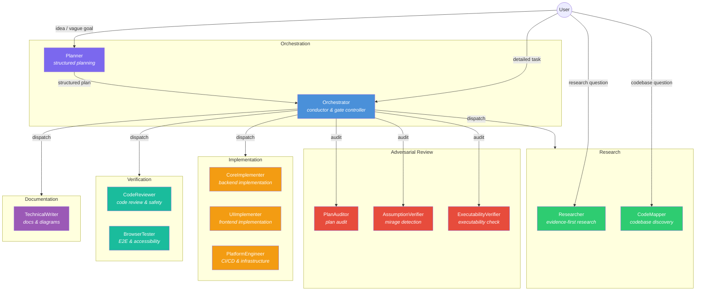
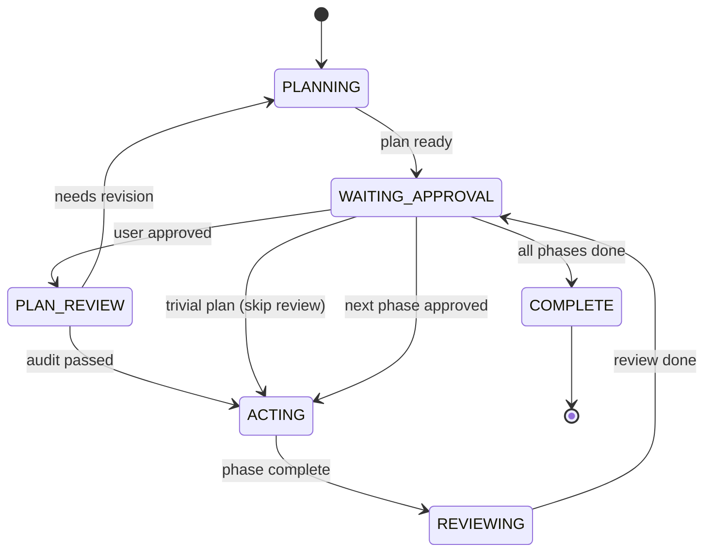

# ControlFlow

[](https://github.com/Smithbox-ai/ControlFlow/actions/workflows/ci.yml)


A multi-agent orchestration system for VS Code Copilot. ControlFlow replaces single-agent workflows with a coordinated team of 13 specialized agents governed by deterministic **P.A.R.T contracts** (Prompt → Archive → Resources → Tools), structured text outputs, and reliability gates.

## How It Works

**Turn any vague idea into working code in three steps:**

```
1. @Planner  "Add OAuth login with Google"
   → Idea interview → phased plan → Mermaid architecture diagram

2. Approve the plan

3. @Orchestrator  (runs automatically)
   → PlanAuditor reviews → CoreImplementer + TechnicalWriter execute in parallel
   → CodeReviewer gates each phase → done
```

Each agent operates within strict P.A.R.T contracts — deterministic status outputs, least-privilege tool grants, and explicit failure classification — so you get predictable, auditable results instead of unpredictable single-agent sprawl.

## Key Features

- **Context-Efficient Output** — agents return structured text summaries instead of raw JSON, conserving context tokens across delegation chains.
- **Least-Privilege Tool Grants** — each agent's `tools:` frontmatter is trimmed to the minimum set required by its role.
- **Parallel Agent Execution** — Orchestrator dispatches independent subagents in parallel using wave-based execution from Planner plans.
- **Structured Planning** — Planner produces phased plans with `complexity_tier` required by schema, task IDs, dependencies, wave assignments, inter-phase contracts, failure expectations, and tier-gated Mermaid diagrams. Plans include a mandatory **Design Decisions** section (boundary changes, data/artifact flow, temporal choreography, constraints). MEDIUM-complexity plans with non-trivial orchestration flow and all LARGE plans require a `sequenceDiagram` in addition to the phase dependency DAG. `AssumptionVerifier-subagent` and `ExecutabilityVerifier-subagent` are review-only roles, NOT valid `executor_agent` values.
- **Adversarial Plan Review** — PlanAuditor, AssumptionVerifier, and ExecutabilityVerifier audit complex plans before implementation begins.
- **Semantic Risk Discovery** — Planner evaluates 7 non-functional risk categories (`data_volume`, `performance`, `concurrency`, `access_control`, `migration_rollback`, `dependency`, `operability`) before research delegation. For TRIVIAL-tier plans, it emits 7 explicit `not_applicable` entries rather than a shortcut category.
- **Reliability Gates** — PreFlect (pre-execution review), human approval gates for destructive operations, and explicit abstention when confidence is low. Gate-event metadata (`trace_id`, `iteration_index`, `max_iterations`) are schema-required for execution continuity.
- **TDD Integration** — CodeReviewer and implementation agents enforce test-first methodology.
- **Failure Taxonomy** — all agents classify failures (`transient`, `fixable`, `needs_replan`, `escalate`) enabling automated retry and routing.
- **Batch Approval** — one approval per execution wave to reduce approval fatigue, with per-phase approval for destructive operations.
- **Health-First Testing** — BrowserTester verifies application health before running E2E scenarios to eliminate false positives.
- **Eval Command Coverage** — test suite covers 302 checks (179 structural + 74 behavior + 49 orchestration) running offline without live agents. F8 reference integrity scan validates all internal links in `README.md` and `docs/agent-engineering/*.md`. Behavior suite includes Design Step contract checks, tier-gated diagram policy assertions, and template structure validation.
- **Skill Library** — 7 domain-specific skill patterns (Testing, Error Handling, Security, Performance, Completeness, Integration, Idea-to-Prompt) that Planner selects per phase and implementation agents load at execution time.

## Getting Started — When to Use Which Agent

| Scenario | Agent | Why |
| -------- | ----- | --- |
| Abstract idea or vague goal | `@Planner` | Conducts an idea interview, structures the prompt, produces a phased implementation plan with architecture decisions and Mermaid diagrams. |
| Detailed task with clear requirements | `@Orchestrator` | Dispatches subagents directly, runs verification gates, and manages the full implementation cycle phase by phase. |
| Research question | `@Researcher` | Deep evidence-based investigation with confidence scores and source citations. |
| Quick codebase exploration | `@CodeMapper` | Fast read-only discovery — finds files, dependencies, and entry points without modifying anything. |

**Typical workflow:** Start with `@Planner` to author a structured implementation plan for any non-trivial task. Review and approve the generated plan. Then invoke `@Orchestrator` to execute it.

Planner authors plans, and Orchestrator owns the reviewed execution of those plans, handling all subagent coordination, review gates, and approvals automatically.

## Agent Interaction Architecture



## Pipeline by Complexity

ControlFlow adjusts its pipeline depth based on plan complexity. Simpler tasks skip unnecessary review stages.

| Tier | Scope | Review Agents | Max Iterations |
| ---- | ----- | ------------- | -------------- |
| **TRIVIAL** | 1–2 files, single concern | None — PLAN_REVIEW skipped (CodeReviewer still runs per-phase) | — |
| **SMALL** | 3–5 files, single domain | PlanAuditor | 2 |
| **MEDIUM** | 6–15 files, cross-domain | PlanAuditor + AssumptionVerifier | 5 |
| **LARGE** | 15+ files, system-wide | PlanAuditor + AssumptionVerifier + ExecutabilityVerifier | 5 |

Any plan with an unresolved `HIGH`-impact `risk_review` entry forces the full pipeline regardless of tier.

## Orchestration State Machine

> Simplified — REJECTED transition, HIGH_RISK_APPROVAL_GATE, and ABSTAIN paths omitted for clarity. See `Orchestrator.agent.md` for the full state machine.



## Failure Routing

| Classification | Action | Max Retries |
| -------------- | ------ | ----------- |
| `transient` | Retry same agent | 3 |
| `fixable` | Retry with fix hint | 1 |
| `needs_replan` | Delegate to Planner | 1 |
| `escalate` | Stop — present to user | 0 |

When any retry budget is exhausted, the phase escalates to the user with accumulated failure evidence.

## Agent Architecture

### Primary Agents

| Agent | File | Model | Role |
| ----- | ---- | ----- | ---- |
| **Orchestrator** | `Orchestrator.agent.md` | Claude Sonnet 4.6 | Conductor, gate controller, delegation |
| **Planner** | `Planner.agent.md` | Claude Opus 4.6 | Structured planning, idea interviews |

### Specialized Subagents

| Agent | File | Model | Role |
| ----- | ---- | ----- | ---- |
| **Researcher** | `Researcher-subagent.agent.md` | GPT-5.4 | Evidence-first research |
| **CodeMapper** | `CodeMapper-subagent.agent.md` | GPT-5.4 mini | Read-only codebase discovery |
| **CodeReviewer** | `CodeReviewer-subagent.agent.md` | GPT-5.4 | Code review and safety gates |
| **PlanAuditor** | `PlanAuditor-subagent.agent.md` | GPT-5.4 | Adversarial plan audit |
| **AssumptionVerifier** | `AssumptionVerifier-subagent.agent.md` | Claude Sonnet 4.6 | Assumption-fact confusion detection |
| **ExecutabilityVerifier** | `ExecutabilityVerifier-subagent.agent.md` | Claude Sonnet 4.6 | Cold-start plan executability simulation |
| **CoreImplementer** | `CoreImplementer-subagent.agent.md` | Claude Sonnet 4.6 | Backend implementation |
| **UIImplementer** | `UIImplementer-subagent.agent.md` | Gemini 3.1 Pro (Preview) | Frontend implementation |
| **PlatformEngineer** | `PlatformEngineer-subagent.agent.md` | Claude Sonnet 4.6 | CI/CD, containers, infrastructure |
| **TechnicalWriter** | `TechnicalWriter-subagent.agent.md` | Gemini 3.1 Pro (Preview) | Documentation, diagrams, code-doc parity |
| **BrowserTester** | `BrowserTester-subagent.agent.md` | GPT-5.4 mini | E2E browser testing, accessibility audits |

### Clarification & Tool Routing

Planner and Orchestrator own user-facing clarification via `askQuestions`. Acting subagents (CoreImplementer, UIImplementer, PlatformEngineer, TechnicalWriter, BrowserTester) return structured `NEEDS_INPUT` with `clarification_request` when they encounter ambiguity. Read-only agents (Researcher, CodeMapper, CodeReviewer, PlanAuditor, AssumptionVerifier, ExecutabilityVerifier) return findings, verdicts, or `ABSTAIN` — they do not interact with the user directly.

The `clarification_request` payload is governed by `schemas/clarification-request.schema.json`. Each agent has role-specific routing rules for external tools — see `docs/agent-engineering/TOOL-ROUTING.md` and `docs/agent-engineering/CLARIFICATION-POLICY.md`.

## Reliability Model

| Dimension | Description |
| --------- | ----------- |
| **Consistency** | Deterministic statuses and gate transitions |
| **Robustness** | Graceful behavior under paraphrase and naming drift |
| **Predictability** | Explicit abstention when confidence or evidence is low |
| **Safety** | Mandatory human approval for destructive/irreversible operations |
| **Failure Taxonomy** | `transient` / `fixable` / `needs_replan` / `escalate` classification for automated routing |
| **Clarification Reliability** | Proactive `askQuestions` for enumerated ambiguity classes; structured `NEEDS_INPUT` for conductor routing |
| **Tool Routing** | Deterministic rules for local search vs external fetch vs MCP, no phantom grants |
| **Retry Reliability** | Silent failure detection, retry budgets, per-wave throttling, escalation thresholds |

Reference: `docs/agent-engineering/RELIABILITY-GATES.md`.

## Installation

### Quick Start (First Run)

1. Clone this repository.
2. Copy the entire repo contents to your VS Code prompts directory (or symlink it).
3. Enable custom agents in VS Code settings:
   ```json
   {
     "chat.customAgentInSubagent.enabled": true,
     "github.copilot.chat.responsesApiReasoningEffort": "high"
   }
   ```
4. Reload VS Code.
5. Test: type `@Planner` in Copilot Chat — you should see the agent listed.

### Manual Installation (Selective)

1. Copy `*.agent.md` files to your VS Code prompts directory.
2. Copy the following directories alongside the agent files:
   - `schemas/` — JSON Schema contracts
   - `docs/` — Governance policies
   - `plans/` — Plan artifacts and templates
   - `governance/` — Operational knobs and tool grants
   - `skills/` — Domain pattern library
3. Copy `.github/copilot-instructions.md` alongside the agent files (required by all executor agents).
4. Reload VS Code.

### Verify Installation

1. Confirm directories exist: `schemas/`, `docs/agent-engineering/`, `plans/`, `governance/`, `skills/`, `evals/`.
2. Confirm VS Code settings:
   ```json
   { "chat.customAgentInSubagent.enabled": true }
   ```
3. Run evals:
   ```bash
   cd evals && npm install && npm test
   ```
4. Smoke test: type `@Planner` or `@Orchestrator` in Copilot Chat — agents should appear in suggestions.

### Install Eval Dependencies

```bash
cd evals && npm install
```

## Configuration

### Adding Custom Agents

Create a new `.agent.md` file following the P.A.R.T structure (Prompt → Archive → Resources → Tools). Use any existing agent as a template.

Every custom agent should include:

- A JSON Schema contract in `schemas/` for documentation.
- Non-Negotiable Rules (no fabrication, abstain on uncertainty).
- Explicit tool restrictions in the `## Tools` section.

## Requirements

- VS Code Insiders recommended.
- GitHub Copilot with custom agent support.

## Design Principles

### P.A.R.T Contract Architecture

Every agent follows a four-section structure — **Prompt** (mission, scope, deterministic contracts), **Archive** (memory policies, context compaction), **Resources** (file references, loaded on-demand), **Tools** (allowed/disallowed with routing rules). This eliminates ambiguity in agent behavior and makes contracts auditable.

### Structured Text Over JSON

Agents return structured text summaries with clearly labeled fields instead of raw JSON objects. This conserves context tokens in multi-agent delegation chains where the orchestrating LLM reads text — not programmatically parses JSON. Schema files in `schemas/` are retained as documentation contracts and eval references.

### Least-Privilege Delegation

Each agent receives only the tools required by its role. Implementation agents cannot access `askQuestions`. Read-only agents cannot modify files. Orchestrator cannot bypass approval gates. Tool grants are declared in frontmatter and enforced by body-level routing rules.

### Adversarial Review Pipeline

Complex plans pass through up to three independent reviewers — PlanAuditor (architecture and risk), AssumptionVerifier (assumption-fact confusion detection), and ExecutabilityVerifier (cold-start executability simulation) — before implementation begins. The pipeline depth scales with plan complexity.

### Wave-Based Parallel Execution

Planner assigns phases to execution waves. Orchestrator dispatches all phases within a wave in parallel, waits for completion, then advances to the next wave. This maximizes throughput while respecting inter-phase dependencies.

### Failure Taxonomy and Automated Recovery

All agents classify failures into four categories. Orchestrator routes each category through a deterministic retry/escalation path. Retry budgets, per-wave throttling, and escalation thresholds prevent infinite loops and cascading failures.

## Evaluation Suite

The `evals/` directory contains structural, behavioral, and orchestration validation fixtures. Run `cd evals && npm test` to verify schema compliance, reference integrity, P.A.R.T section ordering, tool grant consistency, behavioral invariants, and orchestration handoff discipline across all agents (302 checks total: 179 structural + 74 behavior + 49 orchestration). See `evals/README.md` for details.

## Project Structure

```text
├── Orchestrator.agent.md          # Conductor agent
├── Planner.agent.md               # Planning agent
├── *-subagent.agent.md            # 11 specialized subagents
├── .github/
│   └── copilot-instructions.md    # Shared agent policy (read by all executor agents)
├── schemas/                       # JSON Schema contracts (documentation only)
├── docs/agent-engineering/        # Governance policies and reliability gates
├── governance/                    # Operational knobs and tool grants
├── skills/                        # Reusable domain pattern library
├── evals/                         # Structural, behavioral, and orchestration validation suite
│   └── scenarios/                 # Eval scenario fixtures
└── plans/                         # Plan artifacts and templates
    └── templates/                 # Orchestrator document templates
```

## License

MIT License

Copyright (c) 2026 ControlFlow Contributors

Permission is hereby granted, free of charge, to any person obtaining a copy
of this software and associated documentation files (the "Software"), to deal
in the Software without restriction, including without limitation the rights
to use, copy, modify, merge, publish, distribute, sublicense, and/or sell
copies of the Software, and to permit persons to whom the Software is
furnished to do so, subject to the following conditions:

The above copyright notice and this permission notice shall be included in all
copies or substantial portions of the Software.

THE SOFTWARE IS PROVIDED "AS IS", WITHOUT WARRANTY OF ANY KIND, EXPRESS OR
IMPLIED, INCLUDING BUT NOT LIMITED TO THE WARRANTIES OF MERCHANTABILITY,
FITNESS FOR A PARTICULAR PURPOSE AND NONINFRINGEMENT. IN NO EVENT SHALL THE
AUTHORS OR COPYRIGHT HOLDERS BE LIABLE FOR ANY CLAIM, DAMAGES OR OTHER
LIABILITY, WHETHER IN AN ACTION OF CONTRACT, TORT OR OTHERWISE, ARISING FROM,
OUT OF OR IN CONNECTION WITH THE SOFTWARE OR THE USE OR OTHER DEALINGS IN THE
SOFTWARE.

## Acknowledgments

ControlFlow was inspired by and builds upon ideas from:

- [Github-Copilot-Atlas](https://github.com/bigguy345/Github-Copilot-Atlas) — original multi-agent orchestration concept for VS Code Copilot.
- [claude-bishx](https://github.com/bish-x/claude-bishx) — agent engineering patterns and structured workflows.
- [copilot-orchestra](https://github.com/ShepAlderson/copilot-orchestra)
- [oh-my-opencode](https://github.com/code-yeongyu/oh-my-opencode)
