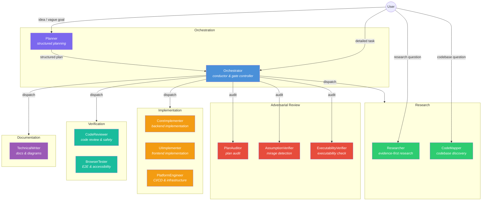
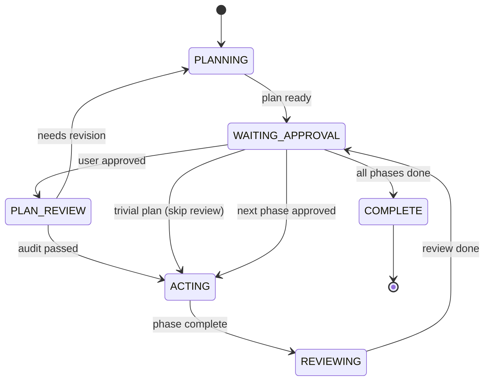

# ControlFlow

[](https://github.com/Smithbox-ai/ControlFlow/actions/workflows/ci.yml)


A multi-agent orchestration system for VS Code Copilot. ControlFlow replaces single-agent workflows with a coordinated team of 13 specialized agents governed by deterministic **P.A.R.T contracts** (Prompt → Archive → Resources → Tools), structured text outputs, and reliability gates.

## Why ControlFlow?

| | Single Agent | ControlFlow (13 agents) |
|---|---|---|
| **Planning** | Agent guesses architecture on-the-fly | Planner runs structured idea interview, produces phased plan with Mermaid diagrams |
| **Quality gates** | None — hope for the best | PlanAuditor + AssumptionVerifier + ExecutabilityVerifier audit before implementation |
| **Execution** | Sequential, monolithic | Wave-based parallel execution with inter-phase contracts |
| **Failures** | Silent or catastrophic | Classified (`transient`/`fixable`/`needs_replan`/`escalate`) with automatic retry routing |
| **Scope drift** | Common — agent "improves" unrelated code | [LLM Behavior Guidelines](skills/patterns/llm-behavior-guidelines.md) enforce surgical changes |
| **Verification** | Manual | 410 offline eval checks + CodeReviewer gates every phase |

## Quick Start (60 Seconds)

```bash
# 1. Clone and set up
git clone https://github.com/Smithbox-ai/ControlFlow.git
# 2. Copy contents to your VS Code prompts directory (or symlink)
#    Windows: %APPDATA%\Code\User\prompts
#    macOS:   ~/Library/Application Support/Code/User/prompts
#    Linux:   ~/.config/Code/User/prompts
# 3. Enable in VS Code settings:
```
```json
{ "chat.customAgentInSubagent.enabled": true }
```
```
4. Reload VS Code → type @Planner in Copilot Chat → done
```

> **First task?** Type `@Planner "Add OAuth login with Google"` — the system handles the rest.

## When to Use Which Agent

| Scenario | Agent | What happens |
| -------- | ----- | ------------ |
| Abstract idea or vague goal | `@Planner` | Idea interview → phased plan → Mermaid diagram |
| Detailed task, clear requirements | `@Orchestrator` | Dispatches subagents → verification gates → phase-by-phase execution |
| Research question | `@Researcher` | Evidence-based investigation with confidence scores |
| Quick codebase exploration | `@CodeMapper` | Read-only discovery — files, dependencies, entry points |

**Typical workflow:** `@Planner` authors a plan → you approve → `@Orchestrator` executes it with full subagent coordination, review gates, and approvals.

## Key Features

| Feature | Description |
|---------|-------------|
| **Structured Planning** | Phased plans with complexity tiers, task IDs, wave assignments, Mermaid diagrams, and mandatory Design Decisions section |
| **Adversarial Plan Review** | Up to 3 independent reviewers (PlanAuditor, AssumptionVerifier, ExecutabilityVerifier) audit plans before implementation |
| **Semantic Risk Discovery** | 7 non-functional risk categories evaluated before research delegation |
| **Wave-Based Parallel Execution** | Independent phases dispatched in parallel, respecting inter-phase dependencies |
| **Failure Taxonomy** | `transient`/`fixable`/`needs_replan`/`escalate` with deterministic retry routing |
| **Least-Privilege Tool Grants** | Each agent's tools trimmed to the minimum required by its role |
| **Context-Efficient Output** | Structured text summaries instead of raw JSON — saves context tokens across delegation chains |
| **Reliability Gates** | PreFlect pre-execution review, human approval for destructive ops, explicit abstention on low confidence |
| **TDD Integration** | CodeReviewer and implementation agents enforce test-first methodology |
| **Final Review Gate (optional)** | Cross-phase scope-drift detection at plan completion; opt-in via `governance/runtime-policy.json` |
| **Batch Approval** | One approval per wave; per-phase for destructive operations |
| **Health-First Testing** | BrowserTester verifies app health before E2E scenarios |
| **410 Offline Eval Checks** | 227 structural + 78 behavior + 63 orchestration + 42 drift-detection — no live agents needed |
| **8 Skill Patterns** | Testing, Error Handling, Security, Performance, Completeness, Integration, Idea-to-Prompt, [LLM Behavior Guidelines](skills/patterns/llm-behavior-guidelines.md) |
| **Model Routing** | Logical role indirection in `governance/model-routing.json` decouples agents from pinned model names. Runtime opt-in (`model_role:` in frontmatter) deferred pending VS Code frontmatter-tolerance verification — currently shipped as logical index only. See [docs/agent-engineering/MODEL-ROUTING.md](docs/agent-engineering/MODEL-ROUTING.md) |
| **Observability & `trace_id`** | UUIDv4 `trace_id` flows through delegation events and all 13 report/verdict schemas as an additive-optional field; NDJSON event sinks under `plans/artifacts/observability/<task-id>.ndjson`. See [docs/agent-engineering/OBSERVABILITY.md](docs/agent-engineering/OBSERVABILITY.md) |
| **Memory Layers** | Three-layer memory model — session (volatile), task-episodic (`plans/artifacts/<task-slug>/`), and repo-persistent (`NOTES.md`). See [docs/agent-engineering/MEMORY-ARCHITECTURE.md](docs/agent-engineering/MEMORY-ARCHITECTURE.md) |
| **Reflection Loop** | Pre-retry analysis hook triggered on `FAILED` / `NEEDS_REVISION`; retries draw from existing `retry_budgets` counters (no compounding). Default disabled. See [skills/patterns/reflection-loop.md](skills/patterns/reflection-loop.md) |
| **Budget Tracking** | Optional per-task `token_cap`, `wall_clock_s`, and `cost_usd` caps; early-stop classified `escalate`. Orthogonal to `retry_budgets`. See [skills/patterns/budget-tracking.md](skills/patterns/budget-tracking.md) |
| **Agent-as-Tool** | MCP forward-compatible subagent input contract (`scope`, `context_refs`, `trace_id`, `iteration_index`) preparing agents for native tool surfacing. See [docs/agent-engineering/AGENT-AS-TOOL.md](docs/agent-engineering/AGENT-AS-TOOL.md) |
| **Drift-Detection Evals** | Roster↔enum bidirectional alignment, agent Resources↔schemas existence, cross-plan file-overlap (anchor-map gated), and multi-doc check-count consistency |

## Agent Interaction Architecture



## Pipeline by Complexity

ControlFlow adjusts its pipeline depth based on plan complexity. Simpler tasks skip unnecessary review stages.

| Tier | Scope | Review Agents | Max Iterations |
| ---- | ----- | ------------- | -------------- |
| **TRIVIAL** | 1–2 files, single concern | None — PLAN_REVIEW skipped (CodeReviewer still runs per-phase) | — |
| **SMALL** | 3–5 files, single domain | PlanAuditor | 2 |
| **MEDIUM** | 6–15 files, cross-domain | PlanAuditor + AssumptionVerifier | 5 |
| **LARGE** | 15+ files, system-wide | PlanAuditor + AssumptionVerifier + ExecutabilityVerifier | 5 |

Any plan with an unresolved `HIGH`-impact `risk_review` entry forces the full pipeline regardless of tier.

## Orchestration State Machine

> Simplified — REJECTED transition, HIGH_RISK_APPROVAL_GATE, and ABSTAIN paths omitted for clarity. See `Orchestrator.agent.md` for the full state machine.



## Failure Routing

| Classification | Action | Max Retries |
| -------------- | ------ | ----------- |
| `transient` | Retry same agent | 3 |
| `fixable` | Retry with fix hint | 1 |
| `needs_replan` | Delegate to Planner | 1 |
| `escalate` | Stop — present to user | 0 |

When any retry budget is exhausted, the phase escalates to the user with accumulated failure evidence.

## Agent Architecture

### Primary Agents

| Agent | File | Model | Role |
| ----- | ---- | ----- | ---- |
| **Orchestrator** | `Orchestrator.agent.md` | Claude Sonnet 4.6 | Conductor, gate controller, delegation |
| **Planner** | `Planner.agent.md` | Claude Opus 4.6 | Structured planning, idea interviews |

### Specialized Subagents

| Agent | File | Model | Role |
| ----- | ---- | ----- | ---- |
| **Researcher** | `Researcher-subagent.agent.md` | GPT-5.4 | Evidence-first research |
| **CodeMapper** | `CodeMapper-subagent.agent.md` | GPT-5.4 mini | Read-only codebase discovery |
| **CodeReviewer** | `CodeReviewer-subagent.agent.md` | GPT-5.4 | Code review and safety gates |
| **PlanAuditor** | `PlanAuditor-subagent.agent.md` | GPT-5.4 | Adversarial plan audit |
| **AssumptionVerifier** | `AssumptionVerifier-subagent.agent.md` | Claude Sonnet 4.6 | Assumption-fact confusion detection |
| **ExecutabilityVerifier** | `ExecutabilityVerifier-subagent.agent.md` | Claude Sonnet 4.6 | Cold-start plan executability simulation |
| **CoreImplementer** | `CoreImplementer-subagent.agent.md` | Claude Sonnet 4.6 | Backend implementation |
| **UIImplementer** | `UIImplementer-subagent.agent.md` | Gemini 3.1 Pro (Preview) | Frontend implementation |
| **PlatformEngineer** | `PlatformEngineer-subagent.agent.md` | Claude Sonnet 4.6 | CI/CD, containers, infrastructure |
| **TechnicalWriter** | `TechnicalWriter-subagent.agent.md` | Gemini 3.1 Pro (Preview) | Documentation, diagrams, code-doc parity |
| **BrowserTester** | `BrowserTester-subagent.agent.md` | GPT-5.4 mini | E2E browser testing, accessibility audits |

### Clarification & Tool Routing

Planner and Orchestrator own user-facing clarification via `askQuestions`. Acting subagents (CoreImplementer, UIImplementer, PlatformEngineer, TechnicalWriter, BrowserTester) return structured `NEEDS_INPUT` with `clarification_request` when they encounter ambiguity. Read-only agents (Researcher, CodeMapper, CodeReviewer, PlanAuditor, AssumptionVerifier, ExecutabilityVerifier) return findings, verdicts, or `ABSTAIN` — they do not interact with the user directly.

The `clarification_request` payload is governed by `schemas/clarification-request.schema.json`. Each agent has role-specific routing rules for external tools — see `docs/agent-engineering/TOOL-ROUTING.md` and `docs/agent-engineering/CLARIFICATION-POLICY.md`.

## Reliability Model

| Dimension | Description |
| --------- | ----------- |
| **Consistency** | Deterministic statuses and gate transitions |
| **Robustness** | Graceful behavior under paraphrase and naming drift |
| **Predictability** | Explicit abstention when confidence or evidence is low |
| **Safety** | Mandatory human approval for destructive/irreversible operations |
| **Failure Taxonomy** | `transient` / `fixable` / `needs_replan` / `escalate` classification for automated routing |
| **Clarification Reliability** | Proactive `askQuestions` for enumerated ambiguity classes; structured `NEEDS_INPUT` for conductor routing |
| **Tool Routing** | Deterministic rules for local search vs external fetch vs MCP, no phantom grants |
| **Retry Reliability** | Silent failure detection, retry budgets, per-wave throttling, escalation thresholds |

Reference: `docs/agent-engineering/RELIABILITY-GATES.md`.

## Installation

### Quick Start (First Run)

> **VS Code prompts directory paths:**
> - **Windows:** `%APPDATA%\Code\User\prompts` (e.g. `C:\Users\<you>\AppData\Roaming\Code\User\prompts`)
> - **macOS:** `~/Library/Application Support/Code/User/prompts`
> - **Linux:** `~/.config/Code/User/prompts`

1. Clone this repository.
2. Copy the entire repo contents into the prompts directory above (or symlink the repo there).
3. Enable custom agents in VS Code settings:
   ```json
   {
     "chat.customAgentInSubagent.enabled": true,
     "github.copilot.chat.responsesApiReasoningEffort": "high"
   }
   ```
4. Reload VS Code.
5. Verify: type `@Planner` in Copilot Chat — you should see the agent listed.
6. Run evals: `cd evals && npm install && npm test`

### Manual Installation (Selective)

Copy only what you need into the prompts directory (same paths as above):

1. `*.agent.md` files — the agents themselves
2. `schemas/` — JSON Schema contracts (referenced by agents)
3. `docs/agent-engineering/` — governance policies (referenced by agents at runtime)
4. `plans/` — plan artifacts and templates
5. `governance/` — operational knobs and tool grants
6. `skills/` — domain pattern library
7. `.github/copilot-instructions.md` — **required** — shared policy read by all executor agents

Without `.github/copilot-instructions.md` agents will not have access to shared failure classification, conventions, and governance references.

### Verify Installation

```bash
cd evals && npm install && npm test
```

Smoke test: type `@Planner` or `@Orchestrator` in Copilot Chat — agents should appear in suggestions.

## Configuration

### Adding Custom Agents

Create a new `.agent.md` file following the P.A.R.T structure (Prompt → Archive → Resources → Tools). Use any existing agent as a template.

Every custom agent should include:

- A JSON Schema contract in `schemas/` for documentation.
- Non-Negotiable Rules (no fabrication, abstain on uncertainty).
- Explicit tool restrictions in the `## Tools` section.

## Requirements

- VS Code Insiders recommended.
- GitHub Copilot with custom agent support.

## Design Principles

### P.A.R.T Contract Architecture

Every agent follows a four-section structure — **Prompt** (mission, scope, deterministic contracts), **Archive** (memory policies, context compaction), **Resources** (file references, loaded on-demand), **Tools** (allowed/disallowed with routing rules). This eliminates ambiguity in agent behavior and makes contracts auditable.

### Structured Text Over JSON

Agents return structured text summaries with clearly labeled fields instead of raw JSON objects. This conserves context tokens in multi-agent delegation chains where the orchestrating LLM reads text — not programmatically parses JSON. Schema files in `schemas/` are retained as documentation contracts and eval references.

### Least-Privilege Delegation

Each agent receives only the tools required by its role. Implementation agents cannot access `askQuestions`. Read-only agents cannot modify files. Orchestrator cannot bypass approval gates. Tool grants are declared in frontmatter and enforced by body-level routing rules.

### Adversarial Review Pipeline

Complex plans pass through up to three independent reviewers — PlanAuditor (architecture and risk), AssumptionVerifier (assumption-fact confusion detection), and ExecutabilityVerifier (cold-start executability simulation) — before implementation begins. The pipeline depth scales with plan complexity.

### Wave-Based Parallel Execution

Planner assigns phases to execution waves. Orchestrator dispatches all phases within a wave in parallel, waits for completion, then advances to the next wave. This maximizes throughput while respecting inter-phase dependencies.

### Failure Taxonomy and Automated Recovery

All agents classify failures into four categories. Orchestrator routes each category through a deterministic retry/escalation path. Retry budgets, per-wave throttling, and escalation thresholds prevent infinite loops and cascading failures.

## Evaluation Suite

The `evals/` directory contains structural, behavioral, orchestration, and drift-detection validation fixtures. Run `cd evals && npm test` to verify schema compliance, reference integrity, P.A.R.T section ordering, tool grant consistency, behavioral invariants, orchestration handoff discipline, and documentation drift across all agents (410 checks total: 227 structural + 78 behavior + 63 orchestration + 42 drift-detection). See `evals/README.md` for details.

## Project Structure

```text
├── Orchestrator.agent.md          # Conductor agent
├── Planner.agent.md               # Planning agent
├── *-subagent.agent.md            # 11 specialized subagents
├── .github/
│   └── copilot-instructions.md    # Shared agent policy (read by all executor agents)
├── schemas/                       # JSON Schema contracts (documentation only)
├── docs/agent-engineering/        # Governance policies and reliability gates
├── governance/                    # Operational knobs and tool grants
├── skills/                        # Reusable domain pattern library
├── evals/                         # Structural, behavioral, and orchestration validation suite
│   └── scenarios/                 # Eval scenario fixtures
└── plans/                         # Plan artifacts and templates
    └── templates/                 # Orchestrator document templates
```

## License

MIT License

Copyright (c) 2026 ControlFlow Contributors

Permission is hereby granted, free of charge, to any person obtaining a copy
of this software and associated documentation files (the "Software"), to deal
in the Software without restriction, including without limitation the rights
to use, copy, modify, merge, publish, distribute, sublicense, and/or sell
copies of the Software, and to permit persons to whom the Software is
furnished to do so, subject to the following conditions:

The above copyright notice and this permission notice shall be included in all
copies or substantial portions of the Software.

THE SOFTWARE IS PROVIDED "AS IS", WITHOUT WARRANTY OF ANY KIND, EXPRESS OR
IMPLIED, INCLUDING BUT NOT LIMITED TO THE WARRANTIES OF MERCHANTABILITY,
FITNESS FOR A PARTICULAR PURPOSE AND NONINFRINGEMENT. IN NO EVENT SHALL THE
AUTHORS OR COPYRIGHT HOLDERS BE LIABLE FOR ANY CLAIM, DAMAGES OR OTHER
LIABILITY, WHETHER IN AN ACTION OF CONTRACT, TORT OR OTHERWISE, ARISING FROM,
OUT OF OR IN CONNECTION WITH THE SOFTWARE OR THE USE OR OTHER DEALINGS IN THE
SOFTWARE.

## Acknowledgments

ControlFlow was inspired by and builds upon ideas from:

- [Github-Copilot-Atlas](https://github.com/bigguy345/Github-Copilot-Atlas) — original multi-agent orchestration concept for VS Code Copilot.
- [claude-bishx](https://github.com/bish-x/claude-bishx) — agent engineering patterns and structured workflows.
- [copilot-orchestra](https://github.com/ShepAlderson/copilot-orchestra)
- [oh-my-opencode](https://github.com/code-yeongyu/oh-my-opencode)
