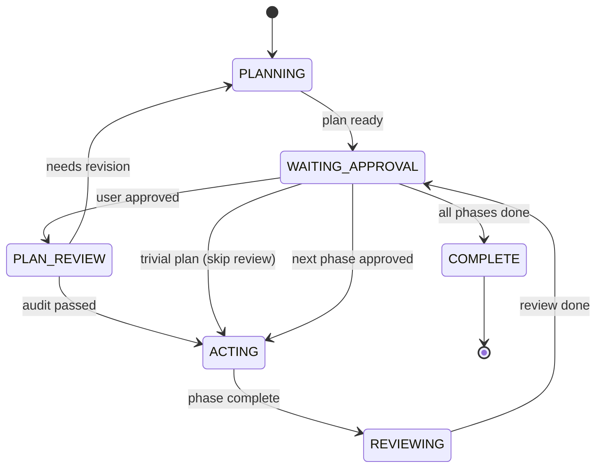
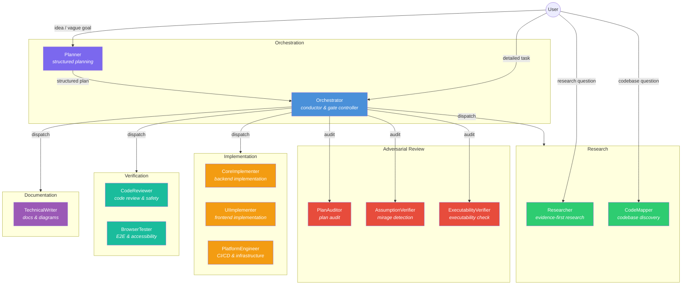

# ControlFlow

[](https://github.com/Smithbox-ai/ControlFlow/actions/workflows/ci.yml)


A multi-agent orchestration system for VS Code Copilot. ControlFlow coordinates 13 specialized agents under deterministic **P.A.R.T contracts** (Prompt → Archive → Resources → Tools), structured text outputs, and layered reliability gates.

---

## Contents

- [Why ControlFlow?](#why-controlflow)
- [Quick Start](#quick-start)
- [When to Use Which Agent](#when-to-use-which-agent)
- [Pipeline by Complexity](#pipeline-by-complexity)
- [Orchestration State Machine](#orchestration-state-machine)
- [Failure Routing](#failure-routing)
- [Agent Architecture](#agent-architecture)
- [Evaluation Suite](#evaluation-suite)
- [Project Structure](#project-structure)
- [Documentation](#documentation)
- [Installation](#installation)
- [License](#license)

---

## Why ControlFlow?

| | Single Agent | ControlFlow (13 agents) |
|---|---|---|
| **Planning** | Agent guesses architecture on-the-fly | Planner runs structured idea interview, produces phased plan with Mermaid diagrams |
| **Quality gates** | None | PlanAuditor + AssumptionVerifier + ExecutabilityVerifier audit before implementation |
| **Execution** | Sequential, monolithic | Wave-based parallel execution with inter-phase contracts |
| **Failures** | Silent or catastrophic | Classified (`transient`/`fixable`/`needs_replan`/`escalate`) with automatic retry routing |
| **Scope drift** | Common | [LLM Behavior Guidelines](skills/patterns/llm-behavior-guidelines.md) enforce surgical changes |
| **Verification** | Manual | Offline eval suite + CodeReviewer gates every phase |

---

## Quick Start

```bash
# 1. Clone
git clone https://github.com/Smithbox-ai/ControlFlow.git

# 2. Copy to your VS Code prompts directory (or symlink)
#    Windows: %APPDATA%\Code\User\prompts
#    macOS:   ~/Library/Application Support/Code/User/prompts
#    Linux:   ~/.config/Code/User/prompts

# 3. Enable in VS Code settings:
#    { "chat.customAgentInSubagent.enabled": true,
#      "github.copilot.chat.responsesApiReasoningEffort": "high" }

# 4. Reload VS Code → type @Planner in Copilot Chat

# 5. Verify evals
cd evals && npm install && npm test
```

> **First task?** Type `@Planner "Add OAuth login with Google"` — the system handles the rest.

---

## When to Use Which Agent

| Scenario | Agent | What happens |
|----------|-------|--------------|
| Abstract idea or vague goal | `@Planner` | Idea interview → phased plan → Mermaid diagram |
| Detailed task, clear requirements | `@Orchestrator` | Dispatches subagents → verification gates → phase-by-phase execution |
| Research question | `@Researcher` | Evidence-based investigation with confidence scores |
| Quick codebase exploration | `@CodeMapper` | Read-only discovery — files, dependencies, entry points |

**Typical workflow:** `@Planner` authors a plan → you approve → `@Orchestrator` executes it with full subagent coordination, review gates, and approvals.

---

## Pipeline by Complexity

| Tier | Scope | Review Agents | Max Iterations |
|------|-------|---------------|----------------|
| **TRIVIAL** | 1–2 files, single concern | None (CodeReviewer still runs per-phase) | — |
| **SMALL** | 3–5 files, single domain | PlanAuditor | 2 |
| **MEDIUM** | 6–15 files, cross-domain | PlanAuditor + AssumptionVerifier | 5 |
| **LARGE** | 15+ files, system-wide | PlanAuditor + AssumptionVerifier + ExecutabilityVerifier | 5 |

Any plan with an unresolved `HIGH`-impact `risk_review` entry forces the full pipeline regardless of tier.

---

## Orchestration State Machine

<details>
<summary>Mermaid diagram (click to expand)</summary>



> Simplified — REJECTED transition, HIGH_RISK_APPROVAL_GATE, and ABSTAIN paths omitted for clarity. See `Orchestrator.agent.md` for the full state machine.

</details>

---

## Failure Routing

| Classification | Action | Max Retries |
|----------------|--------|-------------|
| `transient` | Retry same agent | 3 |
| `fixable` | Retry with fix hint | 1 |
| `needs_replan` | Delegate to Planner | 1 |
| `escalate` | Stop — present to user | 0 |

When any retry budget is exhausted the phase escalates to the user with accumulated failure evidence.

---

## Agent Architecture

### Interaction diagram

<details>
<summary>Mermaid diagram (click to expand)</summary>



</details>

### Primary Agents

| Agent | File | Role |
|-------|------|------|
| **Orchestrator** | `Orchestrator.agent.md` | Conductor, gate controller, delegation |
| **Planner** | `Planner.agent.md` | Structured planning, idea interviews |

### Specialized Subagents

| Agent | File | Role |
|-------|------|------|
| **Researcher** | `Researcher-subagent.agent.md` | Evidence-first research |
| **CodeMapper** | `CodeMapper-subagent.agent.md` | Read-only codebase discovery |
| **CodeReviewer** | `CodeReviewer-subagent.agent.md` | Code review and safety gates |
| **PlanAuditor** | `PlanAuditor-subagent.agent.md` | Adversarial plan audit |
| **AssumptionVerifier** | `AssumptionVerifier-subagent.agent.md` | Assumption-fact confusion detection |
| **ExecutabilityVerifier** | `ExecutabilityVerifier-subagent.agent.md` | Cold-start plan executability simulation |
| **CoreImplementer** | `CoreImplementer-subagent.agent.md` | Backend implementation |
| **UIImplementer** | `UIImplementer-subagent.agent.md` | Frontend implementation |
| **PlatformEngineer** | `PlatformEngineer-subagent.agent.md` | CI/CD, containers, infrastructure |
| **TechnicalWriter** | `TechnicalWriter-subagent.agent.md` | Documentation, diagrams, code-doc parity |
| **BrowserTester** | `BrowserTester-subagent.agent.md` | E2E browser testing, accessibility audits |

Models are resolved at runtime via `governance/model-routing.json` — see [docs/agent-engineering/MODEL-ROUTING.md](docs/agent-engineering/MODEL-ROUTING.md).

---

## Evaluation Suite

`cd evals && npm test` runs the full offline suite — schema compliance, reference integrity, P.A.R.T section ordering, tool grant consistency, behavioral invariants, orchestration handoff discipline, and drift detection. No live agents, no network.

See [`evals/README.md`](evals/README.md) for pass descriptions and how to add scenarios.

---

## Project Structure

```text
├── Orchestrator.agent.md          # Conductor agent
├── Planner.agent.md               # Planning agent
├── *-subagent.agent.md            # 11 specialized subagents
├── .github/
│   └── copilot-instructions.md    # Shared agent policy (loaded by all agents)
├── schemas/                       # JSON Schema contracts
├── docs/
│   ├── agent-engineering/         # Governance policies and reliability gates
│   └── tutorial-ru/               # Full Russian-language tutorial (19 chapters)
├── governance/                    # Operational knobs and tool grants
├── skills/                        # Reusable domain pattern library (11 patterns)
├── evals/                         # Offline validation suite
│   └── scenarios/                 # Eval scenario fixtures
├── plans/                         # Plan artifacts and templates
└── NOTES.md                       # Active objective state (repo-persistent)
```

---

## Documentation

- **[docs/tutorial-ru/](docs/tutorial-ru/README.md)** — complete Russian-language tutorial: architecture, agents, orchestration, planning, review pipeline, schemas, governance, skills, memory, failure taxonomy, evals, case studies, exercises, glossary, FAQ.
- **[docs/agent-engineering/](docs/agent-engineering/)** — authoritative governance specs: P.A.R.T, reliability gates, clarification policy, tool routing, scoring, observability, memory architecture.
- **[CONTRIBUTING.md](CONTRIBUTING.md)** — how to add agents, schemas, eval scenarios.
- **[CHANGELOG.md](CHANGELOG.md)** — version history.

---

## Installation

> **VS Code prompts directory:**
> - **Windows:** `%APPDATA%\Code\User\prompts`
> - **macOS:** `~/Library/Application Support/Code/User/prompts`
> - **Linux:** `~/.config/Code/User/prompts`

1. Clone this repository.
2. Copy the entire repo contents into the prompts directory (or symlink the repo there).
3. Enable custom agents in VS Code settings:
   ```json
   {
     "chat.customAgentInSubagent.enabled": true,
     "github.copilot.chat.responsesApiReasoningEffort": "high"
   }
   ```
4. Reload VS Code.
5. Verify: type `@Planner` in Copilot Chat — the agent should appear in suggestions.
6. Run evals: `cd evals && npm install && npm test`

Without `.github/copilot-instructions.md` agents will not have access to shared failure classification, conventions, and governance references.

### Adding Custom Agents

Create a new `.agent.md` file following the P.A.R.T structure (Prompt → Archive → Resources → Tools). See [CONTRIBUTING.md](CONTRIBUTING.md) for the full 4-step process.

---

## License

MIT. Copyright (c) 2026 ControlFlow Contributors.

## Acknowledgments

ControlFlow was inspired by and builds upon ideas from:

- [Github-Copilot-Atlas](https://github.com/bigguy345/Github-Copilot-Atlas) — original multi-agent orchestration concept for VS Code Copilot.
- [claude-bishx](https://github.com/bish-x/claude-bishx) — agent engineering patterns and structured workflows.
- [copilot-orchestra](https://github.com/ShepAlderson/copilot-orchestra)
- [oh-my-opencode](https://github.com/code-yeongyu/oh-my-opencode)
