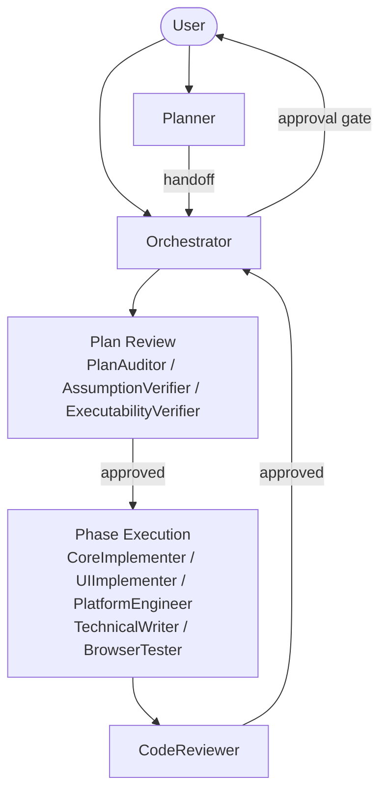

# Chapter 01 — Quick Start

## Why this chapter

Get oriented in the repository within 30 minutes. After this chapter you can open any agent file, run the eval harness, and follow an end-to-end task scenario step by step.

## Step 1: Repository Map

```
ControlFlow/
├── *.agent.md              ← 13 agent prompt files (P.A.R.T. structure)
├── schemas/                ← 15 JSON schemas (inter-agent contracts)
├── governance/             ← 5 JSON configs (permissions, policies, routing)
├── skills/
│   ├── index.md            ← Skill registry
│   └── patterns/           ← 11 reusable domain patterns
├── evals/                  ← Offline validation suite
│   ├── validate.mjs
│   ├── scenarios/          ← Regression fixtures
│   └── tests/
├── plans/
│   ├── project-context.md  ← Agent roster, tiers, taxonomy
│   ├── session-outcomes.md ← Persistent session log
│   ├── templates/          ← Plan and gate-event templates
│   └── artifacts/          ← Per-task history
├── docs/
│   └── agent-engineering/  ← Engineering policy docs
└── NOTES.md                ← Active objective state
```

## Step 2: Run the Eval Harness

The canonical verification command is:

```sh
cd evals && npm test
```

This runs ~410 offline checks — schema validation, behavioral invariants, orchestration handoff contracts, and drift detection. No live agents, no network calls.

Faster targeted runs:
```sh
npm run test:structural   # schemas and P.A.R.T. structure only
npm run test:behavior     # behavior + handoff + drift only
```

Run `npm install` once before `npm test` if you haven't already.

## Step 3: Agent Flow at a Glance



**Entry points:**
- `@Planner` — for vague goals; runs an idea interview, produces a phased plan.
- `@Orchestrator` — for a concrete task or an existing plan; dispatches subagents and manages gates.
- `@Researcher` — for evidence-based investigation.
- `@CodeMapper` — for quick codebase exploration.

## Step 4: Agents Are Markdown Files

Open `CoreImplementer-subagent.agent.md`. You will see:

- **YAML frontmatter** — `description`, `tools`, `model`, `model_role`.
- **## Prompt** — mission, scope, contracts, state machine.
- **## Archive** — context compaction, memory, state tracking.
- **## Resources** — canonical schemas and docs.
- **## Tools** — allowed and disallowed tools.

This is the **P.A.R.T.** structure — every `*.agent.md` follows it in exactly this order. → [Chapter 04](04-part-spec.md)

## Step 5: End-to-End Scenario (CSV Export)

**Task:** "Add CSV export to the orders page."

Here is a simplified walkthrough of what happens:

1. **User invokes `@Planner`** with the task description.
2. **Planner conducts an idea interview** if the scope is ambiguous (format? which endpoint? auth required?).
3. **Planner runs a clarification gate** — checks for scope ambiguity, architecture forks, destructive risks.
4. **Planner classifies complexity** — likely `SMALL` or `MEDIUM` (one domain, ~5 files).
5. **Planner selects skills** — e.g., `tdd-patterns.md`, `error-handling-patterns.md`.
6. **Planner decomposes into phases** — e.g., Phase 1: add service layer; Phase 2: add endpoint; Phase 3: add tests.
7. **Planner hands off to Orchestrator** via `plan_path`.
8. **Orchestrator evaluates PLAN_REVIEW triggers** — if `MEDIUM`, dispatches PlanAuditor + AssumptionVerifier.
9. **Reviewers return verdicts** — if approved, Orchestrator requests user approval.
10. **User approves** — Orchestrator enters `ACTING`.
11. **Phase 1 dispatched** to `CoreImplementer-subagent`.
12. **CoreImplementer returns** an execution report with changes, tests, build state.
13. **CodeReviewer dispatched** — validates implementation against phase scope.
14. **CodeReviewer returns** `APPROVED` (assuming no blocking issues).
15. **User approves phase** — Orchestrator advances to Phase 2.
16. Repeat for remaining phases.
17. **Orchestrator emits completion summary** — user reviews and approves commit.

## Step 6: What to Read Next

| Goal | Chapter |
|------|---------|
| Understand the 13 agents | [Chapter 03](03-agent-roster.md) |
| Understand orchestration states | [Chapter 05](05-orchestration.md) |
| Understand plan structure | [Chapter 06](06-planning.md) |
| Understand the review pipeline | [Chapter 07](07-review-pipeline.md) |
| Understand schemas | [Chapter 09](09-schemas.md) |
| Understand governance | [Chapter 10](10-governance.md) |

## Exercises

1. **(beginner)** Open `Planner.agent.md`. Identify the boundary between each of the four P.A.R.T. sections. Note the line numbers.
2. **(beginner)** Run `cd evals && npm test`. How many checks passed? How long did it take?
3. **(intermediate)** Open `governance/runtime-policy.json`. Find `review_pipeline_by_tier`. Which reviewers are active for `MEDIUM`?
4. **(intermediate)** Open `schemas/planner.plan.schema.json`. Find the `complexity_tier` enum. What are the four allowed values?

## Review Questions

1. What is the canonical verification command?
2. How many agents are in the system and which file describes them all?
3. Name the four P.A.R.T. sections in order.
4. What happens when a plan is handed off from Planner to Orchestrator — is it auto-approved?

## See Also

- [Chapter 02 — Architecture Overview](02-architecture-overview.md)
- [Chapter 04 — P.A.R.T. Specification](04-part-spec.md)
- [Chapter 14 — Eval Harness](14-evals.md)
- [evals/README.md](../../evals/README.md)
