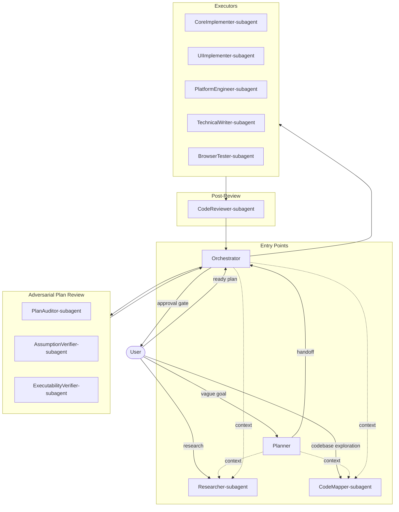
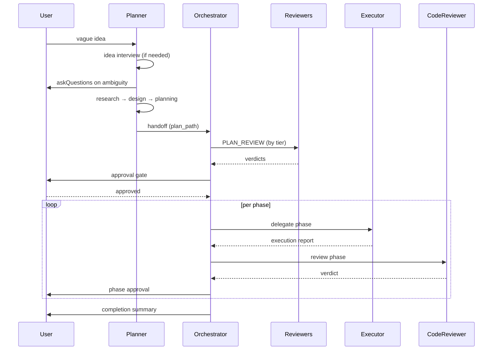

# Chapter 02 — Architecture Overview

## Why this chapter

Build a mental model of the entire system: what groups of agents exist, how control flows between them, and which subsystems connect them. After this chapter you could sketch the ControlFlow architecture on a whiteboard in five minutes.

## Key Concepts

- **Agent** — a Markdown file with YAML frontmatter describing a role for an LLM. Not a process, not a service.
- **Subagent** — an agent that is invoked _from another agent_ rather than directly by the user. Convention: `*-subagent.agent.md`.
- **Orchestrator** — the single "conductor". Delegates rather than implements.
- **Wave** — a group of plan phases executed in parallel. Wave N+1 waits for wave N to complete.
- **Gate** — a control point that evaluates a condition and yields GO / REPLAN / ABSTAIN.
- **Contract (schema)** — a JSON schema that the output of an agent must conform to.

## Top-Level Architecture

## Agent Groups and Their Roles

ControlFlow contains **13 agents** in 5 functional groups.

### 1. Entry Points

These agents are invoked **directly** by the user.

| Agent | When to invoke |
|-------|---------------|
| **Planner** | The task is vague or needs decomposition. Output is a plan. |
| **Orchestrator** | You have a concrete task or a ready plan from Planner. |
| **Researcher-subagent** | Deep investigation of a question with cited evidence. |
| **CodeMapper-subagent** | Quick exploration: "where in the codebase is this logic?" |

**Researcher** and **CodeMapper** are also entry points despite the `subagent` suffix. They are autonomous enough for direct invocation — an exception to the naming convention.

### 2. Adversarial Plan Review

These agents **only read** artifacts, and **only during PLAN_REVIEW**. They never write code and never appear as `executor_agent` in plan phases.

| Agent | What it looks for |
|-------|-----------------|
| **PlanAuditor-subagent** | Architecture problems, security issues, missing rollback. |
| **AssumptionVerifier-subagent** | "Mirages" — plan claims not supported by the codebase. 17 patterns. |
| **ExecutabilityVerifier-subagent** | Cold-start simulation of the first 3 tasks: can an executor start without clarification? |

### 3. Executors

These agents **create and modify files**. They are invoked by the Orchestrator via the `executor_agent` field of a plan phase.

| Agent | Domain |
|-------|--------|
| **CoreImplementer-subagent** | Backend code, tests, any non-UI implementation. **Canonical backbone.** |
| **UIImplementer-subagent** | Frontend: components, styles, accessibility, responsive. |
| **PlatformEngineer-subagent** | CI/CD, containers, infrastructure, deployments with rollback. |
| **TechnicalWriter-subagent** | Documentation, diagrams, code–doc parity. |
| **BrowserTester-subagent** | E2E browser tests, accessibility audit. |

### 4. Post-Review

| Agent | When invoked |
|-------|-------------|
| **CodeReviewer-subagent** | After every execution phase; optionally at the final gate for LARGE tasks. |

### 5. Conductor

**Orchestrator** — the only agent with a full view of the process. It makes all delegation, review, and escalation decisions.

## Key Flows

### Flow 1. From Idea to Code

### Flow 2. Mid-Process Clarification

When a subagent hits an ambiguity during execution, it returns `NEEDS_INPUT` with a `clarification_request`. The Orchestrator presents options to the user via `vscode/askQuestions`, receives an answer, and **retries the same task** with added context. → [Chapter 05](05-orchestration.md)

### Flow 3. Failure and Retry

Every failure receives a `failure_classification` (`transient` / `fixable` / `needs_replan` / `escalate`). The Orchestrator routes automatically per the table in [Chapter 13](13-failure-taxonomy.md): retry, retry with hint, replan, or escalate to the user.

## Subsystems Connecting Agents

| Subsystem | Location | Purpose |
|-----------|----------|---------|
| **Schemas** | `schemas/*.json` | Inter-agent contracts; basis for eval checks. |
| **Governance** | `governance/*.json` | Tool permissions, retry policies, model routing. |
| **Skills** | `skills/patterns/*.md` | Reusable domain expertise selected by Planner. |
| **Memory** | `NOTES.md`, `plans/artifacts/`, `/memories/` | Three-layer model: session / task-episodic / repo-persistent. |
| **Eval harness** | `evals/` | Offline quality checks for the entire system. |

Each is covered in a dedicated chapter (09–14).

## Architecture Principles

1. **Planning / execution separation.** Planner does not write code. CoreImplementer does not change design.
2. **Adversarial review before execution.** Finding a problem in a plan is cheaper than finding it in code.
3. **Contracts over trust.** Every inter-agent message is JSON validated against a schema.
4. **Human approval gates.** The user confirms at phase and wave boundaries.
5. **Explicit failure taxonomy.** Every failure is classified into one of 4 classes and routed deterministically.
6. **Fail-loud, abstain-safe.** When uncertain, an agent returns ABSTAIN rather than guessing.
7. **Least privilege.** Each agent has exactly the tools it needs (`governance/agent-grants.json`).
8. **Structured text output.** Agents do not dump raw JSON to chat — that wastes context tokens.

## Common Misconceptions

- **"A subagent is an agent that runs a subtask."** No — it is just a naming convention. `*-subagent` agents are typically invoked from another agent rather than directly by the user.
- **"PlanAuditor executes phases."** No — it is exclusively a read-only reviewer and never appears in `executor_agent`.
- **"The Orchestrator writes code."** No — it only coordinates. If it starts writing code, that is a contract violation.
- **"You can invoke any executor directly."** Technically yes, but they are designed to be called from the Orchestrator with a fully prepared phase context.

## Exercises

1. **(beginner)** Draw on paper a diagram of all 13 agents grouped into the 5 categories. Compare with the diagram above.
2. **(beginner)** Open `plans/project-context.md` and find the Phase Executor Agents table. Does it match the Executors section above?
3. **(intermediate)** Which three agents **cannot** appear in the `executor_agent` field of a plan phase, and why?
4. **(intermediate)** Open any three agent files. Find the `Tools → Allowed` section in each. Do read-only agents have a noticeably smaller tool surface?
5. **(advanced)** Explain why `Researcher-subagent` and `CodeMapper-subagent` can be invoked as entry points even though their names include `subagent`.

## Review Questions

1. List the 5 functional groups of agents.
2. Which agent is the "canonical backbone" for executors?
3. What does PLAN_REVIEW do and who participates?
4. Why can the Orchestrator not simultaneously be an executor?
5. Which subsystem connects agents through formal contracts?

## See Also

- [Chapter 03 — Agent Roster](03-agent-roster.md)
- [Chapter 05 — Orchestration](05-orchestration.md)
- [Chapter 07 — Review Pipeline](07-review-pipeline.md)
- [plans/project-context.md](../../plans/project-context.md)
