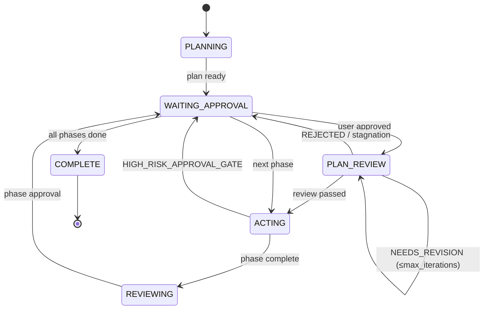
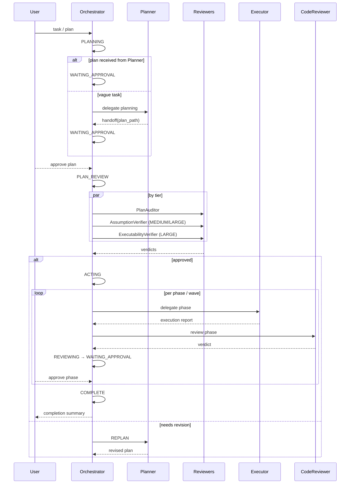

# Chapter 05 — Orchestration

## Why this chapter

Understand **how the Orchestrator governs the entire process**: its states, decision logic, delegation model, and failure response. After this chapter you can trace any task step by step from start to completion.

## Key Concepts

- **Workflow state** — a node in the Orchestrator lifecycle: PLANNING / WAITING_APPROVAL / PLAN_REVIEW / ACTING / REVIEWING / COMPLETE.
- **Gate event** — a structured message recording a state transition and decision. Contract: `schemas/orchestrator.gate-event.schema.json`.
- **Delegation** — handing a task to a subagent with an explicit contract and context.
- **Approval gate** — a point requiring explicit user confirmation before proceeding.
- **Trace ID** — a UUIDv4 generated at task start and propagated to all events and delegations for log correlation.

## Lifecycle

**Note:** The Orchestrator prompt uses the label `PLAN_REVIEW`, but in the **wire format** of `schemas/orchestrator.gate-event.schema.json` this is serialized as `event_type: PHASE_REVIEW_GATE` plus `iteration_index` / `max_iterations` fields. Do not conflate the "prompt-level state label" with the `workflow_state` value in the schema.

## Gate Event Types

From `schemas/orchestrator.gate-event.schema.json`:

| Event type | When |
|------------|------|
| `PLAN_GATE` | Decision to accept a plan for execution. |
| `PREFLECT_GATE` | Pre-action gate (4 risk classes). |
| `PHASE_REVIEW_GATE` | Review of a phase result or plan-review iteration. |
| `HIGH_RISK_APPROVAL_GATE` | A destructive operation requires user approval. |
| `COMPLETION_GATE` | Final summary. |

## Gate Event Fields

Every event contains at minimum:

- `event_type` — one of the enums above.
- `workflow_state` — current state.
- `decision` — `GO` / `REPLAN` / `ABSTAIN` / `APPROVED` / `REJECTED` / …
- `requires_human_approval` — boolean.
- `reason` — one sentence.
- `next_action` — what happens next.
- `trace_id` — UUIDv4 for correlation.
- `iteration_index`, `max_iterations` — for the review loop.

## Scenario: Typical End-to-End Task

## Delegation

The Orchestrator delegates a task to a subagent via a structured payload conforming to `schemas/orchestrator.delegation-protocol.schema.json`. Minimum fields:

- `target_agent` — subagent name.
- `phase_id`, `phase_title`.
- `executor_agent` — must match the `executor_agent` field in the plan phase.
- `scope` — task description.
- `inputs` — file paths, context.
- `expected_output_schema` — which schema the subagent must return.
- `trace_id`, `iteration_index`.

**Rule:** The Orchestrator delegates **only** to agents listed in `plans/project-context.md`. External agents are prohibited.

## Approval Gates

Mandatory pause points:

1. **After plan approval** — the user explicitly approves the plan before any execution begins.
2. **After each phase review** — the CodeReviewer verdict is presented; continuation requires explicit confirmation.
3. **Before completion** — final summary before commit/merge.
4. **Before HIGH_RISK operations** — destructive actions (delete, drop, force push, …).

**Batch approval:** for multi-phase plans, approval is requested **once per wave**, not per phase. Exception — phases with destructive or production operations require per-phase approval for that wave.

## PreFlect

Before **any** action batch the Orchestrator runs PreFlect — checking 4 risk classes from [skills/patterns/preflect-core.md](../../skills/patterns/preflect-core.md):

1. **Scope drift** — are we going beyond the current phase scope?
2. **Schema/contract drift** — will we violate a contract?
3. **Missing evidence** — do we have evidence, or are we guessing?
4. **Safety/destructive** — does high-risk authorization need confirmation?

Decision: GO / REPLAN / ABSTAIN. **"Silent GO with unresolved risk is a contract violation."**

## Failure Handling

Every failure receives a `failure_classification`. The Orchestrator routes automatically (see [Chapter 13](13-failure-taxonomy.md)):

| Class | Action | Limit |
|-------|--------|-------|
| transient | Retry the same task | 3 |
| fixable | Retry with a hint | 1 |
| needs_replan | Route to Planner for targeted phase replan | 1 |
| escalate | STOP → WAITING_APPROVAL → user | 0 |

**Reliability policy** (from `governance/runtime-policy.json`):
- `max_retries_per_phase` = 5 cumulative.
- 3 identical failures in a row → escalate (regardless of class).
- ≥2 transient failures in one wave → next wave runs at 50% parallelism.

## NEEDS_INPUT Routing

When a subagent returns `status: NEEDS_INPUT` with a `clarification_request`, the Orchestrator does **not** treat this as a failure. It follows a separate path:

1. Extract `clarification_request`.
2. Present options to the user via `vscode/askQuestions`.
3. Wait for selection.
4. Retry the subagent task with the user's answer added to context.

See [docs/agent-engineering/CLARIFICATION-POLICY.md](../agent-engineering/CLARIFICATION-POLICY.md).

## Wave-Aware Execution

If plan phases have a `wave` field:

1. Group phases by wave (ascending).
2. Within a wave, execute independently in parallel (up to `max_parallel_agents`).
3. Wave N+1 waits for **all** phases of wave N to complete.
4. If any phase in a wave fails — evaluate via failure classification before advancing.

## Stopping Rules

These moments are **mandatory pauses** — they cannot be skipped:

1. After plan approval.
2. After each phase review.
3. After the completion summary.

Violating a stopping rule equals skipping a gate, which is a contract violation.

## Observability

On any event the Orchestrator may optionally append an NDJSON line to `plans/artifacts/observability/<task-id>.ndjson`. See [docs/agent-engineering/OBSERVABILITY.md](../agent-engineering/OBSERVABILITY.md).

`trace_id` is propagated to all subagent delegations, enabling event correlation across the call graph.

## Common Mistakes

- **Treating `plan_path` as approved.** Receiving a plan from Planner is not approval; PLAN_REVIEW triggers are still evaluated.
- **Skipping phase review.** CodeReviewer is mandatory on all tiers (including TRIVIAL).
- **Ignoring `validated_blocking_issues`.** Only these block continuation — raw CRITICAL findings do not.
- **Not propagating `trace_id`.** Without it, log correlation is impossible.
- **Forcing continuation after ABSTAIN.** ABSTAIN means ABSTAIN. Return to the user.

## Exercises

1. **(beginner)** Open `schemas/orchestrator.gate-event.schema.json` and list all valid `event_type` values.
2. **(beginner)** Find the "Stopping Rules" section in `Orchestrator.agent.md`. How many mandatory pause points are listed?
3. **(intermediate)** Open `governance/runtime-policy.json` → `retry_budgets`. What are the limits for transient/fixable/needs_replan/escalate?
4. **(intermediate)** In what situation does the Orchestrator invoke `vscode/askQuestions` without a preceding NEEDS_INPUT from a subagent?
5. **(advanced)** A plan has 6 phases: 3 in wave 1, 2 in wave 2, 1 in wave 3. How many approval prompts does the Orchestrator show the user in batch mode?

## Review Questions

1. List the 5 gate event types.
2. What is a trace ID and why is it needed?
3. How does the Orchestrator handle `NEEDS_INPUT` from a subagent?
4. What is wave-aware execution?
5. What 3 actions require a mandatory pause?

## See Also

- [Chapter 06 — Planning](06-planning.md)
- [Chapter 07 — Review Pipeline](07-review-pipeline.md)
- [Chapter 08 — Execution Pipeline](08-execution-pipeline.md)
- [Chapter 13 — Failure Taxonomy](13-failure-taxonomy.md)
- [Orchestrator.agent.md](../../Orchestrator.agent.md)
