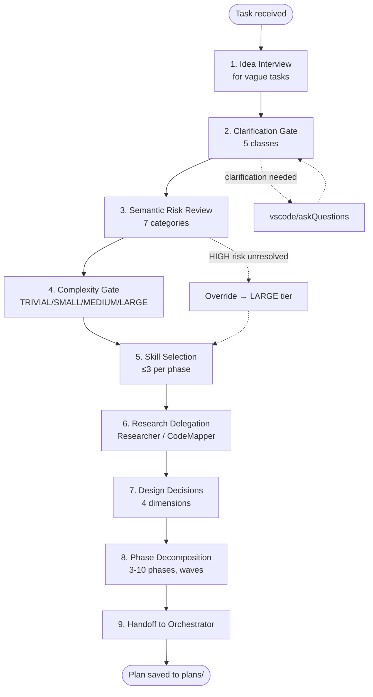

# Chapter 06 — Planning

## Why this chapter

Walk through **how the Planner turns an idea into a plan**: 9 sequential steps from first user interaction to handoff to the Orchestrator. This is the most "thinking-intensive" part of the system.

## Key Concepts

- **Idea interview** — a structured dialogue with the user when a task is vague.
- **Clarification gate** — check against 5 clarification classes from [CLARIFICATION-POLICY.md](../agent-engineering/CLARIFICATION-POLICY.md).
- **Semantic risk review** — mandatory assessment across 7 risk categories.
- **Complexity gate** — classification into 4 tiers (TRIVIAL/SMALL/MEDIUM/LARGE).
- **Skill selection** — choosing ≤3 skill patterns per phase.
- **Handoff** — passing the finished plan to the Orchestrator via `target_agent` and `prompt`.

## Complete Planner Workflow



## Step 1. Idea Interview

If the user's request is vague ("improve performance", "let's refactor"), the Planner conducts an interview:

- **What is the goal?** — what specifically changes in the system for the user.
- **What are the boundaries?** — what must NOT be touched.
- **What are the success criteria?** — how will we know it's done.
- **What are the constraints?** — performance, time, dependencies.

Skill pattern: [`skills/patterns/idea-to-prompt.md`](../../skills/patterns/idea-to-prompt.md).

**Can be skipped** if the task is already precisely formulated.

## Step 2. Clarification Gate

From [CLARIFICATION-POLICY.md](../agent-engineering/CLARIFICATION-POLICY.md) — **5 mandatory clarification classes**:

| Class | Example |
|-------|---------|
| Scope ambiguity | "Add export" — where? CSV/JSON/PDF? |
| Architecture fork | "Store in Redis or Postgres?" |
| User preference decision | "Sort by name or by date?" |
| Destructive risk approval | "Permanently delete old records?" |
| Repository structure change | "Rename the module?" |

If any class matches → `vscode/askQuestions` with **2–3 options**, each with pros/cons/affected files and a **recommendation**.

If the task matches no class — gate passed, proceed.

## Step 3. Semantic Risk Review

**Mandatory** for all plan statuses (including `READY_FOR_EXECUTION`). 7 categories:

| Category | What it checks |
|----------|---------------|
| `data_volume` | Data sizes, pagination, batch ops, SELECT * |
| `performance` | Query paths, N+1, indexes, hot path |
| `concurrency` | Parallel operations, data races |
| `access_control` | Authorization, permissions, ownership |
| `migration_rollback` | Schema migrations, data transforms, format changes |
| `dependency` | External APIs, new packages, versions |
| `operability` | Deployment, monitoring, infrastructure |

For each category, record:
- `applicability`: applicable / not_applicable / uncertain
- `impact`: HIGH / MEDIUM / LOW / UNKNOWN
- `evidence_source`: file path or query
- `disposition`: resolved / open_question / research_phase_added / not_applicable

**Override:** if any entry has `applicability: applicable` AND `impact: HIGH` AND `disposition` is not `resolved` → forced LARGE-tier pipeline.

**Even for TRIVIAL** all 7 categories must be present (most as `not_applicable`).

## Step 4. Complexity Gate

| Tier | Files | Scope | Pipeline |
|------|-------|-------|---------|
| TRIVIAL | ≤2 | Isolated change | Skip PLAN_REVIEW entirely |
| SMALL | 3–5 | Single domain | PlanAuditor only |
| MEDIUM | 6–15 | Cross-domain | PlanAuditor + AssumptionVerifier |
| LARGE | 15+ | Cross-cutting | Full pipeline |

Step 3 override wins.

## Step 5. Skill Selection

The Planner reads [`skills/index.md`](../../skills/index.md) and selects **≤3 skill patterns** most relevant to the task. Paths are written to `skill_references` in each applicable phase.

**Available skill domains** — see [Chapter 11](11-skills.md).

Example selection for "add endpoint with auth":
- `skills/patterns/security-patterns.md` (auth, validation)
- `skills/patterns/tdd-patterns.md` (tests)
- `skills/patterns/error-handling-patterns.md` (boundaries)

Implementation agents must read these skills **before** starting work.

## Step 6. Research Delegation

The Planner may delegate only to two research agents:
- `CodeMapper-subagent` — for codebase structure exploration.
- `Researcher-subagent` — for evidence-based investigation.

Delegation to external agents is **prohibited**.

If the task's context is already available, this step can be skipped.

## Step 7. Design Decisions

**Mandatory** for all plans. 4 dimensions:

| Dimension | Contains |
|-----------|---------|
| Architectural Choices | Key architectural decisions and rationale. |
| Boundary & Integration Points | System boundary changes, new actors, integration points. |
| Temporal Flow | Execution order, parallel paths, gates, retries. For MEDIUM/LARGE — Mermaid `sequenceDiagram`. |
| Constraints & Trade-offs | Constraints and accepted trade-offs. |

## Step 8. Phase Decomposition

The plan is broken into **3–10 phases**. If more are needed — decompose the task further.

Each phase contains:
- `phase_id` (integer ≥1).
- `title`, `objective`.
- `wave` (integer ≥1) — for parallelism.
- `executor_agent` — required field, **enum** of 8 allowed executors.
- `dependencies` — array of phase_ids.
- `files` — `{path, action, reason}`.
- `tests`.
- `steps` — in prose, **no code blocks**.
- `acceptance_criteria` — measurable conditions (minimum 1).
- `quality_gates` — from enum: tests_pass / lint_clean / schema_valid / safety_clear / human_approved_if_required.
- `failure_expectations` — array of `{scenario, classification, mitigation}`.
- `skill_references` — paths from step 5.

**Inter-phase contracts** — if phase B depends on phase A, record `{from_phase, to_phase, interface, format}`.

**Architectural visualization:**
- 3+ phases → a `flowchart TD` (DAG of dependencies) is required.
- MEDIUM with non-trivial orchestration → also `sequenceDiagram`.
- LARGE → always both `sequenceDiagram` and DAG.

## Step 9. Handoff

```yaml
target_agent: Orchestrator
prompt: "Plan saved at plans/<task>-plan.md. Please begin PLAN_REVIEW and dispatch Phase 1 when ready."
```

`plan_path` is passed as a **reviewable input**, not as implicit approval.

## Terminal Outcomes

If the Planner cannot produce a valid plan:

- **`status: ABSTAIN`** — insufficient evidence; user action needed.
- **`status: REPLAN_REQUIRED`** — initial premises turned out to be invalid.

Both have a different file structure (see template in [`plans/templates/plan-document-template.md`](../../plans/templates/plan-document-template.md), Terminal Non-Ready Outcome Artifact section).

## Schema-Driven Structure

The complete plan structure is defined by `schemas/planner.plan.schema.json`. Required top-level fields:

- `schema_version` (`1.2.0`)
- `agent` (`Planner`)
- `status`
- `task_title`, `summary`
- `confidence` (0–1; <0.9 triggers escalation)
- `abstain` `{is_abstaining, reasons}`
- `phases` (array)
- `open_questions`
- `risks`
- `risk_review` (7 categories)
- `success_criteria`
- `complexity_tier`
- `handoff` `{target_agent, prompt}`

## Common Mistakes

- **Omitting `risk_review` for TRIVIAL.** No — all 7 categories are required, even as `not_applicable`.
- **Vague `acceptance_criteria`.** Must be a **measurable** condition.
- **Code blocks in `steps`.** Forbidden — describe in prose.
- **Manual testing steps.** Forbidden — all verification must be automatable.
- **Delegating to reviewers.** The Planner delegates only to Researcher/CodeMapper.
- **Assigning PlanAuditor as `executor_agent`.** Forbidden by schema; reviewers are read-only.

## Exercises

1. **(beginner)** Open `Planner.agent.md` and find the 9 workflow steps. Compare with the diagram above.
2. **(beginner)** Open `schemas/planner.plan.schema.json` and list the 8 allowed values of `executor_agent`.
3. **(intermediate)** Which workflow step can Planner skip if the task is already precisely stated?
4. **(intermediate)** Open any plan in `plans/`. Find all 7 semantic risk categories and their `disposition` values.
5. **(advanced)** Task: "Remove the deprecated endpoint /v1/users". Which clarification trigger classes apply? What complexity tier, and which override might fire?

## Review Questions

1. How many steps are in the Planner workflow?
2. What is the maximum number of skill references per phase?
3. Under what conditions is a task forced to LARGE tier regardless of file count?
4. What are the two terminal non-ready outcomes from Planner?
5. Can the Planner delegate to CoreImplementer?

## See Also

- [Chapter 05 — Orchestration](05-orchestration.md)
- [Chapter 07 — Review Pipeline](07-review-pipeline.md)
- [Chapter 11 — Skills](11-skills.md)
- [Planner.agent.md](../../Planner.agent.md)
- [docs/agent-engineering/CLARIFICATION-POLICY.md](../agent-engineering/CLARIFICATION-POLICY.md)
