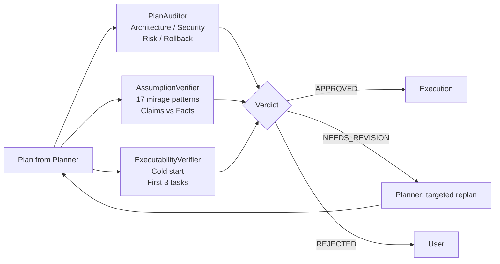
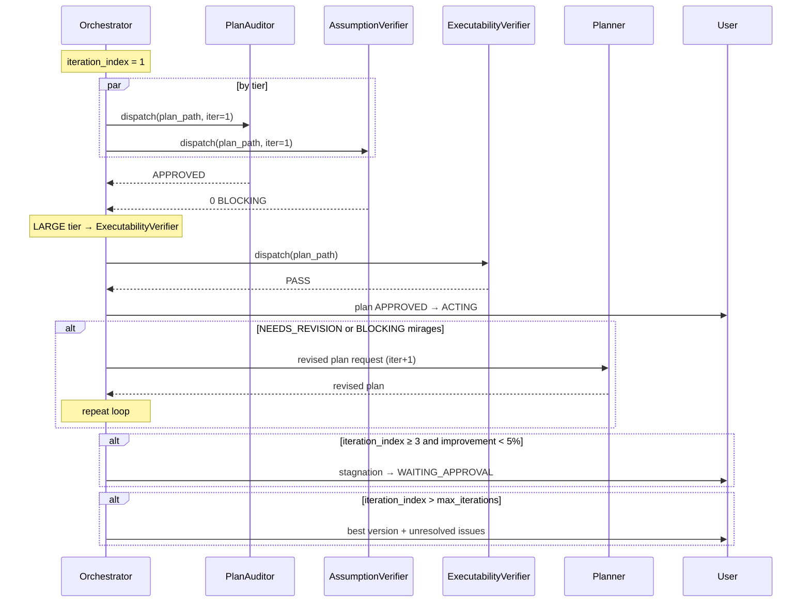

# Chapter 07 — Review Pipeline

## Why this chapter

Understand **PLAN_REVIEW** — the adversarial plan-validation phase that runs *before* execution begins. Learn which reviewers participate, how they complement each other, and why finding a problem in a plan is cheaper than finding it in code.

## Key Concepts

- **PLAN_REVIEW** — the Orchestrator stage between plan approval and the start of execution.
- **Adversarial review** — the reviewer tries to **break** the plan, not confirm it.
- **Reviewer** — a read-only agent that never appears as `executor_agent`.
- **Iteration loop** — the review cycle with an iteration cap; each iteration can refine the plan.
- **Stagnation** — when the plan stops improving between iterations; triggers escalation.

## PLAN_REVIEW Triggers

Triggers are stored in `governance/runtime-policy.json` → `plan_review_gate_trigger_conditions`. PLAN_REVIEW activates if **at least one** condition is met:

- Phase count ≥ `min_phases`.
- `confidence` < `confidence_threshold`.
- The scope contains destructive or high-risk operations.
- There is a `risk_review` entry with `applicability: applicable` AND `impact: HIGH` AND `disposition` ≠ `resolved`.

If none fire — skip the pipeline and proceed directly to execution.

## Routing by Tier

| Tier | Active reviewers | Max iterations |
|------|-----------------|----------------|
| TRIVIAL | — (pipeline skipped) | — |
| SMALL | PlanAuditor | 2 |
| MEDIUM | PlanAuditor + AssumptionVerifier | 5 |
| LARGE | PlanAuditor + AssumptionVerifier + ExecutabilityVerifier | 5 |

Source: `governance/runtime-policy.json` → `review_pipeline_by_tier` and `max_iterations_by_tier`.

**Override:** Any plan with an unresolved HIGH-impact risk entry → forced LARGE pipeline, regardless of tier.

## The Three Reviewers and Their Focus Areas

### PlanAuditor — Design and Risk

**What it looks for:**
- Architectural inconsistencies.
- Security vulnerabilities.
- Missing rollback for destructive steps.
- Dependency conflicts between phases.
- Scope coverage gaps.

**Focus areas** are determined by the mapping in [project-context.md](../../plans/project-context.md):

| Risk category | PlanAuditor focus |
|---------------|------------------|
| data_volume, performance | `["performance"]` |
| concurrency, access_control | `["architecture"]` |
| migration_rollback | `["destructive_risk", "missing_rollback"]` |
| dependency | `["architecture"]` |
| operability | `["scope_gap"]` |

**Contract:** `schemas/plan-auditor.plan-audit.schema.json`. Failure classification **excludes** `transient`.

### AssumptionVerifier — Mirages

**What it looks for:** plan claims not supported by the codebase. **17 patterns**, for example:

- "File X exists" — it actually doesn't.
- "Function Y returns Z" — it actually returns something else.
- "API W is available" — it is actually deprecated.
- "Dependency is already installed" — it isn't.
- "Test covers the case" — it actually doesn't.

**Severity:** `BLOCKING` / `WARNING` / `INFO`. Only `BLOCKING` stops the pipeline.

**Why it supplements PlanAuditor:** PlanAuditor reviews design (is the solution correct?). AssumptionVerifier reviews factual accuracy (is what Planner wrote actually true?). Different axes.

**Contract:** `schemas/assumption-verifier.plan-audit.schema.json`.

### ExecutabilityVerifier — Cold Start

**What it looks for:** Simulates whether an executor, given only the repository plus the first 3 plan tasks, can start work without additional questions.

**Checklist:**
- Are file paths concrete?
- Are input/output contracts specified?
- Are verification commands given?
- Are acceptance criteria clear?

**Status:** `PASS` / `WARN` / `FAIL`. `FAIL`/`WARN` routes back to Planner for refinement.

**Contract:** `schemas/executability-verifier.execution-report.schema.json`.

## Iteration Loop

## Regression Tracking

At `iteration_index > 1` the Orchestrator passes reviewers a **list of previously verified items**. If a previously verified item now fails → automatic BLOCKING regression issue.

> "Any previously verified item that now fails → automatic BLOCKING regression issue." — [Orchestrator.agent.md](../../Orchestrator.agent.md)

## Stagnation Detection

If `iteration_index ≥ 3` and the score improvement over the last 2 iterations is < 5% → **stagnation**. The Orchestrator transitions to `WAITING_APPROVAL` with findings, and the user makes the decision.

## Revision-Loop Invalidation (Closed World)

What counts as a "significant" plan change and forces a **full restart** of the pipeline:

- Changes to `Planner.agent.md`, `Orchestrator.agent.md`, `governance/runtime-policy.json`.
- Changes to orchestration handoff tests/scenarios, review routing, verification commands.
- Changes to policy surfaces, phase structure, task/file paths, contracts, `risk_review`, `complexity_tier`.
- Changes to executability-bearing steps.
- **Any ambiguous** change, by default.

Selective rerun is allowed **only** for reviewer summary wording changes with no changes to plan artifacts.

## Reviewer Outputs

Each reviewer returns a structured report with a status:

| Status | Meaning |
|--------|---------|
| APPROVED | No issues; plan proceeds to execution. |
| NEEDS_REVISION | Correctable issues; replan via Planner. |
| REJECTED | Plan is fundamentally wrong; escalate to user. |
| ABSTAIN | Reviewer cannot assess confidently; pipeline continues with a note. |

**Important:** ABSTAIN from a reviewer does **not** block the plan. It is a signal of uncertainty, not a found problem.

## Optional Final Review Gate

For LARGE tasks (or by user request) after all phases complete, a **final review** runs:

1. Orchestrator collects the aggregate list of changed files from all phases.
2. Takes a snapshot of plan phases.
3. Dispatches CodeReviewer with `review_scope: "final"`.
4. If blocking issues are found — the **fix is delegated to the executor**, **not** the reviewer (CodeReviewer never owns a fix cycle). Maximum 1 fix cycle.
5. If clean — advisory log to `plans/artifacts/<task>/final_review.md`.

See `governance/runtime-policy.json` → `final_review_gate`.

## Common Mistakes

- **Treating ABSTAIN from a reviewer as blocking.** It does not block — the pipeline continues.
- **Treating AssumptionVerifier as "a second pair of eyes."** No — it checks a **different** axis (facts vs design).
- **Ignoring the override from a HIGH risk entry.** A plan may be SMALL by file count, but HIGH risk → LARGE pipeline.
- **Assigning a reviewer as `executor_agent`.** Forbidden by schema.
- **Hoping ABSTAIN will resolve the problem.** ABSTAIN means "uncertain" — more data is needed.
- **Patching the plan without a full rerun** for a significant change. Closed-world rule: if the change is not strictly textual reviewer-summary wording, a full rerun is mandatory.

## Exercises

1. **(beginner)** Open `governance/runtime-policy.json` and find `review_pipeline_by_tier`. What is the pipeline for MEDIUM?
2. **(beginner)** Open `schemas/assumption-verifier.plan-audit.schema.json`. What severity values are allowed?
3. **(intermediate)** Under what conditions does a SMALL-tier plan get the full LARGE pipeline?
4. **(intermediate)** What happens if at iteration 2 PlanAuditor returns `APPROVED` but AssumptionVerifier finds a BLOCKING mirage?
5. **(advanced)** Explain why CodeReviewer **never** owns a fix cycle in the final review.

## Review Questions

1. List the 3 reviewers and their focus areas.
2. What is regression tracking?
3. When does stagnation detection fire?
4. Which failure class do reviewers exclude?
5. On which tiers is ExecutabilityVerifier active?

## See Also

- [Chapter 05 — Orchestration](05-orchestration.md)
- [Chapter 06 — Planning](06-planning.md)
- [Chapter 09 — Schemas](09-schemas.md)
- [PlanAuditor-subagent.agent.md](../../PlanAuditor-subagent.agent.md)
- [AssumptionVerifier-subagent.agent.md](../../AssumptionVerifier-subagent.agent.md)
- [ExecutabilityVerifier-subagent.agent.md](../../ExecutabilityVerifier-subagent.agent.md)
