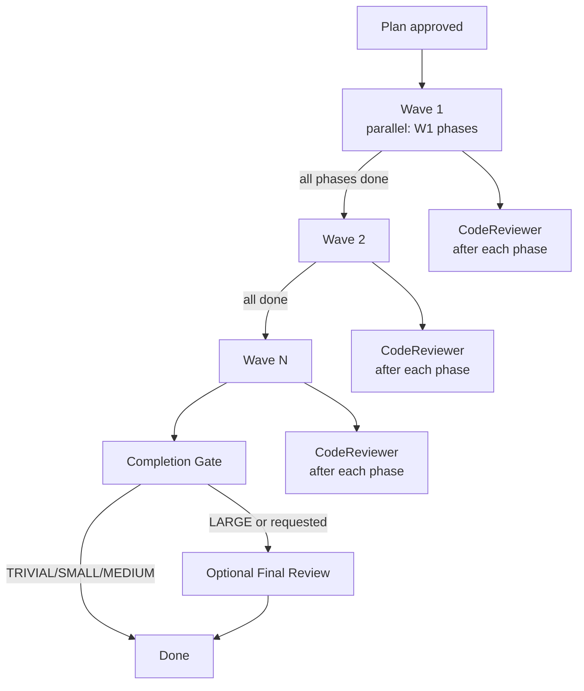
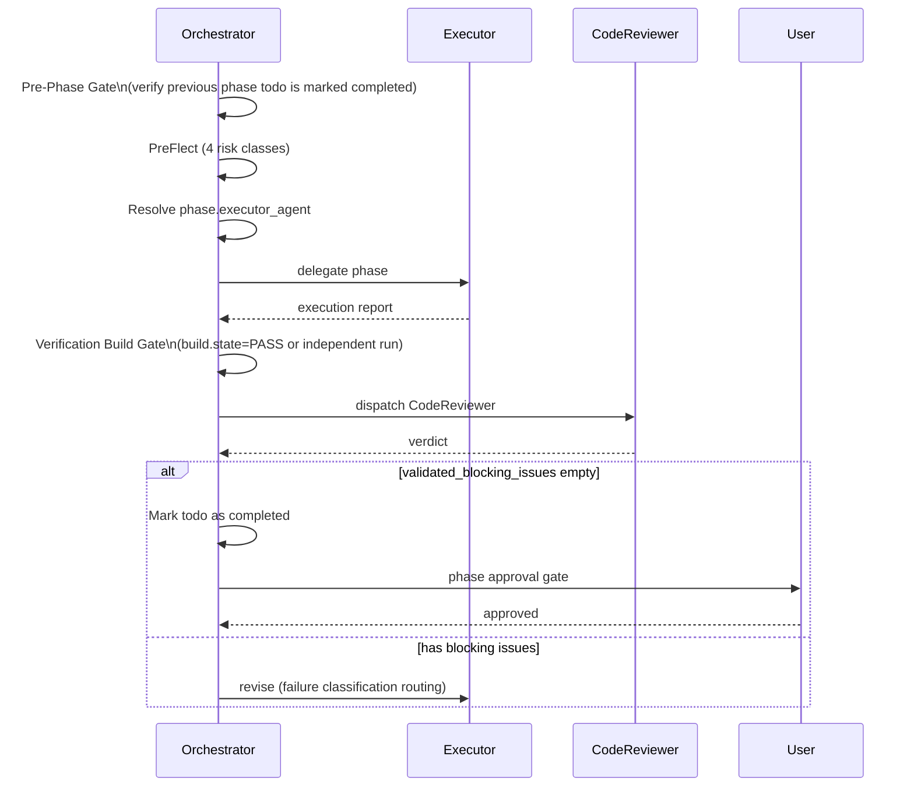

# Chapter 08 — Execution Pipeline

## Why this chapter

Understand **what happens after plan approval**: how the Orchestrator invokes executors, what waves are, which quality gates are mandatory, and how the completion gate and optional final review work.

## Key Concepts

- **Phase** — a plan unit with a fixed `executor_agent`.
- **Wave** — a group of phases executed in parallel.
- **Quality gate** — a mandatory readiness condition for a phase (tests_pass, lint_clean, schema_valid, safety_clear, human_approved_if_required).
- **Completion gate** — the final task summary.
- **Final review gate** — optional final CodeReviewer pass for LARGE tasks.

## Execution Flow

## Per-Phase Cycle

For each phase the Orchestrator runs:

## Wave-Aware Execution

**Rules:**
1. Phases are grouped by `wave` (ascending).
2. Within a wave, phases **may** execute in parallel (up to `max_parallel_agents`, default 10).
3. Wave N+1 waits for **all** phases of wave N to complete.
4. If a wave phase fails — failure classification routing decides: retry / replan / escalate.

**Example:**

| Phase | Wave | Dependencies |
|-------|------|-------------|
| 1: research backend | 1 | — |
| 2: research frontend | 1 | — |
| 3: design API | 2 | 1 |
| 4: implement endpoint | 3 | 3 |
| 5: implement UI | 3 | 2, 3 |
| 6: e2e tests | 4 | 4, 5 |

Wave 1 — phases 1, 2 in parallel. Wave 3 — phases 4, 5 in parallel. Total: 4 waves for 6 phases.

## executor_agent — Required Field

Each phase contains `executor_agent` from an enum (8 values):

- CodeMapper-subagent
- Researcher-subagent
- CoreImplementer-subagent
- UIImplementer-subagent
- PlatformEngineer-subagent
- TechnicalWriter-subagent
- BrowserTester-subagent
- CodeReviewer-subagent

**Hard rule:** The Orchestrator **must not infer** `executor_agent` heuristically. If the field is missing from a legacy plan → REPLAN via Planner.

## Quality Gates

Each phase declares `quality_gates` from an enum:

| Gate | Meaning |
|------|---------|
| `tests_pass` | All tests in the target scope pass. |
| `lint_clean` | Lint is clean (`read/problems` is empty). |
| `schema_valid` | All produced schemas are valid. |
| `safety_clear` | PreFlect revealed no unresolved risk. |
| `human_approved_if_required` | If approval is required — it has been obtained. |

**Verification Build Gate (mandatory):** after every phase, the Orchestrator either uses `build.state: PASS` from the execution report or **independently runs the build**. Accepting a completion claim without verification is a contract violation.

## Phase Verification Checklist

Before marking a phase as complete, the Orchestrator **must** verify:

1. ✅ Tests passed — evidence from the subagent report or an independent run.
2. ✅ Build passed — `build.state: PASS`.
3. ✅ Lint/problems are clean.
4. ✅ Review status is `APPROVED` from CodeReviewer.
5. ✅ Phase todo item is marked completed via `#todos`.

If **any** check fails → Failure Classification Handling → do not mark complete.

## CodeReviewer and validated_blocking_issues

CodeReviewer is mandatory on **all tiers** (including TRIVIAL).

**Key idea:** The Orchestrator blocks continuation **only** on `validated_blocking_issues`, not on raw CRITICAL/MAJOR findings. This is because not every CRITICAL finding is confirmed as applicable in the specific context of the phase.

If `validated_blocking_issues` is empty — the phase proceeds even with unresolved INFO/WARNING items.

## Failure Classification Handling

If a subagent returns a failure (see [Chapter 13](13-failure-taxonomy.md)):

| Classification | Action | Limit |
|----------------|--------|-------|
| transient | Retry the same task | 3 |
| fixable | Retry with a hint | 1 |
| needs_replan | Targeted phase replan via Planner | 1 |
| escalate | STOP → user | 0 |

**Reliability policy:**
- Cumulative budget per phase = 5 retries.
- 3 identical failures in a row → escalate (regardless of class).
- ≥2 transient failures in one wave → 50% parallelism for subsequent waves.
- Empty response, timeout, HTTP 429 — silent failure, **not** counted as success.

## Batch Approval

To avoid approval fatigue: one approval message **per wave**, not per phase.

Template:
> "Wave 2: 3 phases, agents: [CoreImplementer, UIImplementer, TechnicalWriter]. Approve all? (y/n/details)"

**Exception:** if the wave contains destructive/production operations — per-phase approval for that wave.

## Completion Gate

After all phases:

1. Cross-phase consistency review.
2. Verify all phase todo items are marked completed.
3. If Final Review Gate is active → run it.
4. Append session-outcome entry to `plans/session-outcomes.md` (using [`plans/templates/session-outcome-template.md`](../../plans/templates/session-outcome-template.md)).
5. Produce completion summary for the user.

**Order matters:** the session-outcome is written **before** the completion summary, so the user sees the summary after telemetry is flushed.

## Optional Final Review Gate

Activates per rules in `governance/runtime-policy.json` → `final_review_gate`:
- `enabled_by_default: true`, or
- `complexity_tier` is in `auto_trigger_tiers`, or
- user explicitly requested.

**Workflow:**
1. Normalize `changed_files[]` — collect from all phase reports (mapped by agent type).
2. Build `plan_phases_snapshot[]` — `[{phase_id, files[]}]`.
3. Dispatch CodeReviewer with `review_scope: "final"`.
4. If `validated_blocking_issues` (CRITICAL/MAJOR) are found:
   - Resolve fix executor: the phase with the **highest** `phase_id` whose `files[]` contains the affected file.
   - Dispatch that executor with targeted fix scope.
   - Re-run CodeReviewer (final mode) — max `max_fix_cycles` = 1.
   - If still blocked → escalate to user.
   - **CodeReviewer NEVER owns the fix cycle.**
5. If clean → advisory log to `plans/artifacts/<task>/final_review.md`, continue.

## Commit Conventions

- Prefix from enum: `fix`, `feat`, `chore`, `test`, `refactor`.
- **Do not** mention plan names or phase numbers in commit messages.

## Common Mistakes

- **Accepting a completion claim without verification.** Forbidden — always check the build.
- **Skipping CodeReviewer on TRIVIAL.** Mandatory on all tiers.
- **Inferring `executor_agent`.** Forbidden — REPLAN via Planner.
- **Marking a phase complete before updating the todo.** The Pre-Phase Gate will break on the next phase.
- **Running phases from different waves in parallel.** Forbidden: wave N+1 waits for wave N.
- **Giving CodeReviewer the fix.** Forbidden — fix cycles always belong to executors.

## Exercises

1. **(beginner)** A plan with 5 phases: phases 1, 2 in wave 1; phase 3 in wave 2; phases 4, 5 in wave 3. How many approval prompts does the Orchestrator show in batch mode?
2. **(beginner)** Open `schemas/planner.plan.schema.json` and find the `quality_gates` enum. List all values.
3. **(intermediate)** What should the Orchestrator do if the phase report does not contain `build.state`?
4. **(intermediate)** A MEDIUM-tier plan has completed. Will the final review gate activate? What must you check to answer?
5. **(advanced)** Final review found a CRITICAL issue in `src/api/users.ts`. The file was created in phase 3 and modified in phase 5. Who does the Orchestrator delegate the fix to?

## Review Questions

1. What does "wave 2 waits for wave 1" mean?
2. Why must the Orchestrator not infer `executor_agent`?
3. What are `validated_blocking_issues` and why do they matter?
4. What 5 items are in the Phase Verification Checklist?
5. When does CodeReviewer own a fix cycle? (hint: never)

## See Also

- [Chapter 05 — Orchestration](05-orchestration.md)
- [Chapter 07 — Review Pipeline](07-review-pipeline.md)
- [Chapter 13 — Failure Taxonomy](13-failure-taxonomy.md)
- [Orchestrator.agent.md](../../Orchestrator.agent.md)
- [governance/runtime-policy.json](../../governance/runtime-policy.json)
