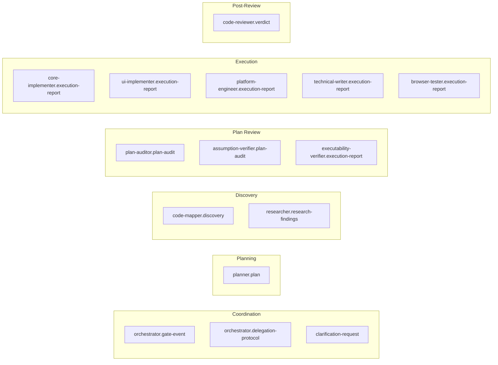

# Chapter 09 — Schemas (Contracts)

## Why this chapter

Understand **that schemas are contracts between agents**, not just JSON files. After this chapter you will know the purpose of each of the 15 schemas and where to find their key fields.

## What a Schema Is in ControlFlow

A schema (`schemas/*.json`) is a **JSON Schema (draft 2020-12)** that fixes the structure of one agent's output or payload. Schemas serve three purposes:

1. **Contract** — agent A knows which fields will arrive from agent B.
2. **Documentation** — every field has a `description`.
3. **Eval fixture** — `validate.mjs` validates real scenarios and templates against schemas.

**Important:** agents do **not** output raw JSON to chat. A schema is a mental model and contract, but in chat agents emit structured text. JSON appears only in eval fixtures and formal inter-tool payloads.

## Complete Schema Registry

| # | File | Emitter | Purpose |
|---|------|---------|---------|
| 1 | `clarification-request.schema.json` | Any acting subagent | Payload for `NEEDS_INPUT` (shared template) |
| 2 | `orchestrator.delegation-protocol.schema.json` | Orchestrator | Delegation contract for subagents |
| 3 | `orchestrator.gate-event.schema.json` | Orchestrator | Gate event on state transitions |
| 4 | `planner.plan.schema.json` | Planner | Full plan with phases, risks, contracts, handoff |
| 5 | `code-mapper.discovery.schema.json` | CodeMapper-subagent | Discovery report |
| 6 | `researcher.research-findings.schema.json` | Researcher-subagent | Findings with citations |
| 7 | `plan-auditor.plan-audit.schema.json` | PlanAuditor-subagent | Audit verdict (APPROVED/NEEDS_REVISION/REJECTED/ABSTAIN) |
| 8 | `assumption-verifier.plan-audit.schema.json` | AssumptionVerifier-subagent | Mirage detection report |
| 9 | `executability-verifier.execution-report.schema.json` | ExecutabilityVerifier-subagent | Cold-start report |
| 10 | `core-implementer.execution-report.schema.json` | CoreImplementer-subagent | Backend implementation report |
| 11 | `ui-implementer.execution-report.schema.json` | UIImplementer-subagent | UI implementation report (a11y/responsive) |
| 12 | `platform-engineer.execution-report.schema.json` | PlatformEngineer-subagent | Infra report (approvals, rollback, health) |
| 13 | `technical-writer.execution-report.schema.json` | TechnicalWriter-subagent | Docs report (parity, diagrams) |
| 14 | `browser-tester.execution-report.schema.json` | BrowserTester-subagent | E2E report (scenarios, accessibility) |
| 15 | `code-reviewer.verdict.schema.json` | CodeReviewer-subagent | Review verdict (validated_blocking_issues) |

> **Note:** "14 agent output schemas" + 1 shared `clarification-request.schema.json` = 15 files.

## Schema Groups by Purpose

## Key Schemas — Deep Dive

### planner.plan.schema.json

The most comprehensive and important schema. Required top-level fields:

- `schema_version` (`1.2.0`)
- `agent` (`Planner`)
- `status` (`READY_FOR_EXECUTION` / `ABSTAIN` / `REPLAN_REQUIRED`)
- `task_title`, `summary`, `confidence` (0–1)
- `abstain` `{is_abstaining, reasons}`
- `phases[]` — array of phases
- `open_questions[]`, `risks[]`
- `risk_review[]` — 7 semantic risk categories
- `success_criteria[]`
- `complexity_tier` (TRIVIAL/SMALL/MEDIUM/LARGE)
- `handoff` `{target_agent, prompt}`

**Each phase:**
- `phase_id`, `title`, `objective`, `wave`
- `executor_agent` (enum — 8 values)
- `dependencies[]`, `files[]`, `tests[]`, `steps[]`
- `acceptance_criteria[]` (≥1, required)
- `quality_gates[]` (enum — 5 values)
- `failure_expectations[]`
- `skill_references[]`

**Optional top-level fields:** `trace_id`, `contracts[]`, `max_parallel_agents`, `diagrams[]`, `iteration_budget`.

### orchestrator.gate-event.schema.json

Minimum fields:
- `event_type` (enum: `PLAN_GATE`, `PREFLECT_GATE`, `PHASE_REVIEW_GATE`, `HIGH_RISK_APPROVAL_GATE`, `COMPLETION_GATE`)
- `workflow_state` (enum: PLANNING/WAITING_APPROVAL/ACTING/REVIEWING/COMPLETE — **without** PLAN_REVIEW; that label exists only in the prompt)
- `decision` (enum)
- `requires_human_approval` (boolean)
- `reason`, `next_action`
- `trace_id` (UUIDv4), `iteration_index`, `max_iterations`

### code-reviewer.verdict.schema.json

Key feature: **`validated_blocking_issues`** — a separate array, distinct from raw `issues`. The Orchestrator blocks continuation **only** on validated_blocking items. Also contains:
- `status` (`APPROVED`/`NEEDS_REVISION`/`REJECTED`)
- `review_scope` (`phase` / `final`)
- `phase_id`
- `issues[]` (severity, file, message)
- `final_review_analysis` (optional; for final mode — scope drift, file-to-phase mapping)

### *-implementer.execution-report.schema.json

Common structure for the three implementer schemas:
- `status` (COMPLETE/FAILED/NEEDS_INPUT/…)
- `failure_classification` (optional)
- `changes[]` (file, action, summary) — CoreImplementer and PlatformEngineer
- `ui_changes[]` — UIImplementer
- `tests[]`, `build` `{state, output}`, `lint`, `definition_of_done[]`
- `clarification_request` (if NEEDS_INPUT)

UI variant adds: `accessibility[]`, `responsive[]`.
Platform variant adds: `approvals[]`, `rollback_plan`, `health_checks[]`.

### technical-writer.execution-report.schema.json

- `docs_created[]`, `docs_updated[]` — each with `path`.
- `parity_check` — validates code and docs are in sync.
- `diagrams[]` — Mermaid diagrams.
- `coverage` — which concepts are covered.

### browser-tester.execution-report.schema.json

- `health_check` — health-first gate (did the application start?).
- `scenarios[]` (status, steps, screenshots).
- `console_failures[]`, `network_failures[]`.
- `accessibility_findings[]`.

### plan-auditor and assumption-verifier schemas

Similar structure:
- `status` (APPROVED/NEEDS_REVISION/REJECTED/ABSTAIN)
- `findings[]` or `mirages[]` — each with `severity` (BLOCKING/WARNING/INFO/CRITICAL/MAJOR/MINOR), `file`, `description`, `evidence`.
- `score` — quantitative (see [SCORING-SPEC.md](../agent-engineering/SCORING-SPEC.md)).
- `iteration_index`.

Failure classification **excludes** `transient`.

### executability-verifier.execution-report.schema.json

- `status` (PASS/WARN/FAIL).
- `task_walkthroughs[]` — simulation of the first 3 tasks.
- For each: `task_id`, `executable` (boolean), `gaps[]`.

### researcher.research-findings.schema.json

- `status` (COMPLETE/ABSTAIN).
- `confidence`.
- `summary`.
- `findings[]` — each with `topic`, `definition`, `key_invariants`, `source`, `example_or_quote`.
- `open_questions[]`.

### code-mapper.discovery.schema.json

- `files[]` — each with `path`, `type`, `relevance`.
- `dependencies[]`.
- `entry_points[]`.
- `conventions[]`.

### orchestrator.delegation-protocol.schema.json

Describes the **delegation payload**. Load **on-demand** — not preloaded into every Orchestrator context:
- `target_agent`, `phase_id`, `phase_title`.
- `executor_agent` (must match `phase.executor_agent`).
- `scope`, `inputs`, `expected_output_schema`.
- `trace_id`, `iteration_index`, `iteration_budget`.

### clarification-request.schema.json

Shared template for acting subagents on NEEDS_INPUT:
- `question`.
- `options[]` — each with `label`, `pros`, `cons`, `affected_files`, `recommended` (boolean).
- `recommendation_rationale`.
- `impact_analysis`.

## Schema Conventions

- All schemas use `additionalProperties: false` — **unknown fields are forbidden**.
- Enums are stable and must not be rewritten without a migration.
- Minimum string lengths: `minLength` on critical fields (titles, descriptions).
- Versioning: `schema_version` constant in each schema (for Planner — `"1.2.0"`).

## Who Validates

`evals/validate.mjs` — structural pass. Verifies:
- Each schema is a valid JSON Schema.
- Each scenario in `evals/scenarios/` is valid against its corresponding schema.
- All schema references from agent files are correct.

## Common Mistakes

- **Treating a schema as a chat format.** No — schemas are contracts; in chat agents emit **structured text**, not raw JSON.
- **Adding a field without updating the schema.** `additionalProperties: false` — eval will fail.
- **Treating `clarification-request` as the 14th agent schema.** It is a **shared** template, not tied to one agent.
- **Confusing `workflow_state` (without PLAN_REVIEW) with the prompt-level stage label (with PLAN_REVIEW).**
- **Ignoring `validated_blocking_issues` in the verdict.** Only these block — not raw issues.

## Exercises

1. **(beginner)** Open `schemas/planner.plan.schema.json` and find all 7 semantic risk categories in `risk_review.items.properties.category.enum`.
2. **(beginner)** How many required top-level fields does `core-implementer.execution-report.schema.json` have?
3. **(intermediate)** What is the difference between `orchestrator.gate-event.schema.json` and `orchestrator.delegation-protocol.schema.json`?
4. **(intermediate)** Open `code-reviewer.verdict.schema.json` and find `validated_blocking_issues`. How does it differ from `issues`?
5. **(advanced)** Find all schemas with `additionalProperties: false` — is that all of them? What happens if you add an extra field?

## Review Questions

1. How many JSON schemas are in `schemas/`?
2. How does `clarification-request.schema.json` differ from the others?
3. Which schema describes the plan?
4. Which schema describes the post-review verdict?
5. Which schema describes an Orchestrator state-transition event?

## See Also

- [Chapter 04 — P.A.R.T. Specification](04-part-spec.md)
- [Chapter 06 — Planning](06-planning.md)
- [Chapter 14 — Eval Harness](14-evals.md)
- [schemas/](../../schemas/)
