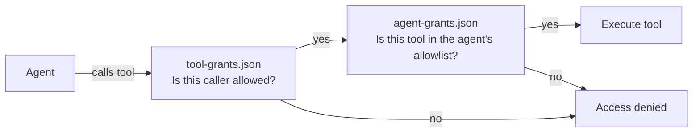
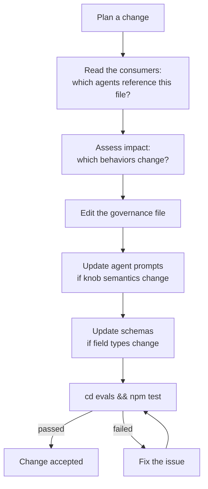

# Chapter 10 — Governance

## Why this chapter

Understand **which governance files regulate agent behavior** and how to change them safely without breaking the system.

## Key Concepts

- **Governance** — a set of configuration files in `governance/` that define agent permissions, model routing, retry budgets, and approval policies.
- **"Governance beats prompt"** — if the prompt and a governance file conflict, the governance file wins. Agents reference governance files in their Resources section.
- **Just-in-time access** — agents load governance files on demand, not upfront.

## Governance Files

| File | Purpose |
|------|---------|
| `agent-grants.json` | Which agents can access which tools |
| `tool-grants.json` | Which tools are exposed and their properties |
| `runtime-policy.json` | Operational knobs: retry budgets, tier routing, approval policies |
| `model-routing.json` | Model selection by task type and tier |
| `rename-allowlist.json` | Allowed file renames (anti-drift protection) |

## agent-grants.json and tool-grants.json — Two Sides of One Medal

These files are the **authorization layer** for tool access.

- **`agent-grants.json`** — lists which tools are allowed for each agent. Example: `CoreImplementer-subagent` has `["read_file", "write_file", "run_terminal"]`.
- **`tool-grants.json`** — defines properties for each tool: `allowed_callers`, `max_calls_per_phase`, `requires_approval`.

**Rule:** when adding a new tool to an agent, both files must be updated. If they conflict, the stricter wins.



## runtime-policy.json — Operational Knobs

The most important governance file. Orchestrator reads it as the **authoritative source** for all operational decisions.

### Key Sections

**`approval_actions`** — which operations require user approval before execution:
```
["delete_file", "drop_table", "git_push_force", "git_reset_hard", "run_destructive_migration"]
```

**`review_pipeline_by_tier`** — which reviewers run for each tier:
```
TRIVIAL: []
SMALL: [PlanAuditor]
MEDIUM: [PlanAuditor, AssumptionVerifier]
LARGE: [PlanAuditor, AssumptionVerifier, ExecutabilityVerifier]
```
(plus `code_review: always` on all tiers)

**`max_iterations_by_tier`** — review loop iteration cap:
```
TRIVIAL: 0, SMALL: 2, MEDIUM: 5, LARGE: 5
```

**`retry_budgets`** — cumulative retry limit per phase and ceiling on consecutive identical failures:
```
per_phase: 5
same_classification_ceiling: 3
```

**`stagnation_detection`** — when to call a review loop "stuck":
```
min_iterations_before_check: 3
min_improvement_percentage: 5
```

**`plan_review_gate_trigger_conditions`** — PLAN_REVIEW activation conditions:
```
min_phases: 3
confidence_threshold: 0.8
destructive_operations: true
unresolved_high_risks: true
```

**`final_review_gate`** — optional final CodeReviewer pass:
```
enabled_by_default: true / false
auto_trigger_tiers: ["LARGE"]
max_fix_cycles: 1
```

## model-routing.json

Defines which LLM model handles which type of task. Does **not** contain API keys — only model names / capabilities.

**Typical sections:**
- `task_type_routing` — by task type (research, implementation, review, planning).
- `tier_routing` — by complexity tier.
- `fallback` — default model.

**Who uses it:** Orchestrator and individual agents via the `model_role` field in schema outputs. See also [docs/agent-engineering/MODEL-ROUTING.md](../agent-engineering/MODEL-ROUTING.md).

## rename-allowlist.json

Contains permitted file renames. Prevents accidental drift: if an agent tries to rename a file not on the allowlist — the drift check fails.

**Typical structure:**
```json
[{"from": "old-name.md", "to": "new-name.md", "reason": "..."}]
```

After adding an entry here, run `cd evals && npm test` to verify the drift check accepts the new allowlist entry.

## Principle: Governance Beats Prompt

The Orchestrator prompt says "retry up to 3 times" — but `runtime-policy.json` says `per_phase: 5`. Which applies?

`runtime-policy.json` is authoritative. Agent prompts are **default behavior**; governance files **override** it. When they conflict, the governance value wins.

**Why this matters:** changing behavior doesn't require editing agent prompts. You edit `governance/runtime-policy.json`, and the change propagates to all consuming agents automatically — at the cost of each file reference being verified.

## Safe Governance Change Flowchart



## Knowledge Location Table

| Question | Where to look |
|----------|--------------|
| Which tools can an agent use? | `agent-grants.json` |
| Which callers can use a tool? | `tool-grants.json` |
| How many retries are allowed? | `runtime-policy.json → retry_budgets` |
| When does PLAN_REVIEW fire? | `runtime-policy.json → plan_review_gate_trigger_conditions` |
| Which model to use for which tier? | `model-routing.json` |
| Can a file be renamed? | `rename-allowlist.json` |
| What approval is required? | `runtime-policy.json → approval_actions` |

## Additional Governance Docs

Authoritative policy documents in `docs/agent-engineering/`:

| Document | Content |
|----------|---------|
| `CLARIFICATION-POLICY.md` | When to call `vscode/askQuestions` vs NEEDS_INPUT |
| `TOOL-ROUTING.md` | External tool routing rules (web/fetch, githubRepo, MCP) |
| `SCORING-SPEC.md` | Quantitative scoring formula |
| `PART-SPEC.md` | P.A.R.T. section order specification |
| `RELIABILITY-GATES.md` | Verification gate requirements |
| `MEMORY-ARCHITECTURE.md` | Three-layer memory model |
| `PROMPT-BEHAVIOR-CONTRACT.md` | Behavioral invariants supplementing P.A.R.T. |
| `MIGRATION-CORE-FIRST.md` | Backbone pattern and consolidation exit criteria |
| `OBSERVABILITY.md` | Gate event format and NDJSON log |

## Common Mistakes

- **Editing `runtime-policy.json` without running evals.** The drift check may break.
- **Changing a knob name without updating agent prompts that reference it.** Agents will read a non-existent field.
- **Treating `governance/` as internal agent files.** No — they are checked into the repo and are public contracts.
- **Trying to override governance with a prompt.** Governance always wins.
- **Adding a new tool without updating both `agent-grants.json` AND `tool-grants.json`.** Auth will fail.

## Exercises

1. **(beginner)** Open `governance/runtime-policy.json` and find `max_iterations_by_tier`. What is the value for MEDIUM?
2. **(beginner)** Open `governance/agent-grants.json`. How many tools does `PlanAuditor-subagent` have in its allowlist?
3. **(intermediate)** You need to change `per_phase` retry budget from 5 to 7. Which files must be updated?
4. **(intermediate)** In `runtime-policy.json` → `review_pipeline_by_tier` you see the TRIVIAL pipeline is empty (`[]`). Does this mean code review is skipped for TRIVIAL? Explain.
5. **(advanced)** Name all agents that must reference `runtime-policy.json` in their Resources section. Verify your answer against the actual agent files.

## Review Questions

1. Name the 5 governance files.
2. What does "governance beats prompt" mean?
3. Which file controls PLAN_REVIEW trigger conditions?
4. Which file controls tool access?
5. What must you do after adding a new tool to an agent?

## See Also

- [Chapter 05 — Orchestration](05-orchestration.md)
- [Chapter 07 — Review Pipeline](07-review-pipeline.md)
- [Chapter 08 — Execution Pipeline](08-execution-pipeline.md)
- [governance/](../../governance/)
- [docs/agent-engineering/](../agent-engineering/)
