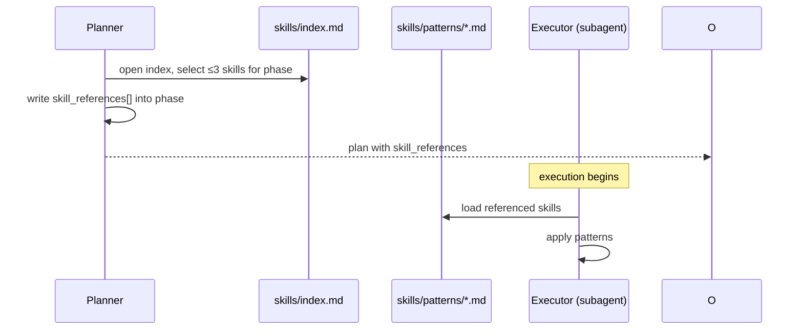

# Chapter 11 — Skills

## Why this chapter

Understand **what skills are** in ControlFlow, how they differ from documentation, and how the Planner selects and loads them.

## Key Concepts

- **Skill** — a reusable, versioned pattern file in `skills/patterns/` that provides specialized implementation guidance for a specific domain.
- **Skill index** — `skills/index.md`, the registry from which the Planner selects ≤3 skills per plan phase.
- **Just-in-time loading** — a subagent loads a skill only when it is referenced in the plan phase's `skill_references[]`.
- **Not a code library** — skills are Markdown patterns, not executable code.

## What a Skill Is

A skill is a `skills/patterns/*.md` file with:
- **Domain** — specific area (testing, reliability, budget, etc.).
- **Pattern** — a tested Markdown set of instructions for that domain.
- **Integration points** — who loads it and when.

**Skills vs documentation:**

| Skills | Documentation |
|--------|---------------|
| Loaded by an agent at runtime | Read by a human in advance |
| Selected per phase | Always available |
| At most 3 per phase | No limit |
| Contain tested patterns | Contain policies and explanations |
| Loaded just in time | Loaded on demand |

## Skill Catalog

| Skill | File | Primary Loader |
|-------|------|---------------|
| preflect-core | `preflect-core.md` | Orchestrator (mandatory before each phase) |
| llm-behavior-guidelines | `llm-behavior-guidelines.md` | CoreImplementer, UIImplementer, CodeReviewer, Planner |
| tdd-patterns | `tdd-patterns.md` | CoreImplementer, UIImplementer |
| completeness-traceability | `completeness-traceability.md` | TechnicalWriter |
| integration-validator | `integration-validator.md` | PlatformEngineer |
| reflection-loop | `reflection-loop.md` | Any agent with a reflection step |
| budget-tracking | `budget-tracking.md` | Orchestrator |
| idea-to-prompt | `idea-to-prompt.md` | Planner |
| context-map | *(see skills/README.md)* | CodeMapper-subagent |
| refactor-plan | *(see skills/README.md)* | CoreImplementer |
| what-context-needed | *(see skills/README.md)* | Any subagent needing context clarification |

> Check `skills/index.md` for the current complete list.

## Planner Discovery Protocol

The Planner selects skills in **step 5** of its planning workflow:

1. Identify the phase domain.
2. Open `skills/index.md`.
3. Select ≤3 skills matching the domain.
4. Write selected skills into `skill_references[]` in the phase.

**Rule: ≤3 skills per phase.** More skills increase context overhead and dilute focus. If a phase seems to require more, decompose it.

## Just-in-Time Loading



**Why just in time?** Skills add context to the agent's prompt. Loading all 11 skills upfront wastes tokens and creates noise. Only load what is needed for the current phase.

## Key Skills Deep Dive

### preflect-core

Loaded by the Orchestrator **before every action batch**. Contains the 4 risk classes:
1. **High-risk-destructive** — destroys or irreversibly alters data.
2. **Scope-drift** — action exceeds the plan scope.
3. **Assumption** — acting on an unverified premise.
4. **Dependency** — a prerequisite is not met.

Decision output: `GO` / `PAUSE` / `ABORT`.

### llm-behavior-guidelines

A **meta-skill** for preventing systematic agent anti-patterns. Loaded by CoreImplementer, UIImplementer, CodeReviewer, and Planner on non-trivial tasks. Patterns:
- Scope drift prevention.
- Weak success criteria detection.
- Over-abstraction detection.
- Silent assumption detection.

### tdd-patterns

Testing guidelines for CoreImplementer and UIImplementer:
- Write tests before implementation.
- Test the contract, not the implementation.
- Distinguish unit / integration / e2e levels.
- Report tests in `execution_report.tests[]`.

### completeness-traceability

For TechnicalWriter:
- Every public interface must have a doc.
- Each doc must have a code citation.
- Diagrams must be Mermaid.
- Parity check: if code changes, docs update too.

### integration-validator

For PlatformEngineer:
- Validate environment setup before deploying.
- Health checks after deployment.
- Rollback plan if health check fails.
- Report approvals in `execution_report.approvals[]`.

### idea-to-prompt

For Planner in the **idea interview** phase:
- Convert vague user ideas to concrete requirements.
- Ask clarifying questions one by one.
- Map to `risk_review` categories.
- Don't skip the semantic risk taxonomy.

### budget-tracking

For Orchestrator:
- Track remaining token/retry budget per phase.
- Signal if budget is approaching the limit.
- Reduce parallelism under resource pressure.

### reflection-loop

For agents with a revision step:
- After producing output, step back and self-evaluate.
- Look for violations of own invariants.
- Include reflection results in the output.

## skill_references in the Schema

Each phase in `planner.plan.schema.json` has a `skill_references[]` field:
```json
"skill_references": [
  "preflect-core",
  "tdd-patterns"
]
```

Value = skill name without extension. Agents use this list to know which skill patterns to load during execution.

## Adding a New Skill

1. Create `skills/patterns/<name>.md`.
2. Add an entry to `skills/index.md` with: name, file, description, primary consumers.
3. Update the Planner phase-skill mapping if needed.
4. Run `cd evals && npm test` — drift checks validate the skill index.

## Common Mistakes

- **Treating skills as runtime code.** Skills are Markdown patterns — they provide guidance, not execution.
- **Loading all skills in advance.** Just-in-time loading only — otherwise tokens are wasted.
- **Selecting > 3 skills for one phase.** If a phase requires more → decompose the phase.
- **Forgetting to update `skills/index.md` when adding a skill.** The eval drift check will fail.
- **Confusing `skill_references[]` with documentation links.** They serve a different purpose — they point to loaded patterns, not readable references.

## Exercises

1. **(beginner)** Open `skills/index.md` and count how many skills are in the registry.
2. **(beginner)** Which agents load `llm-behavior-guidelines.md` according to the skill description?
3. **(intermediate)** A phase plans to: write backend, write tests, and update docs. Which ≤3 skills would you assign?
4. **(intermediate)** A plan for a SMALL-tier task has phases: "research", "implement", "document". Which skills are appropriate for phase 2 "implement"?
5. **(advanced)** Describe how adding a new skill affects the eval harness. Which tests can fail?

## Review Questions

1. What is a skill in ControlFlow?
2. How many skills can be in `skill_references[]` per phase?
3. What is just-in-time loading?
4. Which skill is mandatory before every Orchestrator action batch?
5. What must you update when adding a new skill to the repo?

## See Also

- [Chapter 06 — Planning](06-planning.md)
- [Chapter 08 — Execution Pipeline](08-execution-pipeline.md)
- [skills/index.md](../../skills/index.md)
- [skills/patterns/](../../skills/patterns/)
