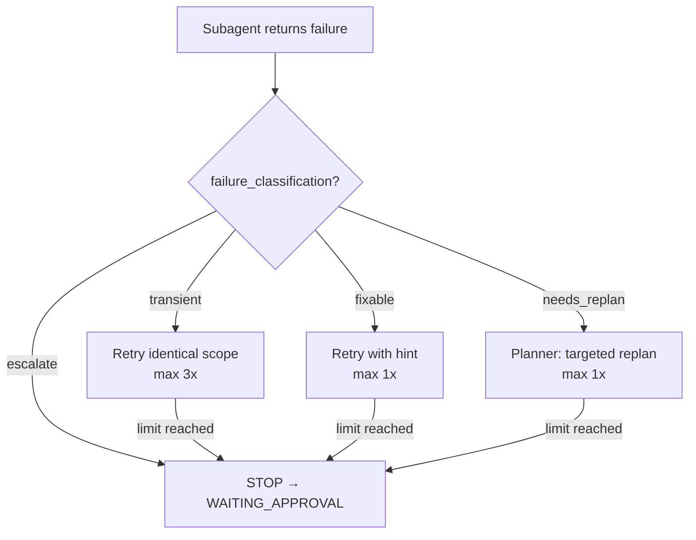
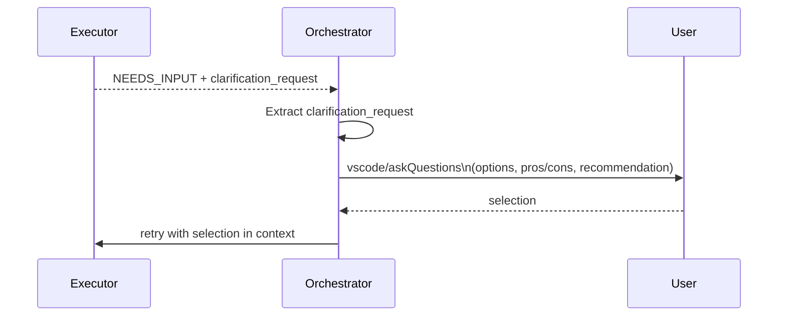

# Chapter 13 — Failure Taxonomy

## Why this chapter

Understand **how ControlFlow classifies failures** so that errors resolve efficiently: retrying when retrying helps, escalating when escalating is needed, without getting into an infinite loop.

## Key Concepts

- **failure_classification** — a mandatory field in every subagent output if the status is `FAILED`, `NEEDS_REVISION`, `NEEDS_INPUT`, or `REJECTED`.
- **Routing** — which action the Orchestrator takes based on the classification.
- **Retry budget** — a limit on the total number of retries per phase.
- **NEEDS_INPUT** — a separate routing path from `failure_classification`; goes through user clarification.

## When failure_classification Is Required

If a subagent status is one of the following, `failure_classification` is **required**:
- `FAILED`
- `NEEDS_REVISION`
- `NEEDS_INPUT`
- `REJECTED`

**Exception:** PlanAuditor and AssumptionVerifier **exclude** `transient` — their failures are structural and non-transient by nature.

## The 4 Classification Classes

| Class | Meaning | Example |
|-------|---------|---------|
| `transient` | Temporary tool error; retry identically | Network timeout, rate limit (HTTP 429) |
| `fixable` | Small correctable error; retry with a hint | Missing import, typo in config |
| `needs_replan` | Architecture mismatch; replan the phase | Dependency doesn't exist, API incompatibility |
| `escalate` | Security risk or unresolvable blocker; stop | Data loss risk, security vulnerability |

## Routing Flowchart

## Retry Routing Table

| Classification | Action | Max Retries |
|----------------|--------|------------|
| `transient` | Retry same agent, identical scope | 3 |
| `fixable` | Retry same agent with `fix_hint` in context | 1 |
| `needs_replan` | Delegate to Planner: targeted phase replan | 1 |
| `escalate` | STOP; transition to WAITING_APPROVAL; present to user | 0 |

## Reliability Policy

Full list of reliability policies from [Orchestrator.agent.md](../../Orchestrator.agent.md):

1. **Silent Failure Detection:** Empty response, timeout, HTTP 429 → failure, **not** success. Must not silently continue.

2. **Per-Phase Retry Budget:** Cumulative limit per phase = **5 retries** across all failure classifications.

3. **Same-Classification Ceiling:** If the same phase fails **3 times** with the same classification → escalate (regardless of individual class budget).

4. **Per-Wave Throttling:** If **≥2 subagents** in one wave return `transient` → reduce parallelism for subsequent waves by 50% (prevent rate-limit cascade).

5. **Exponential Backoff Signaling:** On transient retry, include `retry_attempt` count in the delegation payload so the subagent adjusts call frequency.

## Who Returns What

| Agent | Possible classifications |
|-------|------------------------|
| CoreImplementer | transient, fixable, needs_replan, escalate |
| UIImplementer | transient, fixable, needs_replan, escalate |
| PlatformEngineer | transient, fixable, needs_replan, escalate |
| TechnicalWriter | transient, fixable, needs_replan, escalate |
| BrowserTester | transient, fixable, needs_replan, escalate |
| PlanAuditor | fixable, needs_replan, escalate (NO transient) |
| AssumptionVerifier | fixable, needs_replan, escalate (NO transient) |
| ExecutabilityVerifier | fixable, needs_replan, escalate (NO transient) |
| Planner | needs_replan, escalate |

## NEEDS_INPUT — Separate Routing Path

`NEEDS_INPUT` is a distinct routing path, **independent of** `failure_classification`.

When a subagent returns `status: "NEEDS_INPUT"` with `clarification_request`:

The `clarification_request` format (see `schemas/clarification-request.schema.json`):
- `question`
- `options[]` — each with `label`, `pros`, `cons`, `affected_files`, `recommended`
- `recommendation_rationale`
- `impact_analysis`

## End-to-End Scenario Walkthrough

**Scenario:** Phase 3 fails.

1. CoreImplementer returns `status: FAILED`, `failure_classification: transient`. → Orchestrator retries (retry 1/3).
2. Same failure. → Orchestrator retries (retry 2/3).
3. Same failure again. → 3 identical transient → **escalate ceiling hit**. Transition to WAITING_APPROVAL.
4. User says "probably a network issue; try again in 5 minutes."
5. Orchestrator retries after waiting. → CoreImplementer returns `COMPLETE`. Phase proceeds.

Note: Step 3 fires the **same-classification ceiling** (3×), not the per-phase budget (5). The ceiling is stricter.

## Output Requirements

When returning `failure_classification`, agents include in the output:
- `failure_classification` (string)
- `failure_reason` (description for routing)
- `fix_hint` (for `fixable` — what exactly to fix)
- `escalation_details` (for `escalate` — why human intervention is needed)

These fields are defined in the respective execution-report schemas.

## Common Mistakes

- **Treating NEEDS_INPUT as a `failure_classification`.** No — it's a separate path through `vscode/askQuestions`.
- **Continuing after an empty response.** Silent failure — must be caught, not ignored.
- **Giving PlanAuditor a `transient` classification.** Forbidden — reviewers exclude `transient` by contract.
- **Forgetting to pass `retry_attempt`.** The subagent needs this to adjust behavior.
- **Assuming `needs_replan` repairs the current phase.** It rewrites the phase through Planner — not in place.

## Exercises

1. **(beginner)** Fill in the table: agent = CoreImplementer, failure = "npm registry unavailable for 30 seconds". Classification?
2. **(beginner)** Same scenario but: PlanAuditor, "architecture section references a module that doesn't exist". Classification?
3. **(intermediate)** After 2 transient retries, the phase fails a 3rd time with `fixable`. How many total retries are left in the budget? What does the Orchestrator do?
4. **(intermediate)** Waves 2 and 3 each contain 3 subagents. Two of wave-2 subagents return `transient`. What does the Orchestrator do with wave 3?
5. **(advanced)** UIImplementer returns NEEDS_INPUT with `clarification_request.options` containing 3 options. Describe the exact user interaction format. Where is this behavior defined?

## Review Questions

1. Name the 4 failure classification classes.
2. When is `failure_classification` required?
3. Who excludes `transient` and why?
4. What is the per-phase cumulative retry budget?
5. What is the difference between NEEDS_INPUT and `needs_replan`?

## See Also

- [Chapter 05 — Orchestration](05-orchestration.md)
- [Chapter 08 — Execution Pipeline](08-execution-pipeline.md)
- [docs/agent-engineering/CLARIFICATION-POLICY.md](../agent-engineering/CLARIFICATION-POLICY.md)
- [schemas/clarification-request.schema.json](../../schemas/clarification-request.schema.json)
