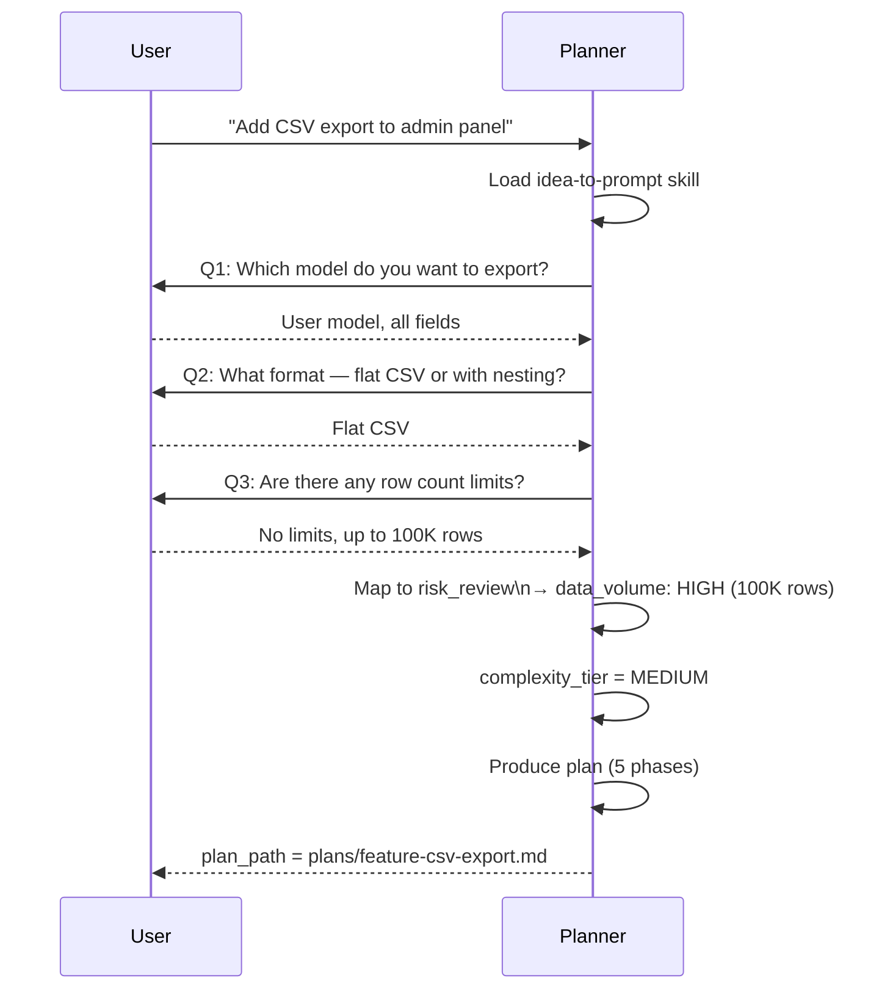
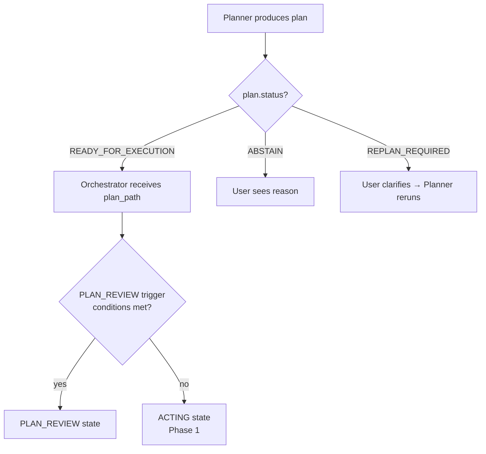
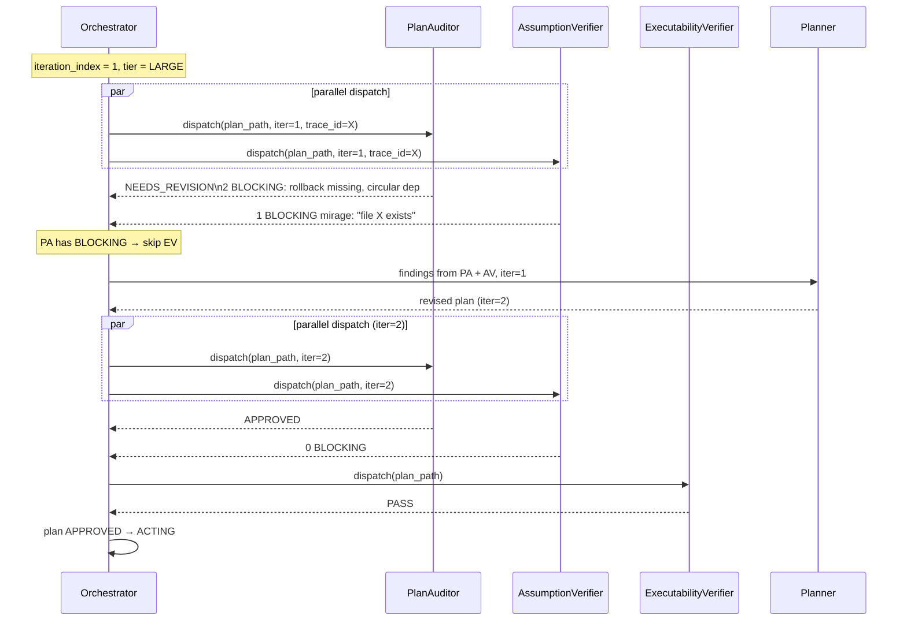
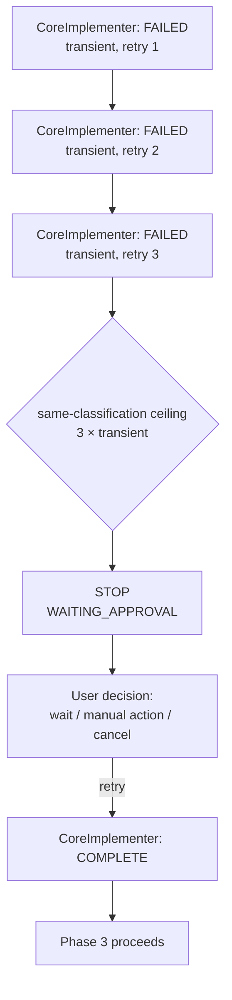
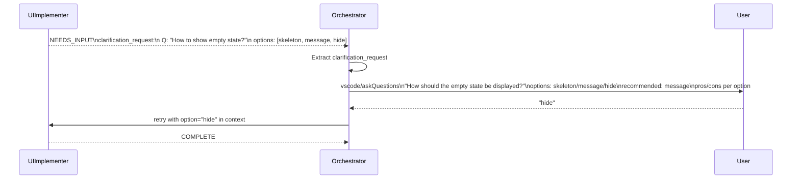
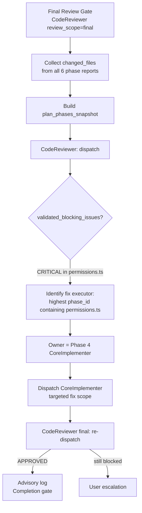

# Chapter 15 — Case Studies

## Why this chapter

Concrete scenarios showing how the ControlFlow system works in practice. Each case study presents a real interaction pattern with diagrams.

## How to Read a Case Study

Each case presents:
- **Scenario** — what the user wants.
- **Flow** — sequence or flowchart.
- **Key decisions** — which rules or contracts determine what happens.

## Case Study 1: Planner Idea Interview

**Scenario:** User says "I want to add a CSV export to the admin panel."



**Key decisions:**
- `idea-to-prompt` skill determines the interview structure.
- `data_volume: HIGH` → risk entry `unresolved` → PLAN_REVIEW activates.
- MEDIUM tier → PlanAuditor + AssumptionVerifier (no ExecutabilityVerifier).

## Case Study 2: Planner → Orchestrator Handoff

**Scenario:** Planner produces a plan, Orchestrator receives it.



**Key decisions:**
- `plan.status` is checked first — ABSTAIN/REPLAN_REQUIRED do not proceed to implementation.
- PLAN_REVIEW trigger conditions are read from `governance/runtime-policy.json`.
- Plan arrival does not mean implicit approval — trigger evaluation runs every time.

## Case Study 3: Orchestrator + PlanAuditor — Adversarial Detection

**Scenario:** LARGE-tier plan, iteration 1. PlanAuditor finds 2 BLOCKING issues.



**Key decisions:**
- PA and AV run in parallel (LARGE tier).
- EV skips in iteration 1 because PA returned NEEDS_REVISION.
- Iteration 2: both PA and AV clean → EV runs.
- EV PASS → plan approved.

## Case Study 4: ExecutabilityVerifier — Cold Start

**Scenario:** LARGE-tier plan. EV detects that phase 2 task 1 lacks a concrete file path.

```mermaid
flowchart TD
    EV[ExecutabilityVerifier receives plan_path] --> W1[Simulate walk-through:\nPhase 1, Task 1]
    W1 --> W2[Phase 1, Task 2]
    W2 --> W3[Phase 1, Task 3]
    W3 --> W4[Phase 2, Task 1]
    W4 --> Gap{Gaps detected?}
    Gap -->|path missing| Fail[status: FAIL\ngaps: ["no concrete file path"]]
    Gap -->|all clear| Pass[status: PASS]
    Fail --> Planner[Route to Planner:\nrefine phase 2 task 1]
```

**Key decisions:**
- EV simulates the first 3 tasks of each phase as a cold-start executor (no prior context).
- "No concrete file path" is classified as `executable: false`.
- FAIL routes to Planner for targeted refinement, not a full replan.

## Case Study 5: Failure Retry Cascade

**Scenario:** Phase 3, CoreImplementer fails 3 times with transient.



**Key decisions:**
- 3 identical transient failures hit the **same-classification ceiling** even before the 5-retry per-phase budget.
- WAITING_APPROVAL — the user makes the decision.
- After the user says "retry", the agent continues from where it left off.

## Case Study 6: NEEDS_INPUT Routing

**Scenario:** UIImplementer cannot decide how to display empty state in the export dialog.



**Key decisions:**
- NEEDS_INPUT is **not** `failure_classification` — it routes through `vscode/askQuestions`.
- The Orchestrator extracts the full `clarification_request` and passes it to `askQuestions`.
- After the user selects, the Orchestrator retries the same UIImplementer with the selection in context.

## Case Study 7: Final Review Gate — Scope Drift

**Scenario:** LARGE-tier task, all 6 phases complete. Final review reveals that CoreImplementer in phase 4 modified `src/auth/permissions.ts` — a file not in phase 4's scope.



**Key decisions:**
- Fix executor is the phase with the **highest** `phase_id` containing the affected file.
- Maximum 1 fix cycle per file.
- **CodeReviewer never owns the fix** — it only evaluates.

---

## Scenario Reading Template

When working through an unfamiliar failure scenario, use this template:

1. **What was the status?** (FAILED / NEEDS_INPUT / NEEDS_REVISION / REJECTED)
2. **What was the failure_classification?** (or is it NEEDS_INPUT routing?)
3. **Who returned the failure?** (reviewer? executor? Planner?)
4. **Which routing path applies?** (retry / replan / escalate / askQuestions)
5. **What are the retry limits?** (per-phase budget, same-class ceiling)
6. **What happens after the retry?** (proceed / escalate / user decision)

## Common Mistakes

- **Confusing "Planner produces a plan" with "plan approved."** Planner hands off a reviewable artifact, not an approved plan.
- **Expecting EV to run even when PA found BLOCKING issues.** EV only runs when PA approved and AV has 0 BLOCKING.
- **Forgetting NEEDS_INPUT is not a failure.** NEEDS_INPUT routes to the user, not to retry logic.
- **Giving CodeReviewer a fix cycle.** It never fixes — the executor does.

## Exercises

1. **(beginner)** In Case Study 1, why does `data_volume: HIGH` affect complexity tier?
2. **(beginner)** In Case Study 3, why does EV skip in iteration 1?
3. **(intermediate)** In Case Study 6, what happens if the user selects "skeleton" instead of "hide"?
4. **(intermediate)** In Case Study 5, what if the 4th failure is `fixable` (not `transient`)? What does the Orchestrator do?
5. **(advanced)** In Case Study 7, if `permissions.ts` was modified in phases 2 and 5, who is the fix executor and why?

## Review Questions

1. When does EV run in LARGE tier?
2. What does "same-classification ceiling" mean?
3. How does the Orchestrator determine the fix executor in the final review?
4. Why does plan arrival not mean implicit approval?
5. What happens if `needs_replan` limit (1) is exhausted?

## See Also

- [Chapter 05 — Orchestration](05-orchestration.md)
- [Chapter 07 — Review Pipeline](07-review-pipeline.md)
- [Chapter 08 — Execution Pipeline](08-execution-pipeline.md)
- [Chapter 13 — Failure Taxonomy](13-failure-taxonomy.md)
