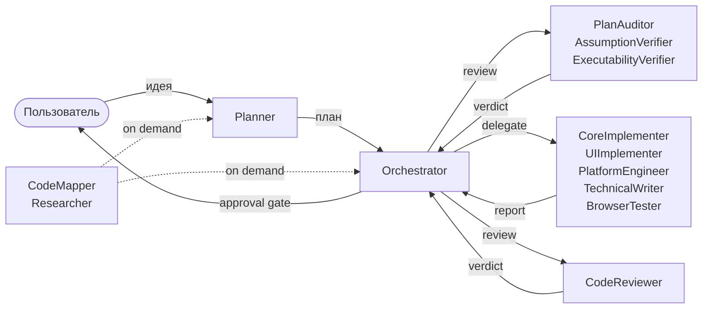

# Глава 01 — Быстрый старт

## Зачем эта глава

За 15 минут получить рабочий обзор репозитория: где что лежит, как запустить проверки и как «вызвать» агента в реальной IDE-сессии.

## Шаг 1. Карта репозитория за 60 секунд

```
ControlFlow/
├── *.agent.md                       # 13 агентов (промпты)
├── schemas/                         # 15 JSON-схем (контракты)
├── governance/                      # 5 файлов политик
│   ├── agent-grants.json
│   ├── tool-grants.json
│   ├── runtime-policy.json
│   ├── model-routing.json
│   └── rename-allowlist.json
├── skills/
│   ├── index.md                     # каталог skill-паттернов
│   └── patterns/                    # 11 паттернов
├── evals/                           # оффлайн-проверки
│   ├── package.json                 # npm test → канонический gate
│   ├── validate.mjs                 # структурный проход
│   └── scenarios/                   # сценарии для регрессионных тестов
├── docs/
│   ├── agent-engineering/           # 12 канонических спецификаций
│   └── tutorial-ru/                 # это пособие
├── plans/
│   ├── project-context.md           # реестр агентов и tiers
│   ├── templates/                   # шаблоны плановых документов
│   └── artifacts/                   # task-episodic память
├── README.md                        # верхнеуровневое описание
├── AGENTS.md                        # рабочие заметки для AI-агента
├── NOTES.md                         # repo-persistent состояние
├── CONTRIBUTING.md                  # как добавлять агентов/схемы
├── .github/copilot-instructions.md  # общие политики
└── governance/runtime-policy.json   # параметры retry, тиров, ревью
```

## Шаг 2. Запуск канонической проверки

Это **единственная** команда, которая что-либо «выполняет» в этом репозитории:

```sh
cd evals
npm install
npm test
```

Что произойдёт: запустится `validate.mjs` + `prompt-behavior-contract.test.mjs` + `orchestration-handoff-contract.test.mjs` + `drift-detection.test.mjs`. Это **оффлайн** проверки — никаких сетевых вызовов, никаких реальных LLM. Проверки структуры, поведенческих инвариантов и согласованности схем (см. [evals/README.md](../../evals/README.md)).

Альтернативные режимы:

```sh
npm run test:structural   # быстрая проверка только схем и P.A.R.T.
npm run test:behavior     # только поведенческие и handoff-инварианты
```

## Шаг 3. Общая картина



**Кто чем занят:**

- **Пользователь** даёт задачу.
- **Planner** превращает её в структурированный план с фазами.
- **Orchestrator** проводит план через ревью и исполнение.
- **Reviewers** (3 шт.) ищут проблемы в плане *до* исполнения.
- **Executors** (5 шт.) пишут код / docs / тесты.
- **CodeReviewer** проверяет каждую фазу после исполнения.
- **Researchers** (2 шт.) предоставляют контекст по запросу.

## Шаг 4. Где «живут» агенты

Агенты — это **не процессы** и не сервисы. Это промпты в формате Markdown с YAML-frontmatter. LLM (например, GitHub Copilot Chat в VS Code) читает эти файлы и **играет** соответствующую роль.

Пример вызова в VS Code Copilot Chat:

- `@Planner` — вызывает агента-планировщика.
- `@Orchestrator` — вызывает оркестратора (для готового плана).
- `@Researcher` — для глубокого исследования.
- `@CodeMapper` — для быстрой разведки кода.

Subagent-ы (`*-subagent.agent.md`) обычно запускаются **через `runSubagent`**, инициированный родительским агентом, а не напрямую пользователем.

## Шаг 5. Минимальный сценарий end-to-end

Допустим, вы хотите **добавить новую функцию** в проект (не ControlFlow, а *вашего* приложения, в репозиторий которого вы скопировали ControlFlow-агентов). Последовательность:

1. **Вызовите Planner**: `@Planner Добавь экспорт CSV в страницу отчётов`.
2. **Planner проведёт интервью** (если задача расплывчата) или сразу составит план.
3. **План сохранится** в `plans/<task-name>-plan.md`.
4. **Planner передаст управление Orchestrator** через `handoff`.
5. **Orchestrator оценит сложность** (TRIVIAL/SMALL/MEDIUM/LARGE) и решит, нужен ли PLAN_REVIEW.
6. **Если нужен** — параллельно вызовутся PlanAuditor, AssumptionVerifier, ExecutabilityVerifier (зависит от тира).
7. **После одобрения плана** Orchestrator волнами вызывает исполнителей (CoreImplementer / UIImplementer / …).
8. **После каждой фазы** — обязательный CodeReviewer.
9. **На границах волн** — пауза на одобрение пользователя.
10. **Финал**: completion gate, опциональный final review для LARGE-задач.

## Шаг 6. Что прочитать дальше

- Хотите быстро **понять зачем нужен каждый агент** → [Глава 03 — Реестр агентов](03-agent-roster.md).
- Хотите **прочитать первый агентский файл** и не запутаться → [Глава 04 — P.A.R.T.](04-part-spec.md).
- Хотите **общую картину архитектуры** глубже → [Глава 02 — Архитектурный обзор](02-architecture-overview.md).
- Хотите **сразу к процессам** → [Глава 05 — Оркестрация](05-orchestration.md).

## Упражнения

1. **(новичок)** Откройте `Orchestrator.agent.md` и найдите четыре секции P.A.R.T. Запишите номера строк, на которых они начинаются.
2. **(новичок)** Запустите `cd evals && npm test`. Сколько тестов прошло? Сколько занял прогон?
3. **(средний)** Откройте `governance/runtime-policy.json` и найдите параметр `max_iterations_by_tier`. Какое значение для LARGE?
4. **(средний)** Откройте `schemas/planner.plan.schema.json` и найдите `executor_agent` enum. Какие 8 значений в нём перечислены?

## Контрольные вопросы

1. Какая команда — единственный канонический способ что-либо «запустить» в этом репо?
2. Где физически живут агентские «процессы»?
3. Что произойдёт, если задача расплывчата, и я вызову `@Planner`?
4. Чем `runSubagent`-вызов отличается от прямого `@`-вызова?

## См. также

- [Глава 02 — Архитектурный обзор](02-architecture-overview.md)
- [Глава 03 — Реестр агентов](03-agent-roster.md)
- [README репозитория](../../README.md)
- [evals/README.md](../../evals/README.md)
