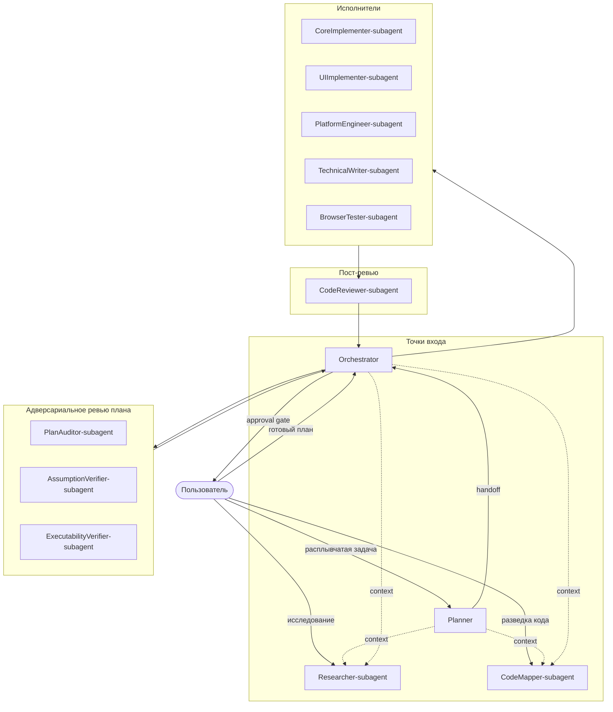
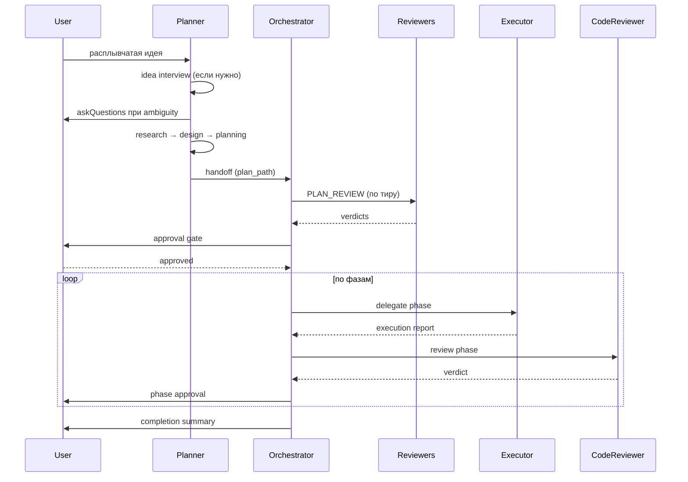

# Глава 02 — Архитектурный обзор

## Зачем эта глава

Получить ментальную модель всей системы: какие группы агентов существуют, как идут потоки управления, какие подсистемы их связывают. После этой главы вы сможете на собеседовании за 5 минут нарисовать архитектуру ControlFlow на доске.

## Ключевые понятия

- **Агент (agent)** — Markdown-файл с YAML-frontmatter, описывающий роль для LLM. Не процесс, не сервис.
- **Subagent** — агент, который вызывается *из другого агента*, а не пользователем напрямую. Соглашение в имени: `*-subagent.agent.md`.
- **Оркестратор (Orchestrator)** — единственный «дирижёр». Не реализует сам, а делегирует.
- **Volнa (wave)** — группа фаз плана, исполняемых параллельно. Wave N+1 ждёт окончания wave N.
- **Гейт (gate)** — точка контроля, в которой проверяется условие и принимается решение GO/REPLAN/ABSTAIN.
- **Контракт (schema)** — JSON-схема, которой обязан соответствовать выход агента.

## Архитектура верхнего уровня

## Группы агентов и их роли

ControlFlow содержит **13 агентов**, разделённых на 5 функциональных групп:

### 1. Точки входа (Entry points)

Это агенты, которых пользователь вызывает **напрямую**.

| Агент | Когда вызывать |
|-------|---------------|
| **Planner** | Задача расплывчата или требует разбиения. Выходом будет план. |
| **Orchestrator** | Готовый план или конкретная задача с понятными требованиями. |
| **Researcher-subagent** | Глубокое исследование вопроса с цитированием источников. |
| **CodeMapper-subagent** | Быстрая разведка: «где в коде такая-то логика?» |

**Researcher** и **CodeMapper** также являются точками входа, хотя по соглашению в имени — subagent. Это исключение: они достаточно автономны, чтобы вызываться напрямую.

### 2. Адверсариальное ревью плана (Review)

Эти агенты **только читают** артефакты и **только во время PLAN_REVIEW**. Они никогда не пишут код и никогда не появляются как `executor_agent` в фазах плана.

| Агент | Что ищет |
|-------|---------|
| **PlanAuditor-subagent** | Проблемы архитектуры, безопасности, рисков, отсутствие отката. |
| **AssumptionVerifier-subagent** | «Миражи» — утверждения в плане, не подтверждённые кодовой базой. 17 паттернов. |
| **ExecutabilityVerifier-subagent** | Холодный старт первых 3 задач: достаточно ли в них конкретики, чтобы исполнитель не «застрял»? |

### 3. Исполнители (Executors)

Эти агенты **создают и изменяют файлы**. Они вызываются Orchestrator-ом по полю `executor_agent` фазы плана.

| Агент | Домен |
|-------|------|
| **CoreImplementer-subagent** | Бэкенд-код, тесты, любая нон-UI имплементация. **Канонический backbone**. |
| **UIImplementer-subagent** | Фронтенд: компоненты, стили, accessibility, responsive. |
| **PlatformEngineer-subagent** | CI/CD, контейнеры, инфраструктура, deployment с rollback-ом. |
| **TechnicalWriter-subagent** | Документация, диаграммы, parity между кодом и доками. |
| **BrowserTester-subagent** | E2E браузерные тесты, accessibility-аудит. |

### 4. Пост-ревью (Post-review)

| Агент | Когда вызывается |
|-------|------------------|
| **CodeReviewer-subagent** | После каждой фазы исполнения; опционально на финальном этапе для LARGE-задач. |

### 5. Дирижёр (Orchestrator)

Единственный, кто видит всю картину и принимает решения о делегировании, ревью, эскалации.

## Ключевые потоки

### Поток 1. От идеи к коду

### Поток 2. Уточнение в середине процесса

Когда subagent в исполнении наталкивается на ambiguity, он возвращает `NEEDS_INPUT` с `clarification_request`. Orchestrator показывает варианты пользователю через `vscode/askQuestions`, получает ответ, и **повторяет ту же задачу** с добавленным контекстом. Подробнее — [глава 05](05-orchestration.md).

### Поток 3. Сбой и retry

Каждый сбой получает `failure_classification` (transient / fixable / needs_replan / escalate). Orchestrator маршрутизирует автоматически по таблице из [главы 13](13-failure-taxonomy.md): retry, retry с подсказкой, replan, или эскалация к человеку.

## Подсистемы, связывающие агентов

| Подсистема | Где живёт | Зачем |
|------------|----------|------|
| **Schemas** | `schemas/*.json` | Контракты между агентами; основа eval-проверок. |
| **Governance** | `governance/*.json` | Разрешения на инструменты, политики retry, маршрутизация моделей. |
| **Skills** | `skills/patterns/*.md` | Переиспользуемые экспертные знания, выбираемые Planner-ом. |
| **Memory** | `NOTES.md`, `plans/artifacts/`, `/memories/` | Трёхслойная модель: session / task-episodic / repo-persistent. |
| **Eval harness** | `evals/` | Оффлайн-проверки качества всей системы. |

Каждая из них — отдельная глава пособия (09–14).

## Принципы архитектуры

1. **Разделение планирования и исполнения**. Planner не пишет код. CoreImplementer не меняет дизайн.
2. **Адверсариальное ревью до исполнения**. Дешевле найти проблему в плане, чем в коде.
3. **Контракты вместо доверия**. Каждое сообщение между агентами — JSON со схемой.
4. **Гейты человеческого одобрения**. На границах фаз и волн пользователь подтверждает продолжение.
5. **Явная taxonomy сбоев**. Любой сбой классифицируется одним из 4 классов и маршрутизируется детерминированно.
6. **Fail-loud, abstain-safe**. Если агент не уверен — он возвращает ABSTAIN, а не угадывает.
7. **Минимум привилегий**. Каждый агент имеет ровно тот набор инструментов, который ему нужен (`governance/agent-grants.json`).
8. **Структурированный текст**. Агенты не выводят raw JSON в чат — это пустая трата контекста.

## Типичные ошибки понимания

- **«Subagent — это агент, выполняющий subtask»**. Нет, это просто соглашение об имени; subagent отличается от не-subagent тем, что обычно вызывается из другого агента, а не пользователем.
- **«PlanAuditor исполняет фазы»**. Нет, это исключительно read-only ревьюер, никогда не появляется в `executor_agent`.
- **«Orchestrator пишет код»**. Нет, он только дирижирует. Если он начинает писать — это нарушение контракта.
- **«Можно вызвать любой исполнитель напрямую»**. Технически да, но они спроектированы для вызова из Orchestrator-а с готовым контекстом фазы.

## Упражнения

1. **(новичок)** Нарисуйте на бумаге диаграмму всех 13 агентов, сгруппированных по 5 категориям. Сверьтесь с диаграммой выше.
2. **(новичок)** Откройте `plans/project-context.md`, найдите таблицу «Phase Executor Agents». Совпадает ли она с разделом «Исполнители» из этой главы?
3. **(средний)** Какие три агента **не могут** появиться в поле `executor_agent` фазы плана и почему?
4. **(средний)** Откройте 3 агентских файла на ваш выбор. Найдите в каждом раздел `Tools → Allowed`. Заметили, что у read-only агентов набор существенно меньше?
5. **(продвинутый)** Объясните, почему `Researcher-subagent` и `CodeMapper-subagent` могут быть точками входа, хотя в имени у них `subagent`.

## Контрольные вопросы

1. Перечислите 5 функциональных групп агентов.
2. Какой агент является «каноническим backbone» для имплементеров?
3. Что делает PLAN_REVIEW и кто в нём участвует?
4. Почему Orchestrator не может одновременно быть исполнителем фазы?
5. Какая подсистема связывает агентов через формальные контракты?

## См. также

- [Глава 03 — Реестр агентов](03-agent-roster.md)
- [Глава 05 — Оркестрация](05-orchestration.md)
- [Глава 07 — Ревью-пайплайн](07-review-pipeline.md)
- [plans/project-context.md](../../plans/project-context.md)
