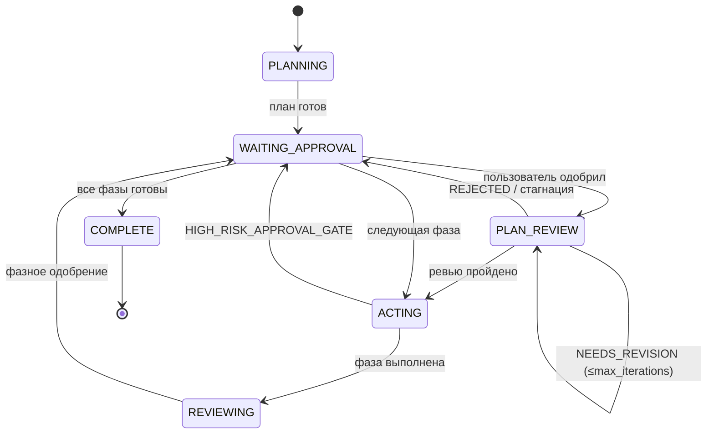
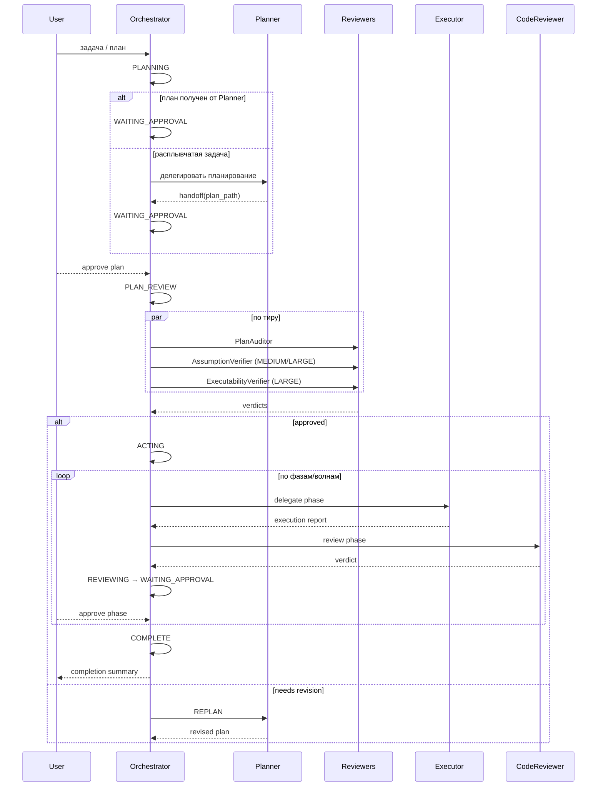

# Глава 05 — Оркестрация

## Зачем эта глава

Понять, **как Orchestrator управляет всем процессом**: какие у него состояния, как он принимает решения, как делегирует, как реагирует на сбои. После этой главы вы сможете «по шагам» проследить любую задачу от начала до завершения.

## Ключевые понятия

- **Состояние (workflow state)** — узел жизненного цикла Orchestrator: PLANNING / WAITING_APPROVAL / PLAN_REVIEW / ACTING / REVIEWING / COMPLETE.
- **Гейт-событие (gate event)** — структурированное сообщение, фиксирующее переход состояния и решение. Контракт: `schemas/orchestrator.gate-event.schema.json`.
- **Делегирование (delegation)** — передача задачи subagent-у с явным контрактом и контекстом.
- **Approval gate** — точка, в которой требуется явное одобрение пользователя.
- **Trace ID** — UUIDv4, генерируемый при старте задачи и пробрасываемый во все события и делегирования для корреляции логов.

## Жизненный цикл

**Важно:** В прампт-описании Orchestrator используется лейбл `PLAN_REVIEW`, но в **wire-формате** `schemas/orchestrator.gate-event.schema.json` это сериализуется через `event_type: PHASE_REVIEW_GATE` + поля `iteration_index` / `max_iterations`. Не путайте: «лейбл состояния в промпте» ≠ «значение workflow_state в схеме».

## Типы гейт-событий

Из `schemas/orchestrator.gate-event.schema.json`:

| Event type | Когда |
|------------|-------|
| `PLAN_GATE` | Решение о принятии плана к исполнению. |
| `PREFLECT_GATE` | Pre-action гейт (4 risk-класса). |
| `PHASE_REVIEW_GATE` | Ревью результата фазы или итерации plan-review. |
| `HIGH_RISK_APPROVAL_GATE` | Деструктивная операция требует одобрения. |
| `COMPLETION_GATE` | Финальная сводка. |

## Поля gate-event

Каждое событие содержит как минимум:

- `event_type` — один из enum выше.
- `workflow_state` — текущее состояние.
- `decision` — `GO` / `REPLAN` / `ABSTAIN` / `APPROVED` / `REJECTED` / …
- `requires_human_approval` — boolean.
- `reason` — одно предложение.
- `next_action` — что произойдёт дальше.
- `trace_id` — UUIDv4 для корреляции.
- `iteration_index`, `max_iterations` — для review-loop.

## Сценарий: типичная end-to-end задача

## Делегирование

Orchestrator делегирует задачу subagent-у через структурированный payload по `schemas/orchestrator.delegation-protocol.schema.json`. Минимальные поля:

- `target_agent` — имя subagent-а.
- `phase_id`, `phase_title`.
- `executor_agent` — должно совпадать с полем фазы из плана.
- `scope` — описание задачи.
- `inputs` — пути к файлам, контекст.
- `expected_output_schema` — какую схему subagent должен вернуть.
- `trace_id`, `iteration_index`.

**Правило:** Orchestrator делегирует **только** агентам, перечисленным в `plans/project-context.md`. Внешние агенты запрещены.

## Approval gates

Обязательные точки паузы:

1. **После одобрения плана** — пользователь явно одобряет план до любого исполнения.
2. **После каждого ревью фазы** — verdict CodeReviewer показывается; продолжение только по подтверждению.
3. **Перед completion** — финальная сводка перед коммитом/мерджем.
4. **Перед HIGH_RISK операциями** — деструктивные действия (delete, drop, force push, …).

**Batch approval:** для многофазных планов одобрение запрашивается **раз на волну**, а не на фазу. Исключение — фазы с деструктивными операциями требуют per-phase approval.

## PreFlect

Перед **любым** action batch Orchestrator выполняет PreFlect — проверку 4 risk-классов из [skills/patterns/preflect-core.md](../../skills/patterns/preflect-core.md):

1. **Scope drift** — выходим ли мы за рамки текущей фазы?
2. **Schema/contract drift** — нарушим ли контракт?
3. **Missing evidence** — есть ли доказательства, или мы угадываем?
4. **Safety/destructive** — нужна ли подтверждённая высокорисковая авторизация?

Решение: GO / REPLAN / ABSTAIN. **«Silent GO with unresolved risk is a contract violation.»**

## Failure handling

Каждый сбой получает `failure_classification`. Orchestrator маршрутизирует автоматически (см. [главу 13](13-failure-taxonomy.md)):

| Класс | Действие | Лимит |
|-------|---------|-------|
| transient | Retry той же задачи | 3 |
| fixable | Retry с подсказкой | 1 |
| needs_replan | Замкнуть на Planner для замены фазы | 1 |
| escalate | СТОП → WAITING_APPROVAL → пользователь | 0 |

**Reliability policy** (из `governance/runtime-policy.json`):
- `max_retries_per_phase` = 5 кумулятивно.
- 3 одинаковых сбоя подряд → эскалация (несмотря на класс).
- ≥2 transient в одной волне → следующая волна с 50% параллелизма.

## NEEDS_INPUT routing

Если subagent возвращает `status: NEEDS_INPUT` с `clarification_request`, Orchestrator **не классифицирует это как failure**. Маршрут отдельный:

1. Извлечь `clarification_request`.
2. Показать варианты пользователю через `vscode/askQuestions`.
3. Дождаться выбора.
4. Повторить subagent-задачу с добавленным контекстом.

См. [docs/agent-engineering/CLARIFICATION-POLICY.md](../agent-engineering/CLARIFICATION-POLICY.md).

## Wave-aware execution

Если в плане у фаз есть поле `wave`:

1. Группируем фазы по wave (по возрастанию).
2. Внутри волны — параллельное исполнение (до `max_parallel_agents`).
3. Wave N+1 ждёт окончания **всех** фаз wave N.
4. Если какая-то фаза волны упала — оцениваем через failure classification до перехода.

## Стоп-правила

Эти моменты — **запрещено** игнорировать:

1. После одобрения плана.
2. После каждого ревью фазы.
3. После completion summary.

Нарушение стоп-правила = пропуск гейта = нарушение контракта.

## Observability

При любом event Orchestrator может опционально дописывать NDJSON-строку в `plans/artifacts/observability/<task-id>.ndjson`. См. [docs/agent-engineering/OBSERVABILITY.md](../agent-engineering/OBSERVABILITY.md).

`trace_id` пробрасывается во все subagent-делегирования, что позволяет корреляцию событий через граф вызовов.

## Типичные ошибки

- **Считать plan_path = approved**. Передача плана от Planner не означает одобрения; PLAN_REVIEW всё равно срабатывает по триггерам.
- **Пропускать ревью фазы**. CodeReviewer обязателен на всех тирах (включая TRIVIAL).
- **Игнорировать `validated_blocking_issues`**. Только эти блокируют, raw CRITICAL — нет.
- **Не пробрасывать `trace_id`**. Без него корреляция невозможна.
- **Силовое продолжение после ABSTAIN**. ABSTAIN — это ABSTAIN. Возвращайтесь к пользователю.

## Упражнения

1. **(новичок)** Откройте `schemas/orchestrator.gate-event.schema.json` и перечислите все возможные значения `event_type`.
2. **(новичок)** Найдите в `Orchestrator.agent.md` раздел «Stopping Rules». Сколько обязательных точек паузы?
3. **(средний)** Откройте `governance/runtime-policy.json` → `retry_budgets`. Какие лимиты для transient/fixable/needs_replan/escalate?
4. **(средний)** В каком случае Orchestrator вызывает `vscode/askQuestions` без предшествующего NEEDS_INPUT от subagent-а?
5. **(продвинутый)** План имеет 6 фаз: 3 в wave 1, 2 в wave 2, 1 в wave 3. Сколько approval-промптов покажет Orchestrator пользователю при batch-режиме?

## Контрольные вопросы

1. Перечислите 5 типов gate-event.
2. Что такое trace_id и зачем он нужен?
3. Как Orchestrator реагирует на `NEEDS_INPUT` от subagent-а?
4. Что такое wave-aware execution?
5. Какие 3 действия требуют немедленной паузы?

## См. также

- [Глава 06 — Планирование](06-planning.md)
- [Глава 07 — Ревью-пайплайн](07-review-pipeline.md)
- [Глава 08 — Пайплайн исполнения](08-execution-pipeline.md)
- [Глава 13 — Таксономия сбоев](13-failure-taxonomy.md)
- [Orchestrator.agent.md](../../Orchestrator.agent.md)
