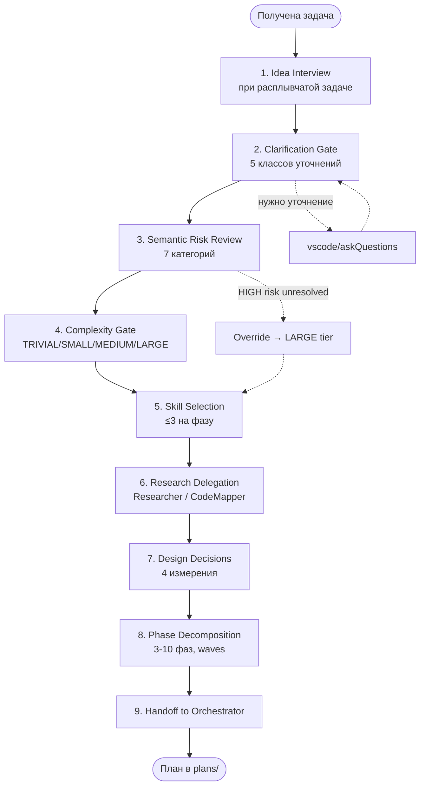

# Глава 06 — Планирование

## Зачем эта глава

Разобрать, **как Planner превращает идею в план**: 9 последовательных шагов от первого взаимодействия с пользователем до handoff в Orchestrator. Это самая «думающая» часть системы.

## Ключевые понятия

- **Idea interview** — структурированный диалог с пользователем при расплывчатой задаче.
- **Clarification gate** — проверка 5 классов уточнений из [CLARIFICATION-POLICY.md](../agent-engineering/CLARIFICATION-POLICY.md).
- **Semantic risk review** — обязательная оценка задачи по 7 категориям рисков.
- **Complexity gate** — классификация задачи по 4 тирам (TRIVIAL/SMALL/MEDIUM/LARGE).
- **Skill selection** — выбор ≤3 skill-паттернов на каждую фазу.
- **Handoff** — передача готового плана Orchestrator-у через `target_agent` и `prompt`.

## Полный workflow Planner



## Шаг 1. Idea Interview

Если задача от пользователя — расплывчатая («хочу улучшить производительность», «давай рефакторить»), Planner проводит интервью:

- **Какова цель?** — что именно изменится в системе для пользователя.
- **Какие границы?** — что НЕ должно быть затронуто.
- **Какие критерии успеха?** — как мы поймём, что готово.
- **Какие ограничения?** — performance, time, dependencies.

Skill-паттерн: [`skills/patterns/idea-to-prompt.md`](../../skills/patterns/idea-to-prompt.md).

**Пропустить можно**, если задача уже сформулирована конкретно.

## Шаг 2. Clarification Gate

Из [CLARIFICATION-POLICY.md](../agent-engineering/CLARIFICATION-POLICY.md) — **5 обязательных классов** уточнений:

| Класс | Пример |
|-------|--------|
| Scope ambiguity | «Добавить экспорт» — куда? CSV/JSON/PDF? |
| Architecture fork | «Хранить в Redis или в Postgres?» |
| User preference decision | «Сортировать по имени или по дате?» |
| Destructive risk approval | «Удалить старые записи навсегда?» |
| Repository structure change | «Переименовать модуль?» |

Если попадает в один из классов → `vscode/askQuestions` с **2–3 опциями**, у каждой описаны pros/cons/affected files и есть **рекомендация**.

Если задача не попадает ни в один класс — gate пройден, идём дальше.

## Шаг 3. Semantic Risk Review

**Обязательно** для всех плановых статусов (включая `READY_FOR_EXECUTION`). 7 категорий:

| Категория | Что проверяет |
|-----------|---------------|
| `data_volume` | Объёмы данных, пагинация, batch ops, SELECT * |
| `performance` | Query paths, N+1, индексы, hot path |
| `concurrency` | Параллельные операции, гонки данных |
| `access_control` | Авторизация, права, ownership |
| `migration_rollback` | Schema migrations, data transforms, format changes |
| `dependency` | Внешние API, новые пакеты, версии |
| `operability` | Deployment, мониторинг, инфраструктура |

Для каждой записывается:
- `applicability`: applicable / not_applicable / uncertain
- `impact`: HIGH / MEDIUM / LOW / UNKNOWN
- `evidence_source`: путь файла или запрос
- `disposition`: resolved / open_question / research_phase_added / not_applicable

**Override:** если есть `applicability: applicable` AND `impact: HIGH` AND `disposition` не `resolved` → принудительно LARGE-tier пайплайн.

**Даже для TRIVIAL** все 7 категорий должны присутствовать (большинство как `not_applicable`).

## Шаг 4. Complexity Gate

| Tier | Файлов | Скоуп | Pipeline |
|------|--------|------|---------|
| TRIVIAL | ≤2 | Изолированное изменение | Skip PLAN_REVIEW целиком |
| SMALL | 3–5 | Один домен | PlanAuditor only |
| MEDIUM | 6–15 | Cross-domain | PlanAuditor + AssumptionVerifier |
| LARGE | 15+ | Cross-cutting | Полный пайплайн |

Override от Шага 3 побеждает.

## Шаг 5. Skill Selection

Planner читает [`skills/index.md`](../../skills/index.md) и выбирает **≤3 skill-паттерна**, наиболее релевантных задаче. Пути паттернов записываются в `skill_references` каждой соответствующей фазы.

**Список доступных skill-доменов** см. [главу 11](11-skills.md).

Пример выбора для задачи «добавить endpoint с auth»:
- `skills/patterns/security-patterns.md` (auth, validation)
- `skills/patterns/tdd-patterns.md` (тесты)
- `skills/patterns/error-handling-patterns.md` (boundaries)

Implementation-агенты обязаны прочитать эти skills **до** начала работы.

## Шаг 6. Research Delegation

Planner — entry point только для двух исследовательских агентов:
- `CodeMapper-subagent` — для разведки структуры репозитория.
- `Researcher-subagent` — для evidence-based исследования.

Делегирование внешним агентам **запрещено**.

Если задача требует понимания, которое уже доступно из контекста, шаг можно пропустить.

## Шаг 7. Design Decisions

**Обязательно** для всех планов. Фиксируются 4 измерения:

| Измерение | Содержит |
|-----------|---------|
| Architectural Choices | Ключевые архитектурные решения и обоснование. |
| Boundary & Integration Points | Изменения границ системы, новые акторы, integration points. |
| Temporal Flow | Порядок исполнения, parallel paths, gates, retries. Для MEDIUM/LARGE — Mermaid `sequenceDiagram`. |
| Constraints & Trade-offs | Ограничения и принятые компромиссы. |

## Шаг 8. Phase Decomposition

План разбивается на **3–10 фаз**. Если получается больше — декомпозируйте задачу глубже.

Каждая фаза содержит:
- `phase_id` (целое ≥1).
- `title`, `objective`.
- `wave` (целое ≥1) — для параллелизма.
- `executor_agent` — обязательное поле, **enum** из 8 разрешённых исполнителей.
- `dependencies` — массив phase_id.
- `files` — `{path, action, reason}`.
- `tests`.
- `steps` — прозой, **без code-блоков**.
- `acceptance_criteria` — измеримые условия (минимум 1).
- `quality_gates` — из enum: tests_pass / lint_clean / schema_valid / safety_clear / human_approved_if_required.
- `failure_expectations` — массив `{scenario, classification, mitigation}`.
- `skill_references` — пути из шага 5.

**Inter-phase contracts** — если фаза B зависит от A, записываем `{from_phase, to_phase, interface, format}`.

**Архитектурная визуализация:**
- 3+ фазы → обязателен `flowchart TD` (DAG зависимостей).
- MEDIUM с нетривиальной оркестрацией → также `sequenceDiagram`.
- LARGE → всегда `sequenceDiagram` + DAG.

## Шаг 9. Handoff

```yaml
target_agent: Orchestrator
prompt: "Plan saved at plans/<task>-plan.md. Please begin PLAN_REVIEW and dispatch Phase 1 when ready."
```

Plan_path передаётся как **input на ревью**, не как implicit approval.

## Терминальные исходы

Если Planner не может произвести валидный план:

- **`status: ABSTAIN`** — нет достаточно доказательств, нужна работа пользователя.
- **`status: REPLAN_REQUIRED`** — изначальные предпосылки оказались невалидны.

Для обоих исходов — другая структура файла (см. шаблон в [`plans/templates/plan-document-template.md`](../../plans/templates/plan-document-template.md), раздел «Terminal Non-Ready Outcome Artifact»).

## Schema-driven structure

Полная структура плана определяется `schemas/planner.plan.schema.json`. Обязательные поля верхнего уровня:

- `schema_version` (`1.2.0`)
- `agent` (`Planner`)
- `status`
- `task_title`, `summary`
- `confidence` (0–1; <0.9 триггерит escalation)
- `abstain` `{is_abstaining, reasons}`
- `phases` (массив)
- `open_questions`
- `risks`
- `risk_review` (7 categories)
- `success_criteria`
- `complexity_tier`
- `handoff` `{target_agent, prompt}`

## Типичные ошибки

- **Пропустить `risk_review`** для TRIVIAL. Нет — все 7 категорий обязательны, даже как `not_applicable`.
- **Размытое `acceptance_criteria`**. Должно быть **измеримым** условием.
- **Code-блоки в `steps`**. Запрещены — описывайте прозой.
- **Manual testing steps**. Запрещены — все проверки должны быть автоматизируемы.
- **Делегировать ревьюерам**. Planner делегирует только Researcher/CodeMapper.
- **Назначить PlanAuditor как `executor_agent`**. Запрещено схемой; они review-only.

## Упражнения

1. **(новичок)** Откройте `Planner.agent.md` и найдите 9 шагов workflow. Сравните с диаграммой выше.
2. **(новичок)** Откройте `schemas/planner.plan.schema.json` и перечислите 8 разрешённых значений `executor_agent`.
3. **(средний)** Какой шаг workflow Planner может пропустить, если задача уже сформулирована точно?
4. **(средний)** Возьмите файл `plans/controlflow-russian-tutorial-plan.md` (план этого пособия). Найдите все 7 категорий semantic risk и их disposition.
5. **(продвинутый)** Задача: «Удалить устаревший endpoint /v1/users». Какие классы clarification triggers применимы? Какой complexity tier и какой override может сработать?

## Контрольные вопросы

1. Сколько шагов в workflow Planner-а?
2. Сколько skill-references максимум на одну фазу?
3. При каких условиях задача принудительно становится LARGE-tier, независимо от файлов?
4. Какие два терминальных не-ready исхода может дать Planner?
5. Может ли Planner делегировать CoreImplementer-у?

## См. также

- [Глава 05 — Оркестрация](05-orchestration.md)
- [Глава 07 — Ревью-пайплайн](07-review-pipeline.md)
- [Глава 11 — Skills](11-skills.md)
- [Planner.agent.md](../../Planner.agent.md)
- [docs/agent-engineering/CLARIFICATION-POLICY.md](../agent-engineering/CLARIFICATION-POLICY.md)
