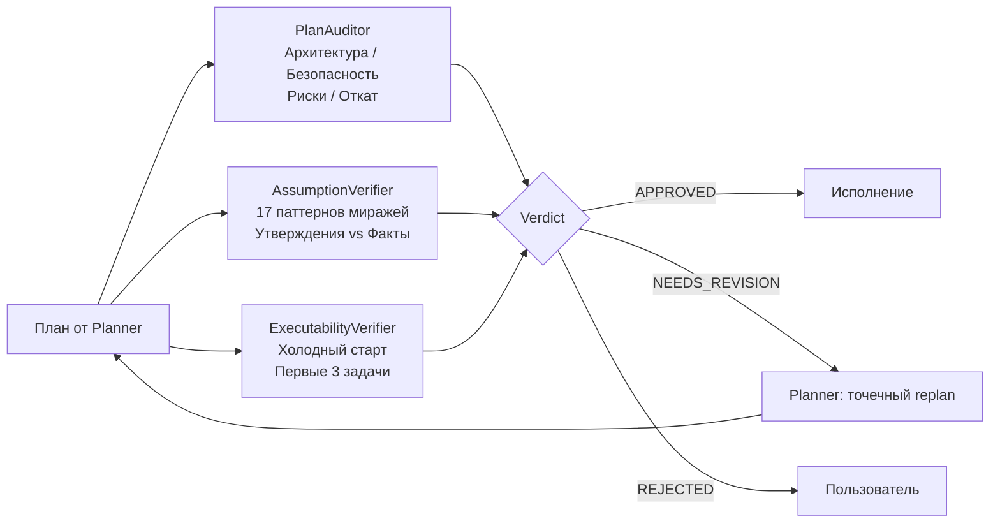
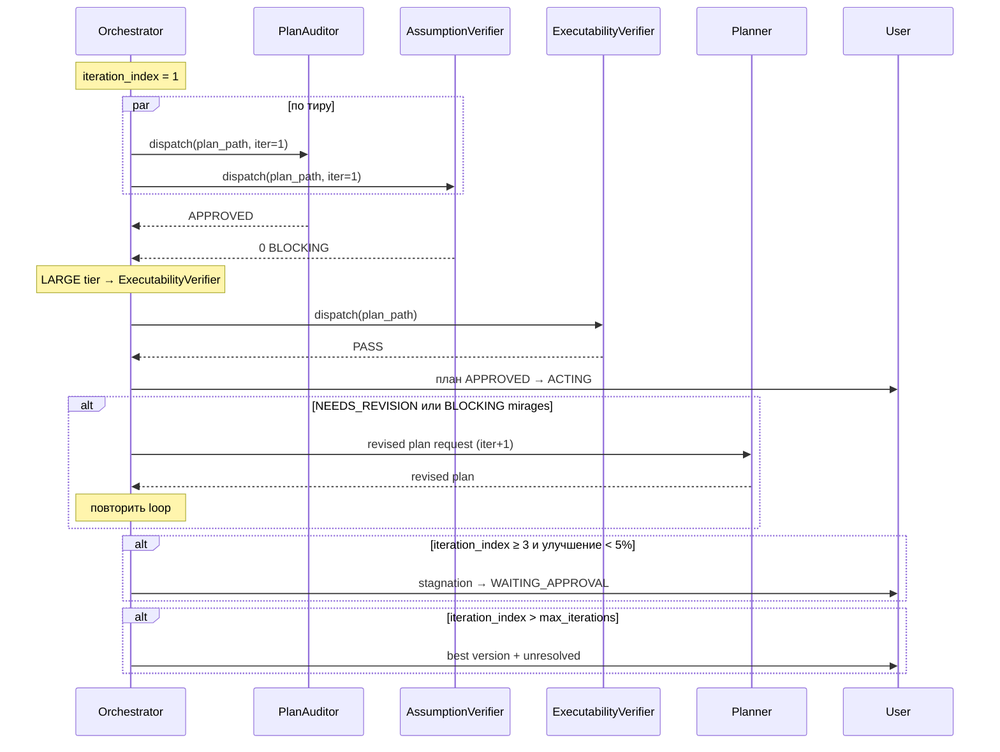

# Глава 07 — Ревью-пайплайн

## Зачем эта глава

Разобрать **PLAN_REVIEW** — адверсариальную фазу проверки плана *до* исполнения. Понять, какие ревьюеры участвуют, как они дополняют друг друга, и почему дешевле найти проблему здесь, чем в коде.

## Ключевые понятия

- **PLAN_REVIEW** — стадия Orchestrator-а между одобрением плана и началом исполнения.
- **Адверсариальное ревью** — ревьюер пытается **сломать** план, а не подтвердить его.
- **Reviewer** — read-only агент, который никогда не появляется в `executor_agent`.
- **Iteration loop** — цикл ревью с лимитом итераций; каждая итерация может уточнить план.
- **Stagnation** — ситуация, когда план перестал улучшаться между итерациями; триггерит эскалацию.

## Триггеры PLAN_REVIEW

Триггер хранится в `governance/runtime-policy.json` → `plan_review_gate_trigger_conditions`. PLAN_REVIEW активируется, если выполнено **хотя бы одно**:

- Phase count ≥ `min_phases`.
- `confidence` < `confidence_threshold`.
- В скоупе есть деструктивные/высокорисковые операции.
- Есть `risk_review` запись с `applicability: applicable` AND `impact: HIGH` AND `disposition` ≠ `resolved`.

Если ни одно не сработало — пайплайн пропускается, идём сразу в исполнение.

## Маршрутизация по тиру

| Tier | Активные ревьюеры | Max iterations |
|------|-------------------|----------------|
| TRIVIAL | — (пайплайн пропущен) | — |
| SMALL | PlanAuditor | 2 |
| MEDIUM | PlanAuditor + AssumptionVerifier | 5 |
| LARGE | PlanAuditor + AssumptionVerifier + ExecutabilityVerifier | 5 |

Источник: `governance/runtime-policy.json` → `review_pipeline_by_tier` и `max_iterations_by_tier`.

**Override:** Любой план с HIGH-impact unresolved risk → принудительно LARGE-пайплайн, независимо от тира.

## Три ревьюера и их предметы

### PlanAuditor — дизайн и риски

**Что ищет:**
- Архитектурные несогласованности.
- Уязвимости безопасности.
- Отсутствие отката для деструктивных шагов.
- Конфликты зависимостей между фазами.
- Пропуски в покрытии скоупа.

**Focus areas** определяются маппингом из [project-context.md](../../plans/project-context.md):

| Risk category | PlanAuditor focus |
|---------------|-------------------|
| data_volume, performance | `["performance"]` |
| concurrency, access_control | `["architecture"]` |
| migration_rollback | `["destructive_risk", "missing_rollback"]` |
| dependency | `["architecture"]` |
| operability | `["scope_gap"]` |

**Контракт:** `schemas/plan-auditor.plan-audit.schema.json`. Failure-классификация **исключает** `transient`.

### AssumptionVerifier — миражи

**Что ищет:** утверждения в плане, не подтверждённые кодовой базой. **17 паттернов**, например:

- «Файл X существует» — на самом деле нет.
- «Функция Y возвращает Z» — на самом деле другое.
- «API W доступен» — на самом deprecated.
- «Зависимость уже установлена» — нет.
- «Тест покрывает случай» — на самом деле нет.

**Severity:** `BLOCKING` / `WARNING` / `INFO`. Только `BLOCKING` останавливает пайплайн.

**Зачем нужен поверх PlanAuditor:** PlanAuditor смотрит на дизайн (правильно ли решено?). AssumptionVerifier — на достоверность фактов (правда ли то, что Planner написал?). Разные оси.

**Контракт:** `schemas/assumption-verifier.plan-audit.schema.json`.

### ExecutabilityVerifier — холодный старт

**Что ищет:** Симулирует, может ли исполнитель, видя только репозиторий + первые 3 задачи плана, начать работу без дополнительных вопросов.

**Чеклист:**
- Конкретны ли пути файлов?
- Есть ли input/output контракты?
- Указаны ли verification commands?
- Понятны ли критерии acceptance?

**Status:** `PASS` / `WARN` / `FAIL`. `FAIL`/`WARN` уходит в Planner на доработку.

**Контракт:** `schemas/executability-verifier.execution-report.schema.json`.

## Iteration loop

## Regression tracking

При `iteration_index > 1` Orchestrator передаёт ревьюерам **список ранее верифицированных пунктов**. Если такой пункт теперь снова не проходит → автоматический BLOCKING regression issue.

> «Any previously verified item that now fails → automatic BLOCKING regression issue.» — [Orchestrator.agent.md](../../Orchestrator.agent.md)

## Stagnation detection

Если `iteration_index ≥ 3` и улучшение скоринга относительно последних 2 итераций < 5% → **стагнация**. Orchestrator транзитит в `WAITING_APPROVAL` с findings, и решение принимает пользователь.

## Revision-Loop Invalidation (Closed World)

Что считается «значительной» правкой плана и заставляет **полностью** перезапустить пайплайн:

- Изменения в `Planner.agent.md`, `Orchestrator.agent.md`, `governance/runtime-policy.json`.
- Изменения в orchestration handoff тестах/сценариях, review routing, verification commands.
- Изменения в policy surfaces, phase structure, task/file paths, contracts, `risk_review`, `complexity_tier`.
- Изменения в executability-bearing steps.
- **Любая неоднозначная** правка по умолчанию.

Селективный rerun допустим **только** для текстовой формулировки reviewer-summary без изменения самих артефактов плана.

## Output ревьюеров

Каждый ревьюер возвращает структурированный отчёт со статусом:

| Status | Значение |
|--------|---------|
| APPROVED | Замечаний нет, план идёт в исполнение. |
| NEEDS_REVISION | Есть исправимые замечания, replan через Planner. |
| REJECTED | План фундаментально неправилен; эскалация к пользователю. |
| ABSTAIN | Ревьюер не может уверенно оценить; пайплайн идёт дальше с пометкой. |

**Важно:** ABSTAIN от ревьюера **не блокирует** план. Это сигнал «я не уверен», а не «я нашёл проблему».

## Optional Final Review Gate

Для LARGE-задач (или по запросу пользователя) после завершения всех фаз срабатывает **финальное ревью**:

1. Orchestrator собирает агрегированный список изменённых файлов из всех фаз.
2. Делает snapshot фаз плана.
3. Диспатчит CodeReviewer с `review_scope: "final"`.
4. Если найдены blocking — fix отдаётся **исполнителю**, **не** ревьюеру (CodeReviewer никогда не владеет fix-cycle). Максимум 1 fix-cycle.
5. Если всё чисто — финальная advisory-запись в `plans/artifacts/<task>/final_review.md`.

См. `governance/runtime-policy.json` → `final_review_gate`.

## Типичные ошибки

- **Считать ABSTAIN от ревьюера блокировкой**. Не блокирует — пайплайн идёт дальше.
- **Считать AssumptionVerifier «второй пар глаз»**. Нет, у него **другая** ось (факты vs дизайн).
- **Игнорировать override от HIGH risk**. Plan может быть SMALL по файлам, но HIGH risk → LARGE pipeline.
- **Назначать ревьюера как executor_agent**. Запрещено схемой.
- **Ждать ABSTAIN решит проблему**. ABSTAIN означает «не уверен», нужны доп. данные.
- **Поправить план без полного rerun** для значимой правки. Closed-world rule: если правка не строго текстуальная — полный rerun обязателен.

## Упражнения

1. **(новичок)** Откройте `governance/runtime-policy.json` и найдите `review_pipeline_by_tier`. Какой пайплайн для MEDIUM?
2. **(новичок)** Откройте `schemas/assumption-verifier.plan-audit.schema.json`. Какие severity допустимы?
3. **(средний)** При каких условиях SMALL-tier план получит full LARGE pipeline?
4. **(средний)** Что произойдёт, если на iteration 2 PlanAuditor вернёт `APPROVED`, но AssumptionVerifier найдёт BLOCKING mirage?
5. **(продвинутый)** Объясните, почему CodeReviewer **никогда** не владеет fix-cycle на финальном ревью.

## Контрольные вопросы

1. Перечислите 3 ревьюера и их предметы.
2. Что такое regression tracking?
3. Когда срабатывает stagnation detection?
4. Какой класс failure ревьюеры исключают?
5. На каких тирах активируется ExecutabilityVerifier?

## См. также

- [Глава 05 — Оркестрация](05-orchestration.md)
- [Глава 06 — Планирование](06-planning.md)
- [Глава 09 — Схемы](09-schemas.md)
- [PlanAuditor-subagent.agent.md](../../PlanAuditor-subagent.agent.md)
- [AssumptionVerifier-subagent.agent.md](../../AssumptionVerifier-subagent.agent.md)
- [ExecutabilityVerifier-subagent.agent.md](../../ExecutabilityVerifier-subagent.agent.md)
