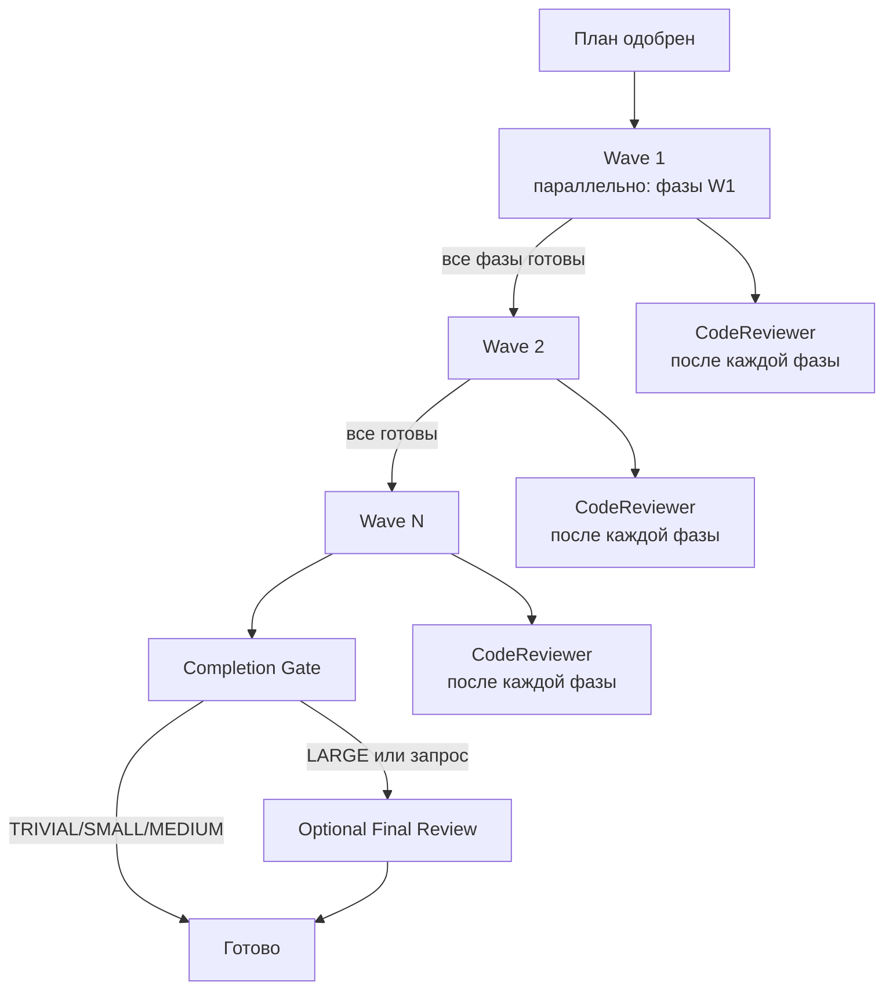
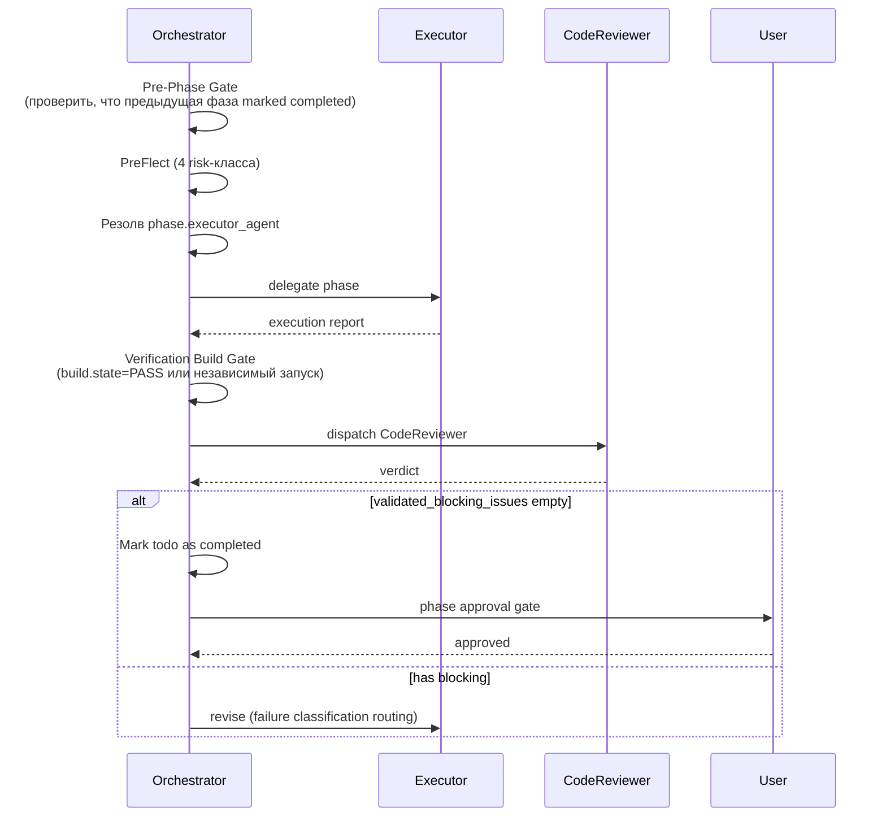

# Глава 08 — Пайплайн исполнения

## Зачем эта глава

Понять, **что происходит после одобрения плана**: как Orchestrator вызывает исполнителей, что такое волны, какие quality gates обязательны, как проходят completion gate и опциональный final review.

## Ключевые понятия

- **Phase** — фаза плана с фиксированным `executor_agent`.
- **Wave** — группа фаз, исполняемых параллельно.
- **Quality gate** — обязательное условие готовности фазы (tests_pass, lint_clean, schema_valid, safety_clear, human_approved_if_required).
- **Completion gate** — финальная сводка задачи.
- **Final review gate** — опциональное финальное ревью CodeReviewer для LARGE-задач.

## Поток исполнения

## Per-phase цикл

Для каждой фазы Orchestrator выполняет:

## Wave-aware execution

**Правила:**
1. Фазы группируются по `wave` (по возрастанию).
2. В пределах волны фазы **могут** выполняться параллельно (до `max_parallel_agents`, default 10).
3. Wave N+1 ждёт окончания **всех** фаз wave N.
4. Если фаза волны падает — failure classification routing решает: retry / replan / escalate.

**Пример:**

| Фаза | Wave | Зависимости |
|------|------|-------------|
| 1: research backend | 1 | — |
| 2: research frontend | 1 | — |
| 3: design API | 2 | 1 |
| 4: implement endpoint | 3 | 3 |
| 5: implement UI | 3 | 2, 3 |
| 6: e2e tests | 4 | 4, 5 |

Wave 1 — фазы 1, 2 параллельно. Wave 3 — фазы 4, 5 параллельно. Всего 4 волны для 6 фаз.

## Executor agent — обязательное поле

Каждая фаза содержит `executor_agent` из enum (8 значений):

- CodeMapper-subagent
- Researcher-subagent
- CoreImplementer-subagent
- UIImplementer-subagent
- PlatformEngineer-subagent
- TechnicalWriter-subagent
- BrowserTester-subagent
- CodeReviewer-subagent

**Hard rule:** Orchestrator **не должен инферить** executor_agent эвристически. Если поле отсутствует в legacy-плане → REPLAN через Planner.

## Quality gates

Каждая фаза декларирует `quality_gates` из enum:

| Gate | Что значит |
|------|-----------|
| `tests_pass` | Все тесты целевого скоупа проходят. |
| `lint_clean` | Lint без ошибок (`read/problems` чист). |
| `schema_valid` | Все produced схемы валидны. |
| `safety_clear` | PreFlect не выявил неразрешённого риска. |
| `human_approved_if_required` | Если требуется approval — получено. |

**Verification Build Gate (обязательно):** после каждой фазы Orchestrator либо берёт `build.state: PASS` из execution report, либо **самостоятельно запускает build**. Принять completion claim без проверки = нарушение контракта.

## Phase Verification Checklist

Перед маркировкой фазы как complete Orchestrator **обязан** проверить:

1. ✅ Тесты прошли (evidence из subagent-отчёта или независимый запуск).
2. ✅ Билд прошёл (`build.state: PASS`).
3. ✅ Lint/problems чисто.
4. ✅ Review status — `APPROVED` от CodeReviewer.
5. ✅ Phase todo marked completed через `#todos`.

Если **любая** проверка не прошла → Failure Classification Handling → не марковать complete.

## CodeReviewer и validated_blocking_issues

CodeReviewer — обязателен на **всех тирах** (включая TRIVIAL).

**Ключевая идея:** Orchestrator блокирует продолжение **только** на `validated_blocking_issues`, а не на сырых CRITICAL/MAJOR. Это потому, что не каждое CRITICAL замечание подтверждено как актуальное в контексте конкретной фазы.

Если `validated_blocking_issues` пусто — фаза продолжается даже с нерешёнными INFO/WARNING.

## Failure Classification Handling

Если subagent возвращает failure (см. [главу 13](13-failure-taxonomy.md)):

| Классификация | Действие | Лимит |
|---------------|---------|-------|
| transient | Retry той же задачи | 3 |
| fixable | Retry с подсказкой | 1 |
| needs_replan | Точечный replan фазы через Planner | 1 |
| escalate | СТОП → пользователь | 0 |

**Reliability policy:**
- Кумулятивный budget на фазу = 5 retry.
- 3 одинаковых failure подряд → эскалация (несмотря на класс).
- ≥2 transient в одной волне → 50% параллелизма для следующих волн.
- Empty response, timeout, HTTP 429 — silent failure, **не** считается успехом.

## Batch Approval

Чтобы не утомлять пользователя: одно approval-сообщение **на волну**, а не на фазу.

Шаблон:
> «Wave 2: 3 фазы, агенты: [CoreImplementer, UIImplementer, TechnicalWriter]. Approve all? (y/n/details)»

**Исключение:** если в волне есть деструктивные/production операции — per-phase approval для этой волны.

## Completion Gate

После всех фаз:

1. Cross-phase consistency review.
2. Проверка, что все phase todo items marked completed.
3. Если активирован Final Review Gate → выполнить.
4. Append session-outcome entry в `plans/session-outcomes.md` (используя [`plans/templates/session-outcome-template.md`](../../plans/templates/session-outcome-template.md)).
5. Produce completion summary для пользователя.

**Порядок важен:** session-outcome пишется **до** completion summary, чтобы пользователь видел сводку после flush телеметрии.

## Optional Final Review Gate

Активируется по правилам из `governance/runtime-policy.json` → `final_review_gate`:
- `enabled_by_default: true` или
- complexity_tier в `auto_trigger_tiers` или
- пользователь запросил явно.

**Workflow:**
1. Нормализовать `changed_files[]` — собрать из всех phase reports (с маппингом по типу агента).
2. Построить `plan_phases_snapshot[]` — `[{phase_id, files[]}]`.
3. Диспатчит CodeReviewer с `review_scope: "final"`.
4. Если найдены `validated_blocking_issues` (CRITICAL/MAJOR):
   - Резолв fix-исполнителя: фаза с **наибольшим** `phase_id`, чьи `files[]` содержат affected file.
   - Диспатчит этого исполнителя с прицельным скоупом исправления.
   - Re-run CodeReviewer (max `max_fix_cycles` = 1).
   - Если всё ещё blocked → escalate to user.
   - **CodeReviewer НИКОГДА не владеет fix-cycle.**
5. Если чисто → advisory log в `plans/artifacts/<task>/final_review.md`, продолжить.

## Что фиксируется в commit

Соглашения по коммитам:
- Префикс из enum: `fix`, `feat`, `chore`, `test`, `refactor`.
- **Не упоминать** имена планов или номера фаз в commit message.

## Типичные ошибки

- **Принять completion claim без verify**. Запрещено — всегда проверяйте build.
- **Пропустить CodeReviewer на TRIVIAL**. Обязателен на всех тирах.
- **Заинферить executor_agent**. Запрещено — REPLAN через Planner.
- **Маркировать фазу complete до todo update**. Pre-Phase Gate сломается на следующей фазе.
- **Параллелить фазы из разных waves**. Запрещено: wave N+1 ждёт wave N.
- **Дать CodeReviewer писать fix**. Запрещено — fix-cycle всегда у исполнителя.

## Упражнения

1. **(новичок)** План из 5 фаз: фазы 1, 2 в wave 1; фаза 3 в wave 2; фазы 4, 5 в wave 3. Сколько approval-промптов покажет Orchestrator при batch-режиме?
2. **(новичок)** Откройте `schemas/planner.plan.schema.json` и найдите enum `quality_gates`. Перечислите все значения.
3. **(средний)** Что должен сделать Orchestrator, если phase report не содержит `build.state`?
4. **(средний)** План MEDIUM tier выполнен. Будет ли активирован final review gate? Что нужно проверить, чтобы ответить?
5. **(продвинутый)** Final review нашёл CRITICAL в файле `src/api/users.ts`. Файл создан в фазе 3 и модифицирован в фазе 5. Кому Orchestrator делегирует fix?

## Контрольные вопросы

1. Что значит wave 2 ждёт wave 1?
2. Почему Orchestrator не должен инферить executor_agent?
3. Что такое `validated_blocking_issues` и зачем они?
4. Какие 5 пунктов входят в Phase Verification Checklist?
5. Когда CodeReviewer владеет fix-cycle? (подсказка: никогда)

## См. также

- [Глава 05 — Оркестрация](05-orchestration.md)
- [Глава 07 — Ревью-пайплайн](07-review-pipeline.md)
- [Глава 13 — Таксономия сбоев](13-failure-taxonomy.md)
- [Orchestrator.agent.md](../../Orchestrator.agent.md)
- [governance/runtime-policy.json](../../governance/runtime-policy.json)
