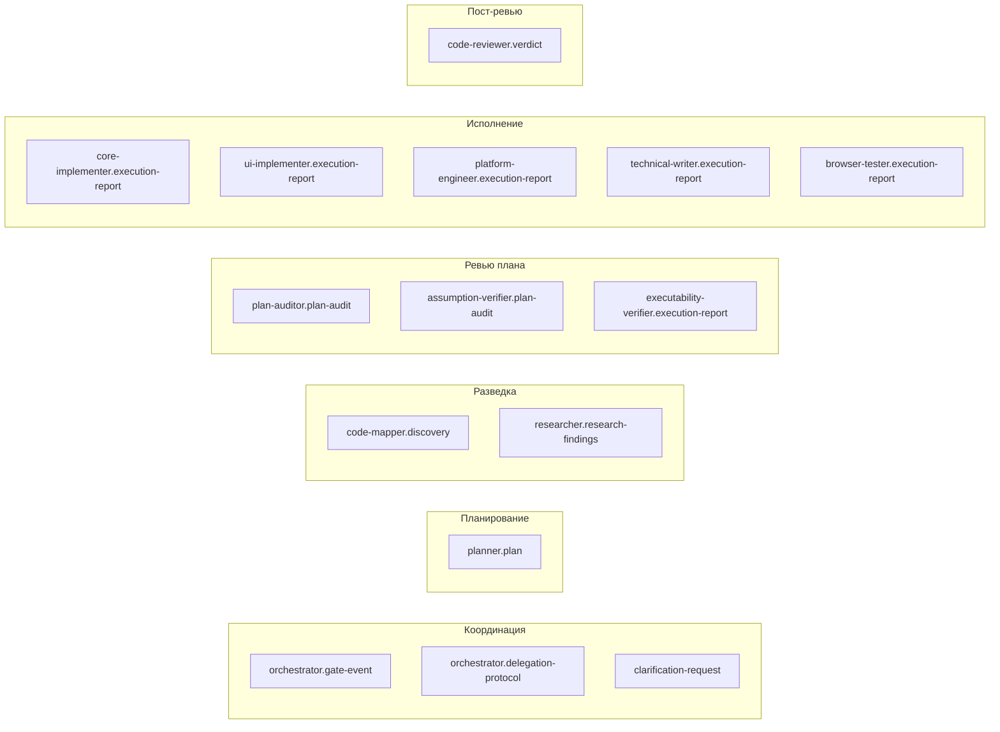

# Глава 09 — Схемы (контракты)

## Зачем эта глава

Понять, **что схемы — это контракты между агентами**, а не просто JSON-файлы. После этой главы вы будете знать назначение каждой из 15 схем и где искать ключевые поля.

## Что такое схема в ControlFlow

Schema (`schemas/*.json`) — это **JSON Schema (draft 2020-12)**, фиксирующий структуру выхода или payload-а одного агента. Схемы выполняют три функции:

1. **Контракт** — agent A знает, какие поля придут от agent B.
2. **Документация** — каждое поле имеет `description`.
3. **Eval-фикстура** — `validate.mjs` сверяет реальные сценарии и шаблоны со схемами.

**Важно:** агенты **не выводят raw JSON в чат**. Схема — это форма мышления и контракт, но в чате агенты выдают структурированный текст. JSON фигурирует только в eval-фикстурах и при формальных payload-ах между инструментальными вызовами.

## Полный реестр схем

| # | Файл | Эмиттер | Назначение |
|---|------|---------|-----------|
| 1 | `clarification-request.schema.json` | Любой acting subagent | Payload при `NEEDS_INPUT` (общий шаблон) |
| 2 | `orchestrator.delegation-protocol.schema.json` | Orchestrator | Контракт делегирования subagent-у |
| 3 | `orchestrator.gate-event.schema.json` | Orchestrator | Gate-event при переходах состояний |
| 4 | `planner.plan.schema.json` | Planner | Полный план с фазами, рисками, contracts, handoff |
| 5 | `code-mapper.discovery.schema.json` | CodeMapper-subagent | Discovery report |
| 6 | `researcher.research-findings.schema.json` | Researcher-subagent | Findings с цитатами |
| 7 | `plan-auditor.plan-audit.schema.json` | PlanAuditor-subagent | Audit verdict (APPROVED/NEEDS_REVISION/REJECTED/ABSTAIN) |
| 8 | `assumption-verifier.plan-audit.schema.json` | AssumptionVerifier-subagent | Mirage-detection report |
| 9 | `executability-verifier.execution-report.schema.json` | ExecutabilityVerifier-subagent | Cold-start report |
| 10 | `core-implementer.execution-report.schema.json` | CoreImplementer-subagent | Backend impl report |
| 11 | `ui-implementer.execution-report.schema.json` | UIImplementer-subagent | Отчёт об имплементации UI (доступность/адаптивная вёрстка) |
| 12 | `platform-engineer.execution-report.schema.json` | PlatformEngineer-subagent | Infra report (approvals, rollback, health) |
| 13 | `technical-writer.execution-report.schema.json` | TechnicalWriter-subagent | Docs report (parity, diagrams) |
| 14 | `browser-tester.execution-report.schema.json` | BrowserTester-subagent | E2E report (scenarios, accessibility) |
| 15 | `code-reviewer.verdict.schema.json` | CodeReviewer-subagent | Review verdict (validated_blocking_issues) |

> **Note:** "14 agent output schemas" + 1 shared `clarification-request.schema.json` = 15 файлов.

## Группы схем по назначению

## Ключевые схемы — разбор

### planner.plan.schema.json

Самая «толстая» и важная. Обязательные поля верхнего уровня:

- `schema_version` (`1.2.0`)
- `agent` (`Planner`)
- `status` (`READY_FOR_EXECUTION` / `ABSTAIN` / `REPLAN_REQUIRED`)
- `task_title`, `summary`, `confidence` (0–1)
- `abstain` `{is_abstaining, reasons}`
- `phases[]` — массив фаз
- `open_questions[]`, `risks[]`
- `risk_review[]` — 7 категорий semantic risk
- `success_criteria[]`
- `complexity_tier` (TRIVIAL/SMALL/MEDIUM/LARGE)
- `handoff` `{target_agent, prompt}`

**Каждая фаза:**
- `phase_id`, `title`, `objective`, `wave`
- `executor_agent` (enum 8 значений)
- `dependencies[]`, `files[]`, `tests[]`, `steps[]`
- `acceptance_criteria[]` (≥1, обязательно)
- `quality_gates[]` (enum 5 значений)
- `failure_expectations[]`
- `skill_references[]`

**Опциональные поля верхнего уровня:** `trace_id`, `contracts[]`, `max_parallel_agents`, `diagrams[]`, `iteration_budget`.

### orchestrator.gate-event.schema.json

Минимальные поля:
- `event_type` (enum: `PLAN_GATE`, `PREFLECT_GATE`, `PHASE_REVIEW_GATE`, `HIGH_RISK_APPROVAL_GATE`, `COMPLETION_GATE`)
- `workflow_state` (enum: PLANNING/WAITING_APPROVAL/ACTING/REVIEWING/COMPLETE — **без** PLAN_REVIEW; этот лейбл живёт только в промпте)
- `decision` (enum)
- `requires_human_approval` (boolean)
- `reason`, `next_action`
- `trace_id` (UUIDv4), `iteration_index`, `max_iterations`

### code-reviewer.verdict.schema.json

Ключевая особенность: **`validated_blocking_issues`** — отдельный массив, отличный от raw `issues`. Orchestrator блокирует продолжение **только** на validated_blocking. Также содержит:
- `status` (`APPROVED`/`NEEDS_REVISION`/`REJECTED`)
- `review_scope` (`phase` / `final`)
- `phase_id`
- `issues[]` (severity, file, message)
- `final_review_analysis` (опциональное; для final-режима — scope drift, file-to-phase mapping)

### *-implementer.execution-report.schema.json

Общая структура для трёх implementer-схем:
- `status` (COMPLETE/FAILED/NEEDS_INPUT/…)
- `failure_classification` (опциональное)
- `changes[]` (file, action, summary) — у CoreImplementer и PlatformEngineer
- `ui_changes[]` — у UIImplementer
- `tests[]`, `build` `{state, output}`, `lint`, `definition_of_done[]`
- `clarification_request` (если NEEDS_INPUT)

UI-вариант добавляет: `accessibility[]`, `responsive[]`.
Platform-вариант добавляет: `approvals[]`, `rollback_plan`, `health_checks[]`.

### technical-writer.execution-report.schema.json

- `docs_created[]`, `docs_updated[]` — каждое с `path`.
- `parity_check` — проверка кода и доков на согласованность.
- `diagrams[]` — Mermaid-диаграммы.
- `coverage` — какие концепции покрыты.

### browser-tester.execution-report.schema.json

- `health_check` — health-first гейт (приложение запустилось?).
- `scenarios[]` (status, steps, screenshots).
- `console_failures[]`, `network_failures[]`.
- `accessibility_findings[]`.

### plan-auditor.plan-audit.schema.json и assumption-verifier.plan-audit.schema.json

Похожая структура:
- `status` (APPROVED/NEEDS_REVISION/REJECTED/ABSTAIN)
- `findings[]` или `mirages[]` — каждый с `severity` (BLOCKING/WARNING/INFO/CRITICAL/MAJOR/MINOR), `file`, `description`, `evidence`.
- `score` — quantitative (см. [SCORING-SPEC.md](../agent-engineering/SCORING-SPEC.md)).
- `iteration_index`.

Failure-классификация **исключает** `transient`.

### executability-verifier.execution-report.schema.json

- `status` (PASS/WARN/FAIL).
- `task_walkthroughs[]` — симуляция первых 3 задач.
- Для каждой: `task_id`, `executable` (boolean), `gaps[]`.

### researcher.research-findings.schema.json

- `status` (COMPLETE/ABSTAIN).
- `confidence`.
- `summary`.
- `findings[]` — каждый с `topic`, `definition`, `key_invariants`, `source`, `example_or_quote`.
- `open_questions[]`.

### code-mapper.discovery.schema.json

- `files[]` — каждый с `path`, `type`, `relevance`.
- `dependencies[]`.
- `entry_points[]`.
- `conventions[]`.

### orchestrator.delegation-protocol.schema.json

Описывает **payload делегирования**. Подгружается **on-demand**, не в каждом контексте Orchestrator-а:
- `target_agent`, `phase_id`, `phase_title`.
- `executor_agent` (должен совпадать с phase.executor_agent).
- `scope`, `inputs`, `expected_output_schema`.
- `trace_id`, `iteration_index`, `iteration_budget`.

### clarification-request.schema.json

Общий шаблон для acting subagent-ов при NEEDS_INPUT:
- `question`.
- `options[]` — каждый с `label`, `pros`, `cons`, `affected_files`, `recommended` (boolean).
- `recommendation_rationale`.
- `impact_analysis`.

## Конвенции схем

- Все схемы используют `additionalProperties: false` — **запрещены** неучтённые поля.
- Enum-ы стабильны и не должны переписываться без миграции.
- Минимальные строки: `minLength` для критичных полей (titles, descriptions).
- Версионирование: `schema_version` константа в каждой схеме (для Planner — `"1.2.0"`).

## Кто валидирует

`evals/validate.mjs` — структурный проход. Проверяет:
- Каждая схема — валидный JSON Schema.
- Каждый сценарий в `evals/scenarios/` валиден против соответствующей схемы.
- Все ссылки на схемы из агентских файлов корректны.

## Типичные ошибки

- **Считать схему форматом чата**. Нет, схема — это контракт; в чате агенты дают **структурированный текст**, не raw JSON.
- **Добавить поле без обновления схемы**. additionalProperties false — eval упадёт.
- **Считать `clarification-request` 14-й схемой агента**. Это **общий** шаблон, не привязан к одному агенту.
- **Перепутать `workflow_state` (без PLAN_REVIEW) и лейбл стадии в промпте (с PLAN_REVIEW)**.
- **Игнорировать `validated_blocking_issues` в verdict**. Только они блокируют, не raw issues.

## Упражнения

1. **(новичок)** Откройте `schemas/planner.plan.schema.json` и найдите все 7 категорий semantic risk в `risk_review.items.properties.category.enum`.
2. **(новичок)** Сколько required-полей у `core-implementer.execution-report.schema.json` на верхнем уровне?
3. **(средний)** Какая разница между `orchestrator.gate-event.schema.json` и `orchestrator.delegation-protocol.schema.json`?
4. **(средний)** Откройте `code-reviewer.verdict.schema.json` и найдите `validated_blocking_issues`. Чем оно отличается от `issues`?
5. **(продвинутый)** Найдите все схемы, у которых `additionalProperties: false` — это все? Что произойдёт, если добавить лишнее поле?

## Контрольные вопросы

1. Сколько JSON-схем в `schemas/`?
2. Чем `clarification-request.schema.json` отличается от других?
3. Какая схема описывает план?
4. Какая схема описывает verdict пост-ревью?
5. Какая схема описывает событие перехода состояния Orchestrator-а?

## См. также

- [Глава 04 — P.A.R.T.](04-part-spec.md)
- [Глава 06 — Планирование](06-planning.md)
- [Глава 14 — Eval-харнесс](14-evals.md)
- [schemas/](../../schemas/)
