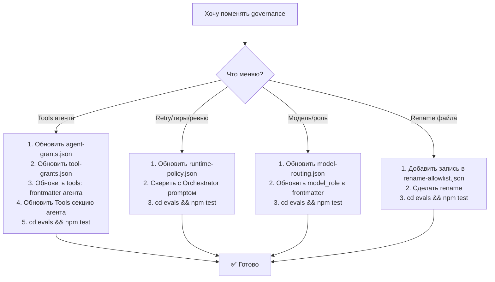

# Глава 10 — Governance

## Зачем эта глава

Понять, **как ControlFlow управляет правами агентов и runtime-параметрами**. После этой главы вы будете знать, какой governance-файл за что отвечает и как менять политики безопасно.

## Что такое governance в ControlFlow

Governance — это **5 JSON-файлов** в `governance/`, фиксирующих:
1. Какие тулзы каждый агент имеет право использовать.
2. Какие runtime-параметры (retry, тиры, ревью-пайплайн) применяются.
3. Какие модели маршрутизируются на какие роли.
4. Какие переименования файлов разрешены и не должны считаться drift-ом.

Это **single source of truth** — если governance говорит «нельзя», агент не может это перешагнуть.

## Карта governance-файлов

| Файл | Назначение | Меняется при |
|------|-----------|--------------|
| `agent-grants.json` | Канонические права тулз агента | Изменении тулз агента |
| `tool-grants.json` | Single source для frontmatter `tools:` | Том же |
| `runtime-policy.json` | Operational параметры Orchestrator-а | Изменении retry/тира/ревью |
| `model-routing.json` | Логические роли моделей | Изменении модели или роли |
| `rename-allowlist.json` | Allowlist переименований | Намеренном rename артефакта |

## agent-grants.json и tool-grants.json — две стороны одной медали

**Зачем два файла:**

- `tool-grants.json` — **плоский** список «агент → массив тулз», ровно тот же набор, что и в `tools:` frontmatter каждого `*.agent.md`. Это «зеркало» frontmatter.
- `agent-grants.json` — **семантическая** организация (read-only / edit / execute / fetch / approval), каноническое представление. Из него выводится `tool-grants.json`.

**Eval-проверка:** drift-checker сверяет `tools:` frontmatter каждого агента с `tool-grants.json`. Расхождение = fail.

**Пример (упрощённо):**
```json
// agent-grants.json (концептуально)
{
  "Researcher-subagent": {
    "read_only": ["search/codebase", "read/file"],
    "fetch": ["web/fetch", "web/githubRepo"],
    "search": ["search/grep", "search/file"]
  }
}

// tool-grants.json (плоско)
{
  "Researcher-subagent": [
    "search/codebase", "read/file", "web/fetch",
    "web/githubRepo", "search/grep", "search/file"
  ]
}
```

## runtime-policy.json — operational knobs

Это **самый важный** файл для понимания поведения Orchestrator-а. Ключевые секции:

### approval_actions

Список действий, требующих явного одобрения пользователя: deletes, drops, force pushes, production deploys и т.д.

### review_pipeline_by_tier

Определяет, какие ревьюеры активны на каждом тире:

| Tier | Активные ревьюеры |
|------|-------------------|
| TRIVIAL | none |
| SMALL | `["PlanAuditor"]` |
| MEDIUM | `["PlanAuditor", "AssumptionVerifier"]` |
| LARGE | `["PlanAuditor", "AssumptionVerifier", "ExecutabilityVerifier"]` |

Также содержит `code_review` — обязателен на всех тирах.

### max_iterations_by_tier

Бюджет PLAN_REVIEW-итераций:

| Tier | Max iterations |
|------|---------------|
| TRIVIAL | — (skip) |
| SMALL | 2 |
| MEDIUM | 5 |
| LARGE | 5 |

### retry_budgets

Лимиты retry по failure classification:

```json
{
  "transient_max": 3,
  "fixable_max": 1,
  "needs_replan_max": 1,
  "escalate_max": 0,
  "max_retries_per_phase": 5
}
```

### stagnation_detection

```json
{
  "min_iteration": 3,
  "improvement_threshold_pct": 5
}
```

После итерации 3, если улучшение < 5% → стагнация.

### plan_review_gate_trigger_conditions

Когда активировать PLAN_REVIEW:
- `min_phases` — минимальное количество фаз для триггера.
- `confidence_threshold` — порог confidence (например, 0.9).
- Деструктивные операции в скоупе.
- HIGH-risk unresolved entries.

### final_review_gate

```json
{
  "enabled_by_default": false,
  "auto_trigger_tiers": ["LARGE"],
  "max_fix_cycles": 1
}
```

## model-routing.json — логические роли моделей

Каждый агент в frontmatter имеет:
- `model: GPT-5.4 (copilot)` — литеральная строка модели.
- `model_role: research-capable` — логическая роль.

`governance/model-routing.json` определяет роли:
```json
{
  "research-capable": {
    "default": "GPT-5.4 (copilot)",
    "by_tier": {
      "TRIVIAL": "GPT-5.4 mini (copilot)"
    }
  }
}
```

**Зачем:** decoupling агентских файлов от хардкоженных моделей. Можно менять модель в одном месте, не трогая 13 агентов.

**Сейчас:** runtime читает `model:` напрямую; `model_role` существует для логического индексирования, eval-выравнивания и будущей миграции.

**by_tier convention:**
- Полный override на тир → `{"TRIVIAL": "..."}`.
- Inherit → `{"TRIVIAL": "inherit_from: default"}`.

См. [docs/agent-engineering/MODEL-ROUTING.md](../agent-engineering/MODEL-ROUTING.md).

## rename-allowlist.json

Drift-чекер замечает, когда файлы появляются/исчезают. Без allowlist каждый намеренный rename ломал бы eval. Allowlist:
```json
{
  "renames": [
    {"from": "old-name.md", "to": "new-name.md", "reason": "Phase 3 consolidation"}
  ]
}
```

Также содержит «active artifacts» — список файлов, которые **должны** существовать (защита от случайного удаления).

## Как менять governance безопасно



## Принцип «governance побеждает промпт»

Если есть конфликт между **тем, что написано в агентском промпте**, и **тем, что в governance** — **governance побеждает**. Оркестратор должен ориентироваться на runtime-policy при операционных решениях, а не на устаревшую формулировку в промпте.

Из `Orchestrator.agent.md`:
> «`governance/runtime-policy.json` is the authoritative source for trigger thresholds, tier routing, `max_iterations`, and retry budgets.»

## Где жить какому знанию

| Знание | Место |
|--------|-------|
| Что агенту разрешено делать | `agent-grants.json` / `tool-grants.json` |
| Сколько раз retry | `runtime-policy.json` → retry_budgets |
| Какие ревьюеры на каком тире | `runtime-policy.json` → review_pipeline_by_tier |
| Какая модель для какой роли | `model-routing.json` |
| Какие переименования допустимы | `rename-allowlist.json` |
| Поведенческие инварианты агента | `*.agent.md` (P.A.R.T.) |
| Шаги процесса для пользователя | `docs/agent-engineering/*.md` |

## Дополнительные governance-доки

В `docs/agent-engineering/` (см. [главу 03](03-agent-roster.md) — список):
- `PART-SPEC.md` — структура агентского файла.
- `RELIABILITY-GATES.md` — verification gates (build/tests/lint).
- `CLARIFICATION-POLICY.md` — 5 классов уточнений.
- `TOOL-ROUTING.md` — local-first и external tool routing.
- `MODEL-ROUTING.md` — model_role design.
- `MEMORY-ARCHITECTURE.md` — три слоя памяти.
- `SCORING-SPEC.md` — quantitative scoring для review.
- `MIGRATION-CORE-FIRST.md` — backbone pattern.
- `PROMPT-BEHAVIOR-CONTRACT.md` — поведенческие инварианты.
- `OBSERVABILITY.md` — trace_id и NDJSON sink.
- `AGENT-AS-TOOL.md` — спецификация для будущей MCP/native экспозиции.

Это **спецификации**, а не код. Они потребляются агентами через `Resources` секцию P.A.R.T.

## Типичные ошибки

- **Поменять frontmatter `tools:` без `tool-grants.json`**. Drift fail.
- **Удалить файл без `rename-allowlist.json`**. Drift fail.
- **Считать промпт побеждает governance**. Нет, governance authoritative.
- **Менять `model_role` без обновления `model-routing.json`**. Eval упадёт.
- **Полагаться на runtime-policy «по умолчанию»**. Всегда читайте JSON напрямую.

## Упражнения

1. **(новичок)** Откройте `governance/runtime-policy.json` и найдите `max_iterations_by_tier`. Какое значение для MEDIUM?
2. **(новичок)** Откройте `governance/tool-grants.json` и найдите `Orchestrator`. Сколько тулз ему разрешено?
3. **(средний)** Сравните `governance/agent-grants.json` и `tool-grants.json` для `CoreImplementer-subagent`. Описывают ли они одно и то же содержимое в разных формах?
4. **(средний)** В `model-routing.json` найдите роль `research-capable`. Какая модель по умолчанию? Какая для TRIVIAL?
5. **(продвинутый)** Я хочу дать `TechnicalWriter-subagent` доступ к `web/fetch`. Какие файлы и в каком порядке нужно изменить?

## Контрольные вопросы

1. Перечислите 5 governance-файлов и их назначения.
2. Что такое `model_role` и зачем он нужен поверх `model:`?
3. В каком файле живут retry-лимиты?
4. Кто побеждает при конфликте: промпт агента или governance?
5. Что произойдёт при rename файла без записи в allowlist?

## См. также

- [Глава 04 — P.A.R.T.](04-part-spec.md)
- [Глава 13 — Таксономия сбоев](13-failure-taxonomy.md)
- [Глава 14 — Eval-харнесс](14-evals.md)
- [governance/](../../governance/)
- [docs/agent-engineering/](../agent-engineering/)
