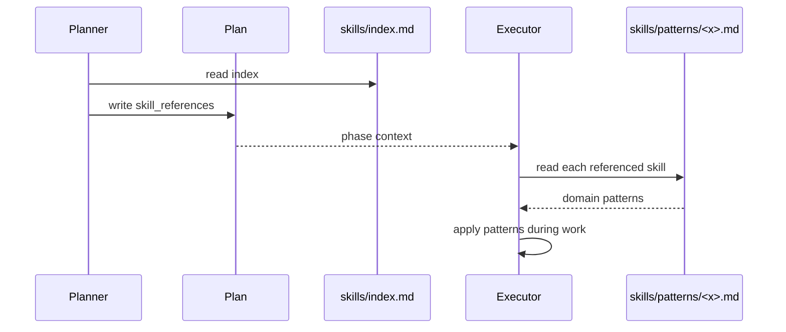

# Глава 11 — Skills (паттерны)

## Зачем эта глава

Понять, **что такое skills**, как Planner их выбирает и зачем они нужны имплементерам. Skills — это переиспользуемые экспертные знания, **выгружаемые точечно** в момент работы.

## Что такое skill

Skill — это Markdown-файл с **паттерном** в `skills/patterns/`, описывающий best practices в конкретном домене. Не пример кода и не туториал, а **инструкция для агента**, как правильно действовать.

**Примеры доменов:** TDD, error handling, security, performance, completeness, integration, idea-to-prompt, LLM behavior, PreFlect, reflection loop, budget tracking.

## Зачем skills

Без skills:
- Каждый имплементер «изобретает заново» best practices.
- Промпты агентов раздуваются попытками покрыть все домены.
- Стиль работы рассинхронизируется между агентами.

Со skills:
- Каждый skill — единый источник истины для домена.
- Агент подгружает skill **точно когда нужно** (just-in-time).
- Контекст-бюджет агента не тратится на нерелевантные домены.

## Каталог skills

Источник: [skills/index.md](../../skills/index.md).

| # | Файл | Домен | Применимые агенты |
|---|------|-------|-------------------|
| 1 | `tdd-patterns.md` | Testing | CoreImplementer, UIImplementer, CodeReviewer |
| 2 | `error-handling-patterns.md` | Error Handling | CoreImplementer, UIImplementer, PlatformEngineer |
| 3 | `security-patterns.md` | Security | CoreImplementer, UIImplementer, CodeReviewer, PlanAuditor |
| 4 | `performance-patterns.md` | Performance | CoreImplementer, UIImplementer, CodeReviewer, PlanAuditor |
| 5 | `completeness-traceability.md` | Completeness | Planner, PlanAuditor, CodeReviewer |
| 6 | `integration-validator.md` | Integration | Planner, PlanAuditor, CoreImplementer |
| 7 | `idea-to-prompt.md` | Idea-to-Prompt | Planner |
| 8 | `llm-behavior-guidelines.md` | LLM Behavior | CoreImplementer, UIImplementer, CodeReviewer, Planner, PlatformEngineer |
| 9 | `preflect-core.md` | PreFlect | All agents |
| 10 | `reflection-loop.md` | Reflection Loop | Orchestrator, CoreImplementer, UIImplementer, PlatformEngineer |
| 11 | `budget-tracking.md` | Budget Tracking | Orchestrator, Planner, CoreImplementer, UIImplementer, PlatformEngineer |

## Discovery protocol

Planner на шаге 5 своего workflow:

1. Читает `skills/index.md`.
2. Для каждой фазы плана — keyword-матчит задачу против Domain Mapping.
3. Выбирает **≤3** наиболее релевантных skill-паттерна.
4. Записывает их пути в `skill_references` фазы.

**Лимит ≤3** — не случайный. Больше ≈ сигнал, что задача недостаточно сфокусирована, или фаза перегружена.

## Loading protocol



**Critical rule:** Implementation agent должен прочитать все referenced skills **до** начала работы, не во время.

## Разбор ключевых skills

### preflect-core.md

**Универсальный** — применим всеми агентами. Описывает **4 канонических risk-класса** для pre-action gate:

1. **Scope drift** — выходим ли за рамки задачи?
2. **Schema/contract drift** — нарушим ли контракт?
3. **Missing evidence** — есть ли доказательства?
4. **Safety/destructive** — нужна ли авторизация?

**Decision output:** GO / REPLAN / ABSTAIN.

> «Silent GO with unresolved risk is a contract violation.»

### llm-behavior-guidelines.md

**Антипаттерны** для LLM-имплементеров:
- Scope drift (расширение скоупа без надобности).
- Over-abstraction (преждевременные helpers).
- Silent assumptions (угадывание вместо вопроса).
- Weak success criteria (нет измеримости).
- Premature optimization.

CoreImplementer, UIImplementer, CodeReviewer, Planner, PlatformEngineer обязаны загружать на нетривиальных задачах.

### tdd-patterns.md

Test-Driven Development паттерны: red-green-refactor, test boundaries, fixture management, что не тестировать.

### completeness-traceability.md

Для Planner / PlanAuditor / CodeReviewer:
- Requirements traceability matrix (RTM).
- Coverage анализ.
- Поиск orphan-требований.
- Поиск scope creep.

### integration-validator.md

Для проверки контрактов между фазами:
- Dependency graph validation.
- Interface compatibility.
- Wave ordering correctness.
- Collision detection.

### reflection-loop.md

Для имплементеров после неудачной попытки:
- Pre-retry анализ.
- Извлечение fix hint.
- Root cause vs surface.
- Когда сдаваться и эскалировать.

### budget-tracking.md

Token/wall-clock budget:
- Раннее завершение при cap.
- Сигналы исчерпания.
- Resource accounting.

### idea-to-prompt.md

Только для Planner. Преобразование расплывчатой идеи в конкретный prompt:
- Структурное интервью.
- Disambiguation questions.
- Goal extraction.

## Где skills цитируются в плане

Из `schemas/planner.plan.schema.json`:

```jsonc
"phases": {
  "items": {
    "properties": {
      "skill_references": {
        "type": "array",
        "items": {"type": "string"},
        "description": "File paths to relevant skill patterns from the skills library."
      }
    }
  }
}
```

Пример из реального плана (фаза «security review»):
```yaml
skill_references:
  - skills/patterns/security-patterns.md
  - skills/patterns/completeness-traceability.md
```

## Skills vs Documentation

| Аспект | Skill | Документация |
|--------|-------|--------------|
| Аудитория | LLM-агент | Человек |
| Стиль | Инструктивный | Объяснительный |
| Длина | Компактная | Может быть длинной |
| Загрузка | Just-in-time | По мере чтения |
| Хранится | `skills/patterns/` | `docs/`, `README.md` |

## Добавление нового skill

Из `skills/index.md`:

1. Создать новый pattern-файл в `skills/patterns/`.
2. Добавить запись в Domain Mapping таблицу `skills/index.md`.
3. Обновить агентов, у которых добавился применимый домен.
4. Запустить `evals/validate.mjs`.

## Типичные ошибки

- **Создать skill «на всякий случай»** без чёткого домена. Skills — для узких доменов.
- **Подгрузить >3 skills** на фазу. Лимит из дизайна.
- **Считать skill = пример кода**. Это паттерн поведения, не template.
- **Дублировать skill в P.A.R.T. секции Resources**. Resources — список используемых, не embedding содержимого.
- **Загрузить skill после написания кода**. Должно быть **до**.

## Упражнения

1. **(новичок)** Сколько skill-паттернов в `skills/patterns/`?
2. **(новичок)** Какой skill применим **всеми** агентами?
3. **(средний)** Задача: «Добавить пагинацию в endpoint /v1/orders». Какие 3 skills выбрали бы для CoreImplementer?
4. **(средний)** Откройте `skills/patterns/preflect-core.md` и найдите 4 risk-класса. Сравните с decision output.
5. **(продвинутый)** Когда `idea-to-prompt.md` неприменим? (подсказка: только Planner, и только при определённом условии)

## Контрольные вопросы

1. Сколько максимум skills на одну фазу?
2. Кто и когда читает `skill_references`?
3. Чем skill отличается от документации?
4. Какой skill — meta-skill про антипаттерны LLM?
5. Где зарегистрирован каждый skill?

## См. также

- [Глава 06 — Планирование](06-planning.md)
- [skills/index.md](../../skills/index.md)
- [skills/README.md](../../skills/README.md)
- [skills/patterns/preflect-core.md](../../skills/patterns/preflect-core.md)
