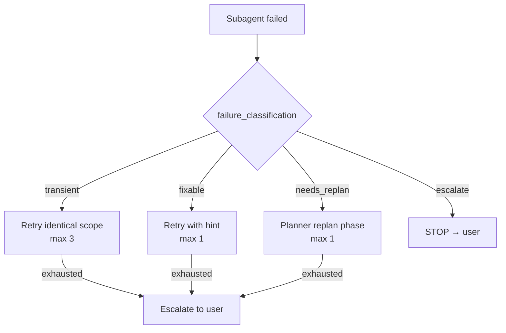
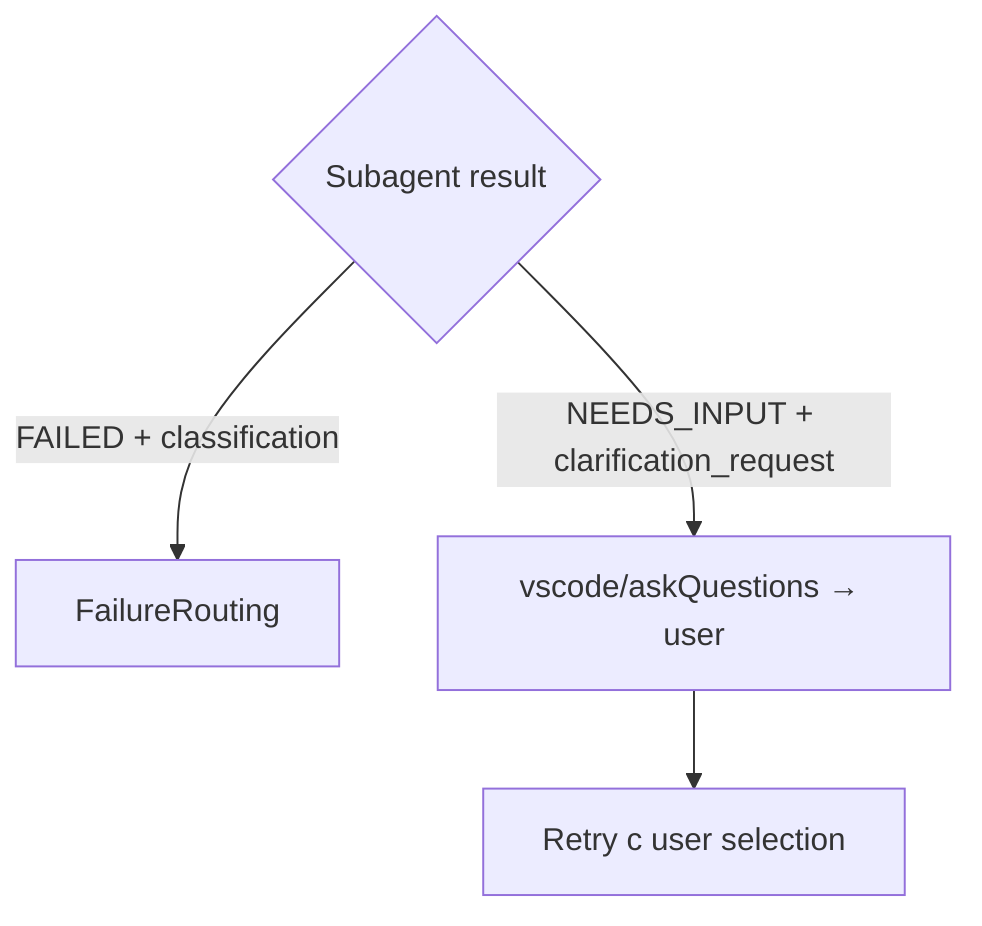

# Глава 13 — Таксономия сбоев

## Зачем эта глава

Понять **4 класса сбоев** в ControlFlow и как Orchestrator маршрутизирует каждый детерминированно. После этой главы вы сможете для любого failure-сообщения сказать: «это transient — retry; это escalate — стоп».

## Ключевые понятия

- **failure_classification** — обязательное поле при не-успешном статусе.
- **transient** — временный сбой, retry с тем же скоупом.
- **fixable** — исправимый дефект, retry с подсказкой.
- **needs_replan** — архитектурное несоответствие, replan через Planner.
- **escalate** — невозможно решить без человека.

## Когда поле обязательно

Из [.github/copilot-instructions.md](../../.github/copilot-instructions.md):

> «When status is `FAILED`, `NEEDS_INPUT`, `NEEDS_REVISION`, or `REJECTED`, include `failure_classification`.»

То есть — **любой не-успешный статус** требует классификации.

## Четыре класса

### 1. transient

**Что это:** временное препятствие, не связанное с дефектом плана или кода.

**Примеры:**
- Flaky test (один раз упал, второй прошёл).
- Network timeout.
- HTTP 429 (rate limit).
- Временная недоступность тулзы.

**Действие:** retry с **идентичным** скоупом.

**Лимит:** `transient_max: 3` (из `governance/runtime-policy.json`).

**Кто исключает:** PlanAuditor и AssumptionVerifier **не** могут возвращать transient. Их failure всегда — содержательный.

### 2. fixable

**Что это:** маленький исправимый дефект (опечатка, отсутствующий import, неверное значение конфига).

**Примеры:**
- Опечатка в имени переменной.
- Забыт import.
- Неверный путь файла.
- Wrong config value.

**Действие:** retry с **подсказкой** (fix hint), извлечённой из failure reason.

**Лимит:** `fixable_max: 1`.

### 3. needs_replan

**Что это:** обнаружено, что план неверен — архитектура не сходится, ключевая зависимость отсутствует, начальная предпосылка ложна.

**Примеры:**
- Запланированный API не существует в указанной версии библиотеки.
- Зависимость между фазами оказалась циклической.
- Архитектурное решение не реализуемо без существенных доработок.

**Действие:** Делегирование Planner-у для **точечного** replan фазы (не всего плана).

**Лимит:** `needs_replan_max: 1`.

### 4. escalate

**Что это:** проблема, которую нельзя решить автоматически — нужно вмешательство человека.

**Примеры:**
- Уязвимость безопасности.
- Риск целостности данных.
- Неразрешимый блокер.
- Решение требует бизнес-уровня (что-то типа «удалить ли legacy-данные»).
- Превышен budget cap.

**Действие:** **СТОП** → транзит в `WAITING_APPROVAL` → отдать пользователю с findings.

**Лимит:** `escalate_max: 0` (никаких retry).

## Сводная таблица

## Reliability policies

Помимо лимитов на класс, действуют **общие правила**:

### Per-phase budget

`max_retries_per_phase: 5` — кумулятивный budget на фазу. Все retry (любого класса) суммируются.

### Same-classification ceiling

> «If the same phase fails 3 times with the same `failure_classification`, escalate to user even if the individual classification would allow more retries.»

То есть: даже если у transient лимит 3, если **подряд** 3 одинаковых сбоя — эскалация.

### Per-wave throttling

> «If 2 or more subagents in the same wave return `transient` failures, reduce parallelism for subsequent waves by 50%.»

Это профилактика каскадного rate-limit exhaustion.

### Silent failure detection

Empty response, timeout, HTTP 429 — **не считается успехом**. Логируется и маршрутизируется как transient.

### Exponential backoff signaling

При retry после transient в payload включается `retry_attempt` count, чтобы subagent мог снизить частоту тулз-вызовов.

## Кто возвращает что

| Агент | Может вернуть transient? |
|-------|--------------------------|
| Все исполнители (CoreImplementer, UIImplementer, …) | Да |
| CodeReviewer | Да |
| Researcher, CodeMapper | Да |
| **PlanAuditor** | **Нет** |
| **AssumptionVerifier** | **Нет** |
| ExecutabilityVerifier | Да |

**Зачем исключение:** ревью плана не должно быть «flaky». Если PlanAuditor что-то нашёл — это **содержательно**, не временное.

## NEEDS_INPUT — отдельный путь

**Важно:** `NEEDS_INPUT` со `clarification_request` — **не** failure classification. Это **отдельный routing path**:

Даже если в payload фигурирует `failure_classification`, при наличии `clarification_request` **первичен** clarification path.

## Пример: end-to-end сценарий

**Задача:** Добавить endpoint /v1/orders.

**Фаза 3:** CoreImplementer пишет endpoint.

**Сбой 1:** Тест упал, ошибка «timeout connecting to test DB». Classification: `transient`. Retry. Прошло. Continue.

**Сбой 2 (другая фаза):** Lint упал, неверное имя переменной. Classification: `fixable`. Retry с подсказкой. Прошло. Continue.

**Сбой 3:** Endpoint требует middleware, которого нет в проекте. Classification: `needs_replan`. Planner добавляет фазу «add middleware». Continue.

**Сбой 4:** Обнаружена SQL injection в запросе из-за устаревшей библиотеки. Classification: `escalate`. **СТОП**. Пользователь решает: обновлять библиотеку или закрывать issue.

## Output requirement

При статусе FAILED/NEEDS_INPUT/NEEDS_REVISION/REJECTED отчёт subagent-а **обязан** содержать:

- `status`
- `failure_classification` (одно из 4 значений; кроме transient для PlanAuditor/AssumptionVerifier)
- `failure_reason` (одно предложение)
- `evidence` (ссылки/выдержки)
- `next_action` (что должен сделать Orchestrator)

Без этого Orchestrator не сможет правильно маршрутизировать.

## Типичные ошибки

- **Считать NEEDS_INPUT failure**. Нет, это отдельный routing path через clarification.
- **Возвращать transient от PlanAuditor**. Запрещено по контракту.
- **Маркировать всё как escalate** «на всякий случай». Это ломает автоматизацию.
- **Не указать failure_classification**. Без неё — Orchestrator не маршрутизирует.
- **Игнорировать same-classification ceiling**. 3 одинаковых подряд — эскалация, даже для transient.
- **Считать timeout success**. Silent failure — это failure.

## Упражнения

1. **(новичок)** Перечислите 4 класса failure_classification.
2. **(новичок)** Какой класс не может вернуть PlanAuditor?
3. **(средний)** Откройте `governance/runtime-policy.json` и найдите `retry_budgets`. Какой лимит для escalate?
4. **(средний)** Subagent падает 3 раза подряд с classification `fixable`. Что произойдёт?
5. **(продвинутый)** В одной волне 4 subagent-а; 2 из них вернули `transient`. Какой параллелизм у следующей волны, если был 8?

## Контрольные вопросы

1. Какие 4 класса failure_classification?
2. Почему PlanAuditor не может вернуть transient?
3. В чём разница между NEEDS_INPUT и FAILED?
4. Что такое per-phase budget и какое значение?
5. Что такое silent failure detection?

## См. также

- [Глава 05 — Оркестрация](05-orchestration.md)
- [Глава 08 — Пайплайн исполнения](08-execution-pipeline.md)
- [Глава 10 — Governance](10-governance.md)
- [.github/copilot-instructions.md](../../.github/copilot-instructions.md)
- [governance/runtime-policy.json](../../governance/runtime-policy.json)
