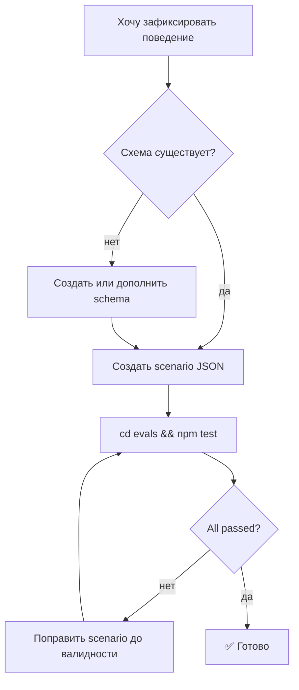

# Глава 14 — Eval-харнесс

## Зачем эта глава

Понять, **как ControlFlow проверяет качество собственных артефактов**. После этой главы вы сможете запускать eval-харнесс, читать его вывод и добавлять новые сценарии.

## Что такое eval-харнесс

`evals/` — это **оффлайн** validation suite, проверяющий schema-соответствие, поведенческие инварианты, orchestration handoff и drift. **Никаких реальных LLM-вызовов**, никакой сети — это статическая проверка артефактов.

**Канонический gate:**

```sh
cd evals && npm test
```

Запускает полный оффлайн набор проверок. CI выполняет ровно эту команду ([.github/workflows/ci.yml](../../.github/workflows/ci.yml)).

## Структура `evals/`

```
evals/
├── package.json              # npm scripts
├── validate.mjs              # структурный проход
├── drift-checks.mjs          # drift-helper
├── README.md                 # документация
├── scenarios/                # сценарии для регрессии
│   ├── planner-orchestrator-handoff.json
│   ├── orchestrator-plan-auditor-integration.json
│   ├── plan-auditor-adversarial-detection.json
│   ├── ...
└── tests/                    # тестовые модули
    ├── prompt-behavior-contract.test.mjs
    ├── orchestration-handoff-contract.test.mjs
    └── drift-detection.test.mjs
```

## Три режима

| Команда | Что запускает | Скорость |
|---------|--------------|---------|
| `npm test` | Полный suite (validate + behavior + handoff + drift) | Медленно |
| `npm run test:structural` | Только `validate.mjs` (схемы и P.A.R.T.) | Быстро |
| `npm run test:behavior` | Behavior + handoff + drift, без structural | Средне |

## Что проверяет каждый pass

### Pass 1–3: validate.mjs (структурный)

- Каждая JSON-схема — валидный JSON Schema (draft 2020-12).
- Каждый сценарий в `scenarios/` валиден против связанной схемы.
- Все ссылки на схемы из агентских файлов корректны.

### Pass 4: drift-detection.test.mjs

- P.A.R.T. section order на всех `*.agent.md`.
- Все 4 секции присутствуют.
- Frontmatter поля (`description`, `tools`, `model`, `model_role`) заполнены.
- `tools:` frontmatter ↔ `governance/tool-grants.json`.
- Каждая упомянутая схема существует.
- PreFlect-ссылка присутствует в каждом агенте.
- Rename allowlist (для удалённых/добавленных файлов).

### Pass 4b: companion rules

- Clarification policy цитируется правильно.
- Tool routing правила соблюдены.

### Pass 5–7: prompt-behavior-contract.test.mjs

Проверяет поведенческие инварианты из [PROMPT-BEHAVIOR-CONTRACT.md](../agent-engineering/PROMPT-BEHAVIOR-CONTRACT.md):

- Evidence discipline (нет силового success без evidence).
- Handoff discipline (правильные target_agent в planner.handoff).
- Abstention rule.

### Pass 8: orchestration-handoff-contract.test.mjs

Проверяет:
- Каждый сценарий handoff Planner→Orchestrator корректен.
- Dispatch payload содержит обязательные поля.
- Trace_id и iteration_index пробрасываются.

## Сценарии

`evals/scenarios/*.json` — это **фикстуры** реальных interaction-сценариев. Они валидируются **против схем** при каждом npm test.

**Зачем сценарии:**
- Регрессионная защита: если кто-то сломает контракт, упадёт сценарий.
- Документация: сценарий показывает, как **должен выглядеть** правильный обмен.
- Тестовый материал: behavior-tests перебирают сценарии и проверяют инварианты.

**Примеры важных сценариев:**

| Файл | Что демонстрирует |
|------|-------------------|
| `planner-idea-interview-trigger.json` | Idea interview gate Planner-а |
| `planner-orchestrator-handoff.json` | Handoff с tier-aware routing |
| `orchestrator-plan-auditor-integration.json` | PLAN_REVIEW триггеры и dispatch |
| `plan-auditor-adversarial-detection.json` | Архитектурные/security findings |
| `executability-verifier-contract.json` | Cold-start симуляция первых 3 задач |
| `code-reviewer-final-scope-drift.json` | Final review со scope drift |
| `failure-retry.json` | Retry routing по failure_classification |
| `needs-input-routing.json` | Clarification flow |

## Чтение вывода

Успешный прогон выглядит примерно так:

```
✔ Pass 1: schema validation        [12/12 OK]
✔ Pass 2: scenario validation      [78/78 OK]
✔ Pass 3: agent reference check    [13/13 OK]
✔ Pass 4: drift detection          [240/240 OK]
✔ Pass 4b: companion rules         [22/22 OK]
✔ Pass 5: evidence discipline      [13/13 OK]
✔ Pass 6: handoff discipline       [9/9 OK]
✔ Pass 7: abstention rule          [13/13 OK]
✔ Pass 8: orchestration handoff    [10/10 OK]

Total: OK (all passed)
```

Failure показывает конкретный pass, конкретный артефакт и конкретное правило, которое нарушено.

## Добавление нового сценария



Из CONTRIBUTING:

1. Создать сценарий в `evals/scenarios/`.
2. Имя файла = `<emitter-agent>-<scenario-purpose>.json`.
3. Содержимое валидно против соответствующей schema.
4. Если поведение нетривиально — добавить тест-кейс в подходящий `*.test.mjs`.
5. `cd evals && npm test`.

## Добавление нового агента/схемы

1. Создать `<NewAgent>.agent.md` с P.A.R.T. структурой.
2. Создать `schemas/<new-agent>.<output>.schema.json`.
3. Зарегистрировать в `plans/project-context.md` (если не review-only).
4. Добавить в `governance/agent-grants.json` и `tool-grants.json`.
5. Создать ≥1 сценарий в `evals/scenarios/`.
6. `cd evals && npm test` должен пройти.

## Что **не** делает eval-харнесс

- ❌ Не вызывает реальных LLM.
- ❌ Не делает сетевых запросов.
- ❌ Не проверяет качество текста промптов (только структуру).
- ❌ Не запускает приложения (нет приложений).

## CI

`.github/workflows/ci.yml`:

```yaml
- name: Install
  working-directory: evals
  run: npm install

- name: Test
  working-directory: evals
  run: npm test
```

То есть CI **зеркалирует** ровно то, что вы запускаете локально.

## Типичные ошибки

- **Запустить из корня репо**. Должно быть `cd evals && npm test`.
- **Считать, что eval запускает агентов**. Нет, это **только** структурные/behavior-проверки.
- **Изменить агента без сверки `tool-grants.json`**. Drift fail.
- **Удалить файл без `rename-allowlist.json`**. Drift fail.
- **Игнорировать локальный fail**. Если `npm test` падает у вас — упадёт и в CI.

## Упражнения

1. **(новичок)** Запустите `cd evals && npm install && npm test`. Сколько тестов прошло? Сколько секунд?
2. **(новичок)** Запустите `npm run test:structural`. Чем отличается результат?
3. **(средний)** Откройте `evals/scenarios/planner-orchestrator-handoff.json`. Какие основные поля?
4. **(средний)** Намеренно сломайте `tools:` frontmatter в одном из агентов (например, удалите тулзу). Запустите eval. Что произойдёт?
5. **(продвинутый)** Прочитайте `evals/tests/orchestration-handoff-contract.test.mjs`. Какие 3 инварианта он проверяет?

## Контрольные вопросы

1. Какая каноническая команда eval-проверки?
2. Сколько примерно тестов в полном suite?
3. Какие 3 режима (full/structural/behavior) и в чём разница?
4. Какой pass проверяет P.A.R.T. order?
5. Что делает CI?

## См. также

- [Глава 04 — P.A.R.T.](04-part-spec.md)
- [Глава 09 — Схемы](09-schemas.md)
- [Глава 10 — Governance](10-governance.md)
- [evals/README.md](../../evals/README.md)
- [CONTRIBUTING.md](../../CONTRIBUTING.md)
