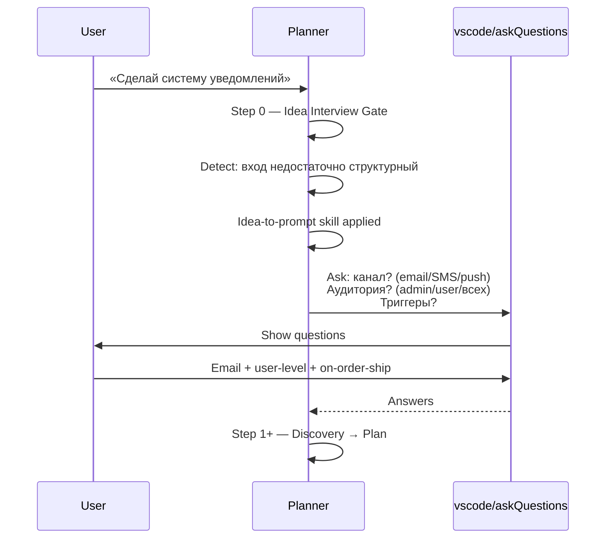
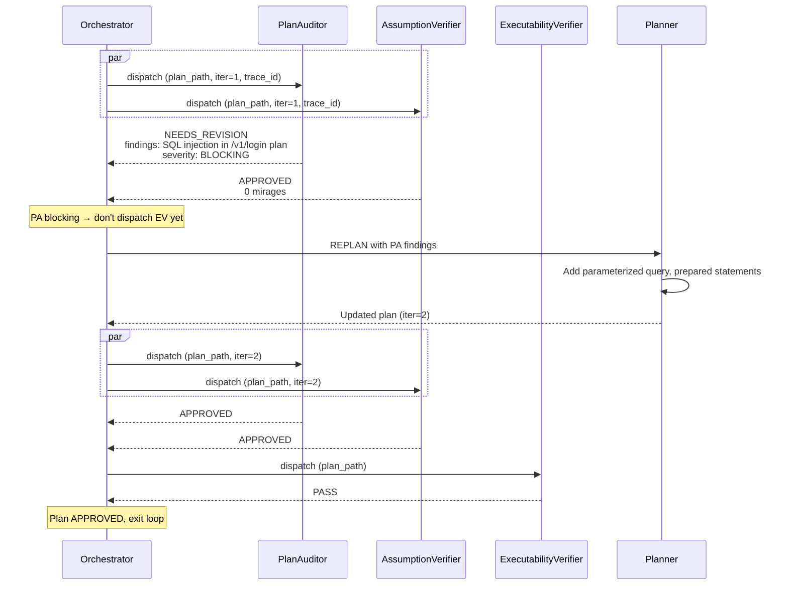
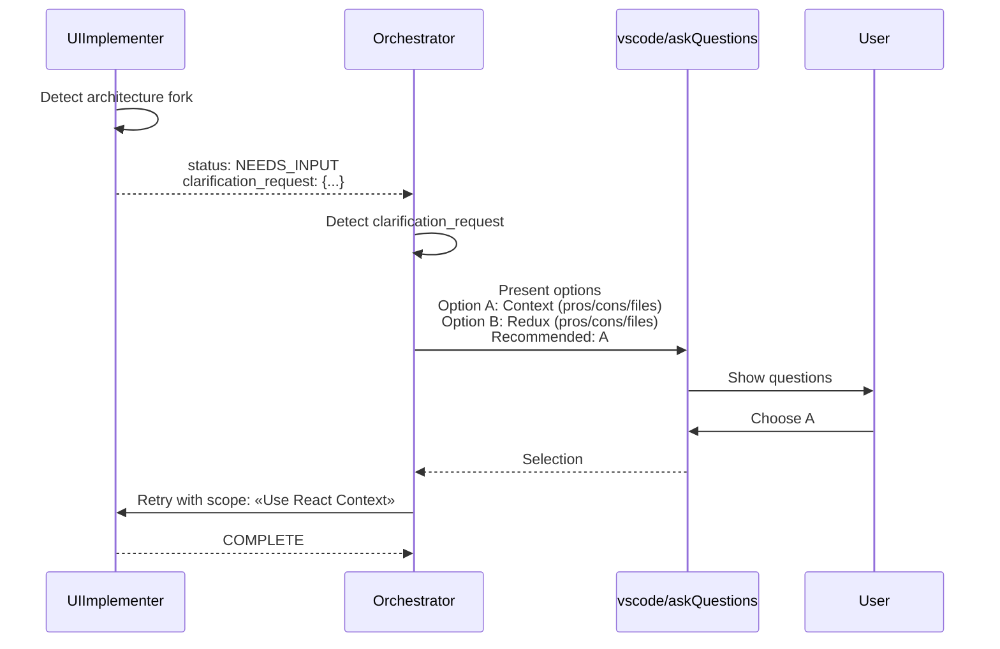

# Глава 15 — Кейсы и разборы

## Зачем эта глава

Увидеть **реальные сценарии** взаимодействия агентов end-to-end. Каждый кейс взят из `evals/scenarios/` и показывает, как теория из предыдущих глав работает на практике.

## Кейс 1: Planner — Idea Interview Trigger

**Сценарий:** `evals/scenarios/planner-idea-interview-trigger.json`.

**Контекст:** пользователь даёт расплывчатый запрос: «Сделай систему уведомлений».

**Что происходит:**



**Ключевое:**
- Planner **не угадывает**. До шага 1 — interview gate.
- `vscode/askQuestions` используется **прямо** Planner-ом (не через Orchestrator).
- Без ответов план не пишется (или пишется со status ABSTAIN).

**Что бы пошло не так без этого:**
- План бы строился под несуществующую гипотезу.
- Расплата дороже на следующих фазах (replan, undo).

## Кейс 2: Planner → Orchestrator handoff

**Сценарий:** `evals/scenarios/planner-orchestrator-handoff.json`.

**Контекст:** Planner закончил план. Передаёт Orchestrator-у.

**Поток:**

```mermaid
sequenceDiagram
    participant P as Planner
    participant Plan as plans/&lt;task&gt;-plan.md
    participant O as Orchestrator
    participant U as User

    P->>Plan: Write final plan with handoff{target_agent: Orchestrator, prompt}
    P-->>O: Handoff via plan_path
    O->>O: Read plan: complexity_tier, risk_review
    O->>O: Evaluate PLAN_REVIEW triggers
    Note over O: triggers met?
    alt Triggers met
        O->>U: Present plan + risk summary, request approval
    else No triggers
        O->>U: Light approval ("Approve plan?")
    end
```

**Ключевое:**
- Plan_path — **reviewable input**, не implicit approval.
- Orchestrator **самостоятельно** проверяет триггеры PLAN_REVIEW.
- `complexity_tier` из плана определяет ревью-pipeline.
- Handoff prompt содержит инструкции, а не код.

**Что бы пошло не так без этого:**
- Если бы Orchestrator принимал план «as-is», LARGE-tier план не получил бы Plan Review.
- AssumptionVerifier и ExecutabilityVerifier пропустились бы.

## Кейс 3: Orchestrator + PlanAuditor — adversarial detection

**Сценарии:** `orchestrator-plan-auditor-integration.json` + `plan-auditor-adversarial-detection.json`.

**Контекст:** Оркестратор отправил план LARGE-тира на ревью. PlanAuditor нашёл BLOCKING-уязвимость.

**Поток:**



**Ключевое:**
- На итерации 1 — PA + AV параллельно.
- ExecutabilityVerifier dispatchится **только если** PA approved и AV без BLOCKING (закон шага 4 из §4 Plan Review).
- PA не возвращает `transient` — её failure всегда содержательный.
- Trace_id и iteration_index пробрасываются.

**Regression tracking:** на итерации 2 PA получает verified items с итерации 1 как контекст. Если что-то ранее verified теперь fails → automatic BLOCKING.

## Кейс 4: ExecutabilityVerifier — cold-start contract

**Сценарий:** `evals/scenarios/executability-verifier-contract.json`.

**Контекст:** PA approved, AV без mirages. Orchestrator dispatchит ExecutabilityVerifier.

**Что делает EV:**

1. Берёт первые 3 задачи из первой фазы плана.
2. Для каждой симулирует **холодный старт** — «я только сейчас читаю задачу, могу ли я её выполнить?».
3. Ищет gaps:
   - Нет ссылок на файлы.
   - Команды без exact strings.
   - Неопределённые термины.
   - Implicit предположения о состоянии.

**Возможные исходы:**
- PASS — все 3 задачи executable.
- WARN — мелкие gaps, не критичные.
- FAIL — задача нельзя выполнить без догадок → routing к Planner.

**Пример FAIL:**

> Task: «Update the parser to handle the new format»
> EV gap: «"new format" не определён, нет ссылки на спецификацию».

После fix плана task становится: «Update `src/parser.py` to handle CSV with quoted strings per RFC 4180». Теперь PASS.

## Кейс 5: Failure retry — каскад классификаций

**Сценарий:** `evals/scenarios/failure-retry.json`.

**Контекст:** CoreImplementer работает над фазой 4. Fails 3 раза подряд по разным причинам.

**Поток:**

| Attempt | Failure | Classification | Action |
|---------|---------|---------------|--------|
| 1 | Test timeout | `transient` | Retry identical (1/3) |
| 2 | Test passed; lint: undefined variable | `fixable` | Retry with hint (1/1) |
| 3 | Lint passed; build fails: missing dependency in package.json | `fixable` | **Limit reached** (1/1 already used) → escalate |

**Что произойдёт:** Orchestrator транзит в `WAITING_APPROVAL` и показывает пользователю накопленные findings. Пользователь выбирает: «добавить зависимость вручную» / «переразложить план» / «остановить задачу».

**Ключевое:** retry-budget на phase = 5, но **классовые** лимиты ниже. Fixable исчерпался на attempt 3.

## Кейс 6: NEEDS_INPUT routing

**Сценарий:** `evals/scenarios/needs-input-routing.json`.

**Контекст:** UIImplementer обнаружил архитектурную развилку: «использовать React Context или Redux для shared state?».

**Поток:**



**Ключевое:**
- `NEEDS_INPUT` + `clarification_request` — **отдельный routing path**, не failure.
- Orchestrator не «угадывает» за пользователя.
- UIImplementer даёт **рекомендацию**, но решение — за пользователем.

## Кейс 7: Final Review Gate — scope drift

**Сценарий:** `evals/scenarios/code-reviewer-final-scope-drift.json`.

**Контекст:** Все фазы COMPLETE. Активирован Final Review Gate (LARGE-tier).

**Что делает CodeReviewer (final mode):**

1. Получает агрегированный `changed_files[]` со всех фаз.
2. Получает `plan_phases_snapshot[]` — какие файлы планировались на какой фазе.
3. Сверяет: какие файлы **изменены, но не планировались**?

**Пример находки:**
- Фаза 3 планировала менять `src/auth.py`.
- Реально изменились: `src/auth.py`, `src/user.py`, `src/db.py`.
- Файлы `user.py` и `db.py` не были в плане → **scope drift**.
- Severity: MAJOR.

**Routing fix:**
- Высший phase_id, в чьём `files[]` встречался `user.py`, владеет fix-cycle-ом.
- Orchestrator dispatchит этого executor-а с targeted scope: «откатить лишнее или дополнить план/тесты».
- Re-run CodeReviewer (final mode) — **max 1** fix cycle.
- Если опять blocking — escalate.

**CodeReviewer НИКОГДА не делает fix.** Только diagnoses.

## Шаблон чтения сценариев

Любой scenario JSON в `evals/scenarios/` имеет:
- `name` — человеко-читаемое имя.
- `description` — что демонстрирует.
- `actors` — какие агенты участвуют.
- `events[]` — последовательность gate-events / handoffs.
- `expected_outcome` — что должно случиться.

Прочитать сценарий = понять «правильное» поведение.

## Типичные ошибки при разборе

- **Считать, что сценарий — реальный run**. Это **фикстура**, не лог.
- **Игнорировать iteration_index в событиях**. Он показывает регрессионную динамику.
- **Не сверяться со схемой**. Без схемы поля могут быть прочитаны неверно.
- **Считать, что Orchestrator может «пропустить» PLAN_REVIEW по своему усмотрению**. Нет, триггеры детерминированы.

## Упражнения

1. **(новичок)** Откройте `evals/scenarios/planner-orchestrator-handoff.json`. Какой `complexity_tier` в сценарии?
2. **(новичок)** Откройте `evals/scenarios/failure-retry.json`. Сколько retry attempts описано?
3. **(средний)** Сравните `plan-auditor-adversarial-detection.json` с `executability-verifier-contract.json`. Какие severity present у findings?
4. **(средний)** Постройте свой mini-сценарий: `MEDIUM`-tier план, PA approved на итерации 1, AV нашёл 1 BLOCKING mirage. Что делает Orchestrator?
5. **(продвинутый)** Найдите все сценарии, где включён `final_review_gate`. Какой % процент?

## Контрольные вопросы

1. Где Planner вызывает `vscode/askQuestions` — на каком шаге?
2. Когда Orchestrator dispatchит EV?
3. В чём разница между `NEEDS_INPUT` и `FAILED` routing?
4. Кто owns fix-cycle при final review BLOCKING?
5. Что происходит при regression на итерации 2 PA?

## См. также

- [Глава 05 — Оркестрация](05-orchestration.md)
- [Глава 07 — Ревью пайплайн](07-review-pipeline.md)
- [Глава 08 — Пайплайн исполнения](08-execution-pipeline.md)
- [Глава 13 — Таксономия сбоев](13-failure-taxonomy.md)
- [evals/scenarios/](../../evals/scenarios/)
